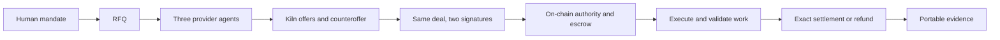

# Accord Lock

**Accord Lock helps research teams pay worker agents only for CAPEX table work that matches their agreement and human spending authority, with a receipt explaining the outcome.**

[Open the permanent demo](https://agent-spending-firewall.vercel.app/) · [Public Kiln / Sepolia proof](https://agent-spending-firewall.vercel.app/#evidence) · [Five-minute pitch](docs/DEALTRACE-PITCH.ko.md) · [Workspace guide](docs/ACCORD-LOCK-WORKSPACE.en.md)

**One product, two explicit execution paths:** Accord Lock is the usable workspace. DealTrace is the signed agreement and public settlement proof path. They demonstrate the same payment boundary with different runtimes.

| | Interactive browser demo | Recorded DealTrace public proof |
|---|---|---|
| Work | Normalize four quarterly CAPEX rows | Extract the pinned quarterly CAPEX references |
| Negotiation | Authored worker pricing rules; no live model calls | Five actual Kiln `qwen3-32b` calls, 22 → 20 |
| Main example | Budget 40, per-deal limit 30, agreement 20, invoice 25 blocked | Budget 40, agreement 20, genuinely signed invoice 25 reverted |
| Enforcement | Application checks before signing; trusted private-EVM controller | Bilateral signed terms and authority checked by the Sepolia V2 contract |
| Outcome | Correct to 20, pay, verify and export a private-chain receipt | Correct 20 settled and withdrawn; 47 finalized verification checks |
| Units | 1 test unit = 1 local gwei | 1 DEMO = 100 Sepolia gwei; gas separately recorded |

Neither unit has a cash price. The browser demo's **35-unit offer** is automatically blocked first against the 30-unit per-deal limit. Select Atlas, negotiate 22 down to 20, lock funds and run the worker. The authored sample bill is 25: **inside both spending limits, but outside the agreement**. Correct it to 20 and finish at the receipt and public-proof links. Every step is an operator action; no autoplay or wallet signup.

Only source-linked quarterly CAPEX table work is supported in this first-use experience. It is not a general marketplace or production financial custody service. Imported tables are compared with their input; source URLs do not certify factual truth.

**Run locally:** `pnpm install --frozen-lockfile`, then `pnpm ade:spending:view` and open http://127.0.0.1:3440. **Hosted build:** `pnpm ade:hosted:build` creates the self-contained `dist-vercel` browser client. `pnpm ade:hosted:test` builds its test artifact in an isolated temporary directory. Browser work persists in IndexedDB on the same origin; export receipts before clearing storage. Source pushes do not automatically publish this manually managed Vercel project.

### The agreement decides what gets paid.

**DealTrace turns agent-to-agent procurement into a mutually signed deal, pays only for delivery and billing that match the deal within human authority, and exports the evidence behind the payment.**

A human allows **40 DEMO**. Kiln-powered agents negotiate **20**. The seller submits a genuinely signed bill for **25**.

The bill fits the budget. **The Sepolia contract still rejects it.** The corrected 20 is paid and withdrawn.

This is our narrow problem: when agents negotiate changing work, a budget alone cannot tell you what they actually agreed to buy.

[Public-proof technical brief](output/pdf/DealTrace-Procurement.en.pdf) · [Run the workbench](#try-it) · [Technical design](docs/DEALTRACE-PROCUREMENT.en.md) · [Finalized public verification](artifacts/dealtrace/procurement/runs/fa5e107c-7a20-4a6d-9970-5f15e8d4f6e9/finalized-verification.json)

## The first user

A research automation team buys short-lived document-processing capacity from worker agents. Each job can have different quantities, source requirements, delivery windows and rates. Someone still has to explain the final invoice.

The supported job extracts four quarterly actual facility-investment values with original source references. The bundle adds three searches over that pinned corpus and two CPU hash batches. These operations execute and their outputs are recomputed before payment. They are **not** external web search, rented GPU-hours or purchased data licenses. Paid outsourcing demand is a customer hypothesis; the small reference job could also be done locally.

## One integrated workflow



| Step | Implemented behavior |
|---|---|
| Discover | Challenge-response discovery of registered, pinned provider identities |
| Negotiate | Three separate seller processes with private cost/capability constraints; buyer counteroffer; final terms chosen by Kiln rather than a prescribed final price |
| Commit | Signed event sequence, field provenance, complete packet review by each party and EIP-712 signatures bound to network, mandate and recipient |
| Authorize | Human budget, per-deal cap, permitted sellers, deadline, nonces, revocation and gross session allocation |
| Execute | Signed unit results; stable request IDs; retry returns the same result without a second billable unit |
| Settle | V2 enforces the fixed agreed total; V3 enforces jointly signed unit rates/caps and returns unused principal |
| Audit | Verify original messages, signatures, supported work, invoice, exact chain calldata, events, transfers and finality without app DB or private keys |

One bounded counteroffer round is intentional. A rejected offer, incompatible quality or unfinished agreement stops before funding. Quantities are fixed by default; `--flex-quantity` explicitly permits a minimum/maximum range. The retained flexible-quantity live attempt did not converge and stopped. We do not replace unsuccessful model output with a fabricated agreement.

The outward message includes qualitative prose and structured commercial terms. Exact numbers come from the signed fields. The earlier natural-language interpretation ledger remains available in the original workbench; this new path does not claim to compile arbitrary legal prose.

## What actually ran

| Evidence | Observed outcome |
|---|---|
| [Live fixed job on Sepolia](artifacts/dealtrace/procurement/runs/fa5e107c-7a20-4a6d-9970-5f15e8d4f6e9/report.json) | 5 actual Kiln calls; 22 → 20 negotiation; 5 public transactions; signed 25 bill reverted; 20 withdrawn |
| [Independent public verification](artifacts/dealtrace/procurement/runs/fa5e107c-7a20-4a6d-9970-5f15e8d4f6e9/finalized-verification.json) | **47 checks, VALID at finalized block 11808905** |
| [Hardened V3 bundle](artifacts/dealtrace/procurement/runs/11ba8d29-1b86-4cb4-8758-3ccb95fb89e8/report.json) | 5 actual Kiln calls; seller C selected; 27.40 maximum, 26.40 paid, 1.00 returned; 56 checks on a real local EVM |
| [Full automated suite](artifacts/deal-escrow/tests.json) | **209/209 pass**; original workbench and evidence replay builds also pass |
| [Failed live attempts and all flow usage](artifacts/dealtrace/procurement/usage-audit.json) | Both truncation and non-convergence retained; neither funded a purchase |

Inspect the actual Sepolia [rejected invoice](https://sepolia.etherscan.io/tx/0x255d855d5e19779fdc0fd12a02c924db0bb1980561fbc3dea98df230135e4e59), [correct settlement](https://sepolia.etherscan.io/tx/0x00b1e35d51542daceacd191caabf6fd0e77b740ecb45eab0b4daa15965ecce2f) and [seller withdrawal](https://sepolia.etherscan.io/tx/0x6a322e82f24b1fd1b3c2d40f2215ead29c9b0c4d1899b1bb6f87cecaf95cb7cc).

V3 blocks both forms of metering bypass: ordinary funding cannot omit a signed unit schedule, and ordinary release cannot bypass usage settlement. Its latest proof is local, not a claim of V3 public deployment. The old 29.00/27.50 bundle run is preserved as an earlier version; [source changes and original execution bytes](artifacts/dealtrace/procurement/post-run-changes.json) keep these versions distinct.

## Kiln where language matters; code where money moves

The actual model is **`qwen3-32b` through Kiln**, following the project's updated model choice. It generates the offers, counteroffer and response. It has no signing key or payment tool. Code chooses the cheapest eligible initial quote, validates terms, signs, executes supported work and computes settlement.

| Live Sepolia flow | Calls | Input tokens | Output tokens |
|---|---:|---:|---:|
| Seller A offer and response | 2 | 1,730 | 1,648 |
| Seller B conflicting offer | 1 | 793 | 658 |
| Seller C offer | 1 | 797 | 923 |
| Buyer counteroffer | 1 | 825 | 516 |
| **Total** | **5** | **4,145** | **3,745** |

The hardened bundle used 10,398 tokens. Across all five live development attempts, including both failures, the retained ledger counts **24 calls / 45,593 tokens**. One early failure report undercounted the truncated call; its durable journal telemetry and explicit correction are retained without rewriting the original report.

Bounded dialogue, structured commercial fields and deterministic verification avoid model calls for signatures, billing, retry, settlement and audit. This is a design choice, not a measured energy-savings percentage. We have **no NPU power telemetry**. As an assumption-only example, assigning 150 or 300 W continuously to the fixed run's 64.056 seconds of API latency gives 2.67 or 5.34 Wh. That latency includes network/queue time; neither power nor occupancy was measured. These numbers are illustrative accounting scenarios, not measured device energy or a GPU comparison.

## Try it

Node 24+ and pnpm:

```sh
pnpm install --frozen-lockfile
pnpm dealtrace:procurement:compile
pnpm dealtrace:procurement                 # fixed job, authored quotes, real local V2 EVM
pnpm dealtrace:procurement --metered       # bundle and real local V3 EVM
pnpm dealtrace:procurement:start          # http://127.0.0.1:3421
pnpm ade:test
```

For actual inference, configure ignored `.env.local` with `KILN_API_KEY`, `KILN_MODEL=qwen3-32b` and optional `KILN_BASE_URL`:

```sh
pnpm dealtrace:procurement --live
pnpm dealtrace:procurement --live --metered
pnpm dealtrace:procurement --live --metered --flex-quantity
```

The browser supports approval, live/local selection, watching, stopping, receipt export, source navigation and verification of an altered copy. A local offline check reports INCOMPLETE / CHAIN_NOT_QUERIED; a saved success badge alone is not a fresh chain check.

Public execution requires an already provisioned **Sepolia-only** identity directory, `DEALTRACE_SEPOLIA_DIR` and `SEPOLIA_RPC_URL`. Existing V2 is pinned; metered public mode would deploy V3. Per-operation and cumulative gas caps apply. DEMO is an accounting unit backed here by tiny test-ETH amounts, not USD or a newly issued token. Gas is a separate operator expense.

```sh
pnpm dealtrace:procurement --live --sepolia
pnpm dealtrace:procurement --live --sepolia --run=<same-id> --resume
pnpm dealtrace:procurement:verify report.json trusted-deployment.json
node scripts/recover-dealtrace-procurement.mjs <run-id>
```

Signed transaction bytes are saved before broadcast. An observation timeout reconciles the same hash; it does not authorize a new payment. Stop revokes new commitments; existing funded work retains its signed deadline. Anyone can trigger an expired refund to the immutable buyer, and the recovery command can sponsor its withdrawal. Local chains are ephemeral.

## Existing controls remain

The earlier [Vault V2 adversarial proof](docs/DEALTRACE-VAULT-V2.en.md) retains 14 Sepolia transactions, three mined attack reverts, 83 finalized checks and a [Sourcify exact source match](https://repo.sourcify.dev/11155111/0x3df2bFc764488Dd6AE85f98774255359b0520048). It demonstrates failed delivery → refund → on-chain `REQUIRE_PREVIEW`, including a new mandate. These are additional retained scenarios, not transactions attributed to the five-call procurement run.

`pnpm dealtrace:start` opens the original workbench on port 3420. The [earlier three-minute film](artifacts/dealtrace/film-v3/dealtrace-3min.ko.webm) is an edit of saved evidence screenshots, not live transaction footage, and describes its original version. [Legacy escrow and research modes](README.legacy-escrow.md) remain available.

## Challenge B evidence

| Criterion | Evidence |
|---|---|
| Declared function and user need | One research job or bounded work bundle; usable outputs and complete receipt |
| Boundaries and stopping | Overbilling, source mismatch, budget/fee limits, seller restriction, expiry, revocation and recorded failure cases |
| Kiln and efficiency | Actual model output changes terms; usage per role includes failed attempts |
| Blockchain | One live workflow reaches finalized Sepolia settlement and withdrawal; V3 unit billing executes locally |
| Approval and evidence | Approve/watch/stop/export UI; portable reconstruction; independently verified chain state |

This is a **testnet prototype**, with registered local provider processes under one operator. A pinned HTTPS provider adapter is implemented, but no independent supplier company has been integrated. The selected evaluator still attests off-chain outcomes; signatures do not prove business identity or the truth of arbitrary content.

Our product hypothesis is an evidence and enforcement layer for negotiated machine work: **what was agreed, what was delivered, and why that amount moved**. We do not claim a new payment protocol, proven moat or production readiness.

[Architecture and provider interface](docs/DEALTRACE-PROCUREMENT.en.md) · [Completion audit](docs/DEALTRACE-COMPLETION-AUDIT.en.md) · [Original final plan](docs/DEALTRACE-FINAL-PLAN.ko.md)
