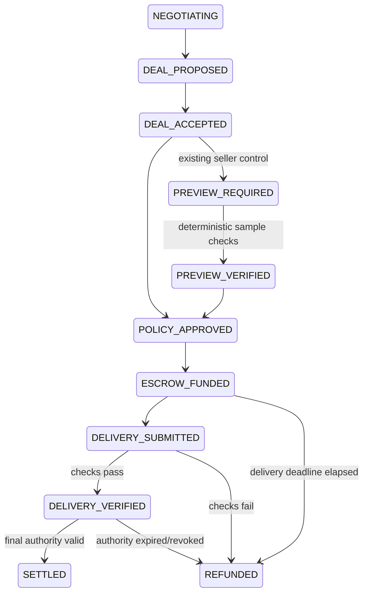

We built a spending-control and escrow prototype for research-agent developers commissioning financial-data extraction: AI proposes the work, code checks the approved terms and pinned-source delivery, and blockchain escrow releases or refunds with reconstructable evidence.

# Agent Deal Escrow

**Pay for the financial-data extraction you approved, with verifiable delivery and settlement.**

This GWDC 2026 FuriosaAI × Bricksum Challenge B prototype focuses on one commissioned research-data extraction job. The previous paid-resource recovery prototype is preserved in [the legacy README](docs/LEGACY-PURCHASE-README.ko.md).

[Focused product plan and user-need evidence](docs/FOCUSED-PRODUCT-PLAN.ko.md): one paid financial-data extraction job, the developer accountable for its result and cost, and explicit limits of reference-based validation. The source-backed and application-off runs are implemented; unseen-document generalization, transaction economics and customer validation remain pending. Older synthetic evidence is kept separately.

## Public Sepolia proof and Korean demo

The newer [source-backed public run](docs/SOURCE-PUBLIC-PROOF.ko.md) uses actual Kiln extraction of four quarterly values from a transcribed issuer table. Correct delivery releases funds; a controlled wrong-metric delivery refunds; the seller's next purchase, an over-budget proposal and a revoked mandate stop before signing. It uses a separate buyer address, two real model calls (4,495 tokens), and explicitly labeled energy assumptions. Validation is against a fixed reference table, not general factual certification.

A separate [application-off recovery run](docs/BUYER-RECOVERY-PROOF.ko.md) terminates the real application, waits for the on-chain deadline, and refunds with the buyer key from a process denied access to the controller key and app database. Reopening the record reconciles the refund and releases the reservation without a new controller transaction or model call. Stage 09 replays this distinct run; its independent finalized verdict is displayed separately.

The buyer refund independently verified VALID at finalized block 11,801,738. The [local participant questionnaire](docs/USER-STUDY.ko.md) now binds answers to the exact evidence and rendered demo version, preserves that snapshot privately, and separates automated QA from self-reported human responses. Run `pnpm ade:source:study` after building the replay, then open `http://127.0.0.1:3414/?study=1`. Actual customer and human-review evidence is still required.

Policy and final-authorization records now retain the exact timestamp used for their checks. A clock-boundary regression previously reproduced a completed payment whose receipt failed with `POLICY_CHECK_MISMATCH`; the fix keeps that receipt reconstructable while preserving a fresh expiry check before signing. Historical records are not rewritten.

```sh
pnpm ade:replay:build
pnpm ade:source:replay
# http://127.0.0.1:3413/?replay=1
```

The earlier synthetic-data proof remains available below for comparison, with its own receipts and measurements.

The completed public run contains two fund transactions, one release, one refund, and four recorded stops. An independent RPC verified all six evidence bundles against finalized Sepolia state. The 9-step Korean demo is read-only and uses those exact records. It needs no API key or wallet.

```sh
pnpm install --frozen-lockfile
pnpm ade:replay:build
pnpm ade:replay
# Open http://127.0.0.1:3410/?replay=1
```

[Public proof, architecture and demo script](docs/PUBLIC-ESCROW-PROOF.ko.md) · [Independent verification](artifacts/deal-escrow/runs/d07e8650-bc47-4ecd-b138-8885d8288a04/independent-verification.json) · [3-minute silent evidence video](artifacts/deal-escrow/public-ui/demo-3min.webm)


## Run

Node 24+ and pnpm are required. Existing dependencies are reused; native Node TypeScript stripping runs the server.

```sh
pnpm install --frozen-lockfile
pnpm ade:contracts
pnpm ade:test
pnpm ade:build
pnpm ade:start
```

Open **http://127.0.0.1:3402**. Overview, Deals, Agents, Controls and Audit are implemented. The browser is a local admin demo, not an internet deployment.

For a new real Kiln + real local EVM run:

```sh
# Set KILN_API_KEY, KILN_MODEL and optionally KILN_BASE_URL in .env.local.
# Model identifier is required, never hardcoded by the new adapter.
pnpm ade:demo
pnpm ade:start
```

`ade:demo` makes six paid API calls under this implementation request and creates new dedicated devnet identities. Do not run it merely to view existing evidence. The local server opens the latest local run's private state, or a new local service directory when the latest evidence is public; `ADE_DATA_DIR` selects a separate directory. Stop a server before opening the same chain database in another process. `ade:test` does **not** make paid model calls or public-chain transactions.

Evidence: [public run](artifacts/deal-escrow/sepolia/latest.json), [actual test runner output](artifacts/deal-escrow/tests.json), [public demo browser checks](artifacts/deal-escrow/public-ui/browser-checks.json), [trusted deployment](artifacts/deal-escrow/sepolia/trusted-deployment.json).

The [persona remediation record](docs/LIMITATIONS-REMEDIATION.ko.md) covers the newer human quality floors, durable purchase intents, strict delivery validation, failure recovery and audit checks. `pnpm ade:personas` runs scripted attacks without external calls; `pnpm ade:personas:live` makes at most six real Kiln calls. `node scripts/check-deal-personas.mjs` verifies preview correction through settlement in an isolated local browser/demo.

## 1. Problem

An external worker can return a plausible four-row financial table with the wrong metric. The developer operating the research agent needs to stop payment, explain the failed condition and require evidence before another purchase from that supplier. A table that merely has the right JSON shape and source links is insufficient.

## 2. Persona

A developer at a small research-automation team already commissioning paid, asynchronous document extraction from an external supplier. The current task is four quarterly facility-investment outflow values from LG Energy Solution's official 2025 Q4 report. The candidate user must have unresolved delivery/refund problems despite existing provider billing; the supplier must accept the agreed verification rules. Public workflow examples support this user hypothesis, but no customer adoption or willingness to pay has been validated.

## 3. Declared function

Help research-agent developers commission a bounded financial-data extraction job and pay only after the approved delivery checks pass, with a reconstructable receipt for payment or refund. A verified failure can activate a predefined seller-specific preview gate. Escrow, structured offers and tool calling are not claimed as novel.

## 4. Demo workflow

### Current source-backed demo — port 3413

1. A person approves the source version, metric, four quarters, unit, supplier, budget and deadline.
2. Kiln Qwen3-32B compares offers and extracts the transcribed source table. Code checks the proposed immutable Deal before funding escrow.
3. Correct delivery matches the pinned reference and releases the locked test principal.
4. A separate fault-injection delivery keeps four rows and source fields but substitutes a different metric's value. Validation fails and refunds; a subsequent deal from that supplier requires a preview before funding.
5. Over-budget and revoked-mandate proposals stop before signing, with recorded reasons.
6. In a separate unpaid deal, the actual application is stopped. After the real chain deadline, the buyer independently refunds; reopening the record reconciles the reservation with no controller transaction or inference.

Source and recovery receipts, transaction hashes, flow usage and independent finality are available in the linked proof documents. The replay is read-only. Its four reference values are fixed in advance, so this run does not establish automatic verification of unseen documents. The deliberately tiny recovery principal also does not establish viable transaction economics.

### Earlier synthetic regression workflow — port 3410

1. A human approves task budget, maximum single transaction, mandate expiry, minimum rows/source coverage/required columns and maximum delivery duration.
2. Buyer and Seller use actual Kiln tools to negotiate price, minimum rows, source coverage and delivery window. Structured output is checked independently.
3. The Buyer proposes `accept_deal(deal_id)`. Strict schema and policy decide whether funding is permitted.
4. Native **test assets** are locked in `AgentDealEscrow`; the seller is not yet paid.
5. Seller A submits 52 synthetic rows, including 50 valid HTTP(S) source URL strings (96.15%). Successful checks release the exact accepted amount.
6. Seller B submits 7 rows against a minimum of 40. Validation fails, escrow refunds, and a trusted mapping adds `REQUIRE_PREVIEW` for Seller B.
7. Another Seller B Deal is denied funding until a preview is verified. Seller A remains unaffected.

The public Sepolia run negotiated both Seller A and Seller B at **1.80** test units. The earlier local run used **2.00** and **1.50** respectively; its prices are not the public proof's prices. Each public purchase is a separately approved 3.00-unit task with a 2.00-unit transaction limit. Two outstanding 1.80-unit purchases under one 3.00-unit mandate exceed the task budget. Control Memory persists at company + seller scope across tasks.

The dataset is synthetic. Source URL coverage counts well-formed HTTP(S) strings without fetching pages or proving that they substantiate the values.

The main UI shows current persisted state. The separate read-only service at port 3410 presents the fixed public evidence in Korean and clearly labels it **not live**. `pnpm ade:record` assembles saved browser frames into a silent 3-minute WebM using FFmpeg; it does not perform new transactions or record a fresh live workflow. See [public proof and demo script](docs/PUBLIC-ESCROW-PROOF.ko.md).

## 5. AI vs Code

| Responsibility | AI / Kiln | Trusted deterministic code |
|---|---|---|
| Understand task and negotiate price/rows/coverage/deadline | Yes | Validate proposed terms |
| Propose acceptance/rejection | ID-only tool | Verify immutable Deal |
| Spending authority, arithmetic, task reservation | No | Human mandate + policy + SQLite transaction |
| Schema, canonical hash, expiry, state transitions | No | Strict validation and fail-closed transitions |
| Delivery checks | No | JSON array, field types, unique company/quarter/currency rows, row count, URL coverage, deadline |
| Settlement amount | Never | Exact accepted `price_minor`, contract-locked amount |
| Transfer, release, refund | Never exposed as model tools | Trusted controller and contract |
| Control Memory | Cannot create/remove rules | Canonical failure → fixed additional gate |
| Audit prose | Optional; not used in this prototype | All displayed facts come from stored records |

The tool allowlist is `discover_sellers`, `request_offer`, `counter_offer`, `accept_deal`, `reject_deal`. Actual negotiation uses `counter_offer`, `request_offer`, `accept_deal`; discovery is the fixed two-seller scenario configuration. There is no generic marketplace. Monetary tools are absent from the model API.

## 6. Trust boundary

Buyer/Seller LLMs, natural language, generated explanations and seller claims are untrusted. Trusted components are the schemas, immutable Deal store, mandate/policy engine, state machine, delivery validator, controller and canonical failure mapper. Kiln, RPC and blockchain are external systems.

The local admin UI binds to loopback only, validates the Host, rejects cross-origin mutations, and requires a per-process session token. Human mandate creation is not a cryptographic identity or enterprise SSO system. API keys, signing keys and signed transaction intents remain in ignored local files; they are not returned in receipts.

Controller authority is explicit: the Solidity contract trusts its configured controller for off-chain delivery and mandate decisions. A compromised controller could make a false attestation. The contract does enforce exact deposited value, a single settlement outcome, release deadline and caller restrictions. There is no claim of trustless off-chain validation.

## 7. State machine



Pre-funding policy failure produces `BLOCKED` or `EXPIRED`; a missing preview remains `PREVIEW_REQUIRED`. All unlisted transitions and all terminal-state escapes are rejected. Accepted Deal bodies and hashes have an SQLite immutable trigger. Amendments create new IDs and reference `supersedes_deal_id`.

`deadline` is an immutable duration in seconds. The funding contract fixes the absolute delivery deadline at `min(funding block timestamp + duration, expires_at)`. Both backend and contract reject late release. Expiry and mandate revocation do not prevent returning escrow to the buyer.

## 8. Kiln / FuriosaAI

The client reads `KILN_MODEL`. On each live negotiation it calls `/models` when supported and rejects an unavailable configured model. The observed organizer endpoint listed `qwen3-32b` and another model; this run used the configured `qwen3-32b`. Model responses must match the requested model and contain exactly one approved tool call with strict arguments. Truncation, malformed JSON, extra authority fields and unknown tools fail closed.

Each inference call records flow, request ID, prompt/completion/total tokens, timestamps, total latency, tool and result. Requests are non-streaming: TTFT is **not measured**. Model discovery is a management request and is not counted as an inference call.

Natural-language reasoning can disagree with numeric fields. The observed Seller A prose mentioned three minutes while its structured duration was 90 seconds. Code bound the Deal to 90 seconds. This demonstrates why prose is not authoritative; it is not a claim of perfect negotiation quality.

## 9. Blockchain read / write / settle

| Action | Implementation |
|---|---|
| WRITE | `fund(dealHash, buyer, seller, amount, deliveryWindow, dealExpiry)` locks the exact test-asset amount and commits to the Deal hash |
| READ | `escrows(dealHash)` and independently read transaction receipts/logs |
| SETTLE | Controller `release(dealHash, evidenceHash)` or `refund(dealHash, reasonHash)` transfers only the locked amount |

The evidence argument is a hash of the stored settlement attestation, including the Deal, mandate snapshot, delivery and validation, final policy checks and prior event hash. This is a direct commitment, not an optional Merkle system. It provides tamper evidence after the commitment point, not truth certification.

Current end-to-end evidence is a **real local Ganache devnet**, chain ID 31338, persistent blocks/receipts and dedicated demo identities. One minor demo unit maps to 1 gwei of native test asset; 100 minor units display as 1.00 demo unit. This is not a USD exchange rate. Deployment plus four financial transactions are recorded in the real demo.

The public Sepolia run is complete: actual fund, release and refund receipts are included in [the public proof](docs/PUBLIC-ESCROW-PROOF.ko.md). `pnpm ade:sepolia` resumes a durable local journal; a completed run is only rechecked, with no new inference or transfer. `pnpm ade:verify:public` uses a separate read-only RPC and finalized blocks, without the app or signer. Public execution only accepts chain ID 11155111. Existing free faucet assets funded the demo; no real ETH was bought.

SQLite and external settlement are not distributed-atomic. Before broadcast, an operation claim and exact signed transaction are persisted privately. Unknown responses keep reservations; recovery reconciles the original transaction or an independently confirmed same-nonce replacement. Confirmed funding reverts release reservations; confirmed release reverts permit refund. Canonical block checks and configured finality precede local confirmation: local defaults to one confirmation and public Sepolia to two. A detected reorganization quarantines financial execution for operator review. These prototype checks are not production finality guarantees. One writer owns each runtime directory and shared Engine facades serialize the executor; this is not a distributed coordinator. The buyer has a contract refund escape after deadline, though this dedicated-wallet demo uses the same controller address as the buyer.

A mined revert is distinguished from an unknown response using the exact signed transaction hash, controller, contract and status-0 receipt. A confirmed failed release is recorded as `REVERTED`, then refunded with reason `ESCROW_RELEASE_REVERTED`; recovery resumes this path after reopening the database. A successful release whose response was lost remains pending until reconciled and must never initiate a refund. Failed funding becomes `BLOCKED`. A reverted refund requires investigation; no automatic new signed retry or production finality guarantee is claimed.

## 10. Two required stopping / failure runs

**Budget:** an accepted 2.50-unit proposal exceeds a 2.00-unit maximum. `MAX_SINGLE` is recorded, state becomes `BLOCKED`, no funding transaction exists.

**Delivery:** Seller B promises at least 40 rows and delivers 7. `DELIVERY_REQUIREMENT_FAILED` is recorded, funds return to the buyer, and `REQUIRE_PREVIEW` activates. A subsequent Deal cannot fund without a verified preview.

The preview template requires 5 rows, the accepted schema and coverage, before Deal expiry. It binds to that Deal hash. It is an additional machine-verifiable precondition, not a guarantee of the final dataset's quality. Controls are company + seller scoped and have database triggers rejecting modification/deletion. Human-admin removal is future work only.

The UI accepts preview and delivery JSON as files or text, reports failed checks, and resumes funding after a verified preview. New mandates bind human quality floors independently of model-generated terms. One default purchase intent persists per mandate; retries and concurrent callers reuse its Deal. Buying a separate dataset requires an explicit new purchase action. Historical mandates and delivery-v1 receipts retain their original interpretation, while the audit also reports whether their data meets current delivery-v2 checks.

## 11. Approval & evidence

Audit Receipt shows mandate, buyer/seller, immutable terms/hash, locked amount, policy checks, delivery raw data and evidence hash, recomputed validator result, release/refund reason, on-chain hashes and timestamps. It distinguishes absence of a submission from a failed submission.

`node scripts/verify-deal-escrow.mjs receipt.json` runs offline. Add `--rpc URL --deployment trusted-deployment.json` for a separately configured RPC and a deployment manifest obtained independently of the untrusted receipt. No wallet key is needed.

`verifyReceipt` can run without application state for structural verification (`STRUCTURALLY_VALID`). With the separately configured chain it checks receipts/logs, deployed address, exact amount, participants, deadline, outcome and attestation (`VALID`). It does not trust an RPC URL supplied by the receipt. Missing settlement receipts and changed data fail. Browser and API invoke the same deterministic verifier; no LLM invents numbers.

Structured hash-linked events include mandate creation, negotiation, proposed/accepted Deal, policy checks, funding, submission, validation, release/refund, blocking and Control Memory activation. All financial events map to one specific Deal and transaction hash. This is not proof of completeness against a compromised controller or a cryptographic human approval system.

## 12. Security invariant results

`pnpm ade:test` exports actual Node runner output and a source fingerprint to `artifacts/deal-escrow/tests.json`. The UI reads this file, never a hand-written pass counter, and marks it stale when its tested source fingerprint differs from the current source. The current suite covers all ten requested invariants, every unlisted state transition, contract authorization, exact funding, concurrency budget reservation, unknown-broadcast recovery, malformed model outputs and receipt tampering. Deterministic fixtures and the paid live-model run are separate evidence.

The ten required properties are: no model-selected settlement amount; immutable accepted Deal; hash mismatch cannot settle; expired Deal cannot fund/release; revoked/expired mandate cannot fund; no duplicate settlement; refund cannot later release; Control Memory cannot expand authority; machine cannot remove a gate; failed delivery cannot release. A passing fixture is not formal verification or a stochastic model-accuracy estimate.

## 13. Kiln token / energy report

The public run has **6 inference calls, 3,958 prompt tokens, 2,942 completion tokens, 6,900 total tokens**. Flow-level rows are in the [public report](artifacts/deal-escrow/sepolia/latest.json). The earlier local run had 6,541 tokens and is retained as historical evidence; totals from different workflows are not combined.

Schema validation, policy, delivery validation and escrow authorization make zero LLM calls. No before/after token reduction claim is made without a measured baseline.

**Energy Estimate — Assumption Based:** no application power telemetry or organizer-provided attributable power assumption is available. Accordingly Joules and assumed watts remain null. If the organizer supplies an appropriate power assumption `P`, the documented illustrative method is `P × API-duration-seconds`; queue/network time, utilization and batching make that a limited estimate, not measured NPU energy. Hardware benchmark values are not substituted for application measurements.

## 14. Limitations

- Does not prove semantic truth of a dataset; synthetic example values and URL strings are used.
- Sellers are demo/adversarial actors, not a live marketplace or validated customer network.
- Escrow and structured offers are not claimed as novel; blockchain does not prove truth.
- Control Memory activates predefined trusted enforcement templates; it does not learn or relax financial policies.
- No production KYC/AML, real money, production custody, enterprise identity or dispute arbitration.
- No claim of formal verification, 100% security, perfect distributed atomicity, finality/reorg resilience, measured energy or guaranteed model accuracy.
- Public testnet financial execution is verified, but not a production custody, legal compliance or data-truth guarantee. Task principal limits do not include operator-funded network gas.
- No completed human-observer study. Receipt reconstruction is currently verified by automated checks and browser tests.

## 15. Future work

Within this narrow workflow: public testnet completion, stronger RPC finality reconciliation, controlled model robustness experiments, and a human audit-reconstruction observation. Optional Merkle anchoring and benchmark visualizations are deferred. Marketplace, ERP/accounting, credit cards, seller reputation networks, semantic truth verification and production custody remain out of scope.

## Files and priority gates

`src/deal-escrow/{domain,store,delivery,engine,kiln,audit}.ts`, `chain.mjs`, `server.mjs`; `contracts/AgentDealEscrow.sol`; `tests/deal-escrow`; `web/deal-escrow`; `scripts/*deal-escrow.mjs`.

P0 schemas/policy/state tests → P1 contract lifecycle → P2 delivery integration → P3 real Kiln tools → P4 reconstructable receipt → P5 scoped gate → P6 UI/demo/README. Core local gates pass; the public-testnet portion of Definition of Done remains open. The optional safety benchmark and Merkle tree were not added.
