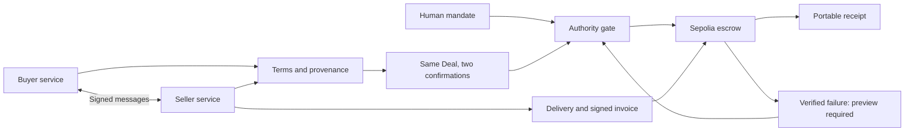

# accord lock

**English task workspace:** Run `pnpm install --frozen-lockfile` and `pnpm ade:spending:view`, then open [Accord Lock](http://127.0.0.1:3440/#workspace). Upload a CSV/JSON table, request and negotiate offers, approve escrow, run a local data worker, inspect the result and invoice, then pay or refund. Tasks and transaction receipts persist on this computer. [Workspace guide and three-minute walkthrough](docs/ACCORD-LOCK-WORKSPACE.en.md).

**Demo assist** provides optional presenter prompts inside the same usable workspace. Every stage advances through your actions. The new workspace uses deterministic local workers and a private EVM with test funds. The historical Sepolia evidence and the separate DealTrace V2 implementation below remain available; they are not the workspace's current transactions. Static hosting alone cannot run the workspace service, and pushing this source does not update previously published Vercel sites or videos.


### An agent can stay under budget and still pay the wrong bill.

**DealTrace turns negotiated agent work into a mutually signed deal, pays only when delivery and billing match that deal within human authority, and preserves the evidence behind every outcome.**

An operator allows **40 DEMO**. Two agents agree on **26**. The seller sends a signed invoice for **31**.

A budget check passes. **DealTrace stops the payment.**

The missing control is the agreement itself: what work was promised, at what price, by when, with which evidence—and who confirmed it.

**The stronger V2 demonstration bypasses our server entirely.** A seller and an intentionally permissive evaluator both sign the excessive invoice. The contract still rejects 31 against the bilaterally committed 26. It also carries a failed delivery into the next order as an on-chain preview requirement. [V2 design, attacks and trust boundary](docs/DEALTRACE-VAULT-V2.en.md).

**Observed V2 proof:** 14 Sepolia transactions, three deliberate on-chain rejections, **83 independent finalized checks passed**, and an exact source/bytecode match on [Sourcify](https://repo.sourcify.dev/11155111/0x3df2bFc764488Dd6AE85f98774255359b0520048). [One-page V2 brief](output/pdf/DealTrace-V2-upgrade.ko.pdf) · [Finalized verification](artifacts/dealtrace/vault/runs/ade00002-2960-4000-8000-202609290001/finalized-verification.json).

[Watch the 3-minute demo](artifacts/dealtrace/film-v3/dealtrace-3min.ko.webm) · [One-page brief](output/pdf/DealTrace-brief.ko.pdf) · [Public proof](docs/DEALTRACE-PUBLIC-PROOF.ko.md) · [Try it](#try-it)

The video and brief have Korean narration text. This README is the English overview for GWDC Challenge B.

## The first customer and the smallest useful job

A small research automation team delegates document-processing work to an external worker agent. The job changes from order to order: which documents, which metric, how much source evidence, and how quickly the result is needed. The operator cannot supervise every exchange, but remains accountable for the bill.

Our first workflow is specific: **extract four quarterly actual facility-investment values from designated official documents, attach the original document/page/table evidence, and return usable JSON.** The buyer pays for completing that job under agreed conditions.

The fixed sample can also be processed locally for free. Paid outsourcing demand is a customer hypothesis, not a result of this demo. The wedge is accountable delegation when a team already uses external capacity and variable job requirements.

## Watch one deal become enforceable

| Moment | What happens | What you can inspect |
|---|---|---|
| **Negotiate** | Seller asks 30, Buyer counters 25, Seller offers 26; delivery changes from 10 to 5 minutes | Real Kiln messages, revisions, and the exact message behind each final field |
| **Commit** | Buyer and Seller review the complete Deal and sign the same version | Two role signatures bound to the Deal, source profile and human mandate |
| **Stop** | A genuine seller signature requests 31, still below the 40 allowance | Exact-price mismatch; 26 stays in escrow; no extra funding or payout |
| **Correct and pay** | Valid delivery plus a new signed invoice for 26 satisfies the agreement | One Sepolia payout, a four-row result, and an exportable audit receipt |

The second loop matters too: an intentionally incorrect delivery is refunded. A company-and-seller `REQUIRE_PREVIEW` rule then blocks the next order—even under a new mandate—until a sample is verified. A past outcome changes a future permission.

**Three primitives:** conversation → confirmed deal; deal → traceable evidence; verified outcome → future permission.

## Why this is more than a chat log or a wallet limit

A chat log preserves what agents said. A budget limit caps how much they can spend. DealTrace connects the changing terms in between to the actual execution:

- **Every term has a source.** Click the price or deadline to return to the original message, rather than generating a retrospective explanation.
- **Agreement and authority are separate.** Two agents can agree to something the human never authorized; that agreement still cannot fund.
- **Delivery and billing are separate.** A valid result alone cannot release money, and a correctly signed invoice cannot change the agreed total.
- **The receipt can leave the application.** Another process can check the messages, signatures, authorization, delivery, claims and finalized chain result without the app database or secret keys.

In the audit appendix, **change a receipt copy's price and verify it** to see `INVALID / DEAL_HASH_MISMATCH`. This runs the real verifier on an in-memory copy; it makes no model call or transaction and preserves the exported original. An offline integrity check does not independently confirm settlement finality.

Our longer-term thesis is an integration layer for teams whose agents buy variable digital work. The reusable asset would be a consistent model of terms, provenance, execution and outcome-driven controls across providers. That is a product hypothesis—not a claim of market leadership, traction or a proven moat.

## Kiln powers the conversation; code controls the money

The workflow uses Bricksum's Kiln API with **`qwen3-32b`**, following this project's updated model choice. The model generates outward negotiation and proposes the meaning of incoming messages. Its responses affect the price, deadline and semantic-conflict record.

Code owns units, evidence spans, signatures, authority, budget reservations, exact billing, supported delivery validation, duplicate prevention and settlement. Models receive **no financial signing key or payment tool**.

This makes efficient inference a service-design question: spend tokens where language varies, then reuse the structured evidence. Fixed approved openings, signatures, price matching, budget arithmetic, settlement, receipt verification and completed-run resume require no additional inference. A live workflow has a ten-call cap.

| Actual public flow | Calls | Input tokens | Output tokens |
|---|---:|---:|---:|
| Seller A negotiation | 2 | 954 | 164 |
| Buyer negotiation | 2 | 1,079 | 121 |
| Seller B conflicting offer | 1 | 402 | 184 |
| Message-to-terms interpretation | 5 | 5,910 | 3,259 |
| **Total** | **10** | **8,345** | **3,728** |

**12,073 tokens**, with individual attempts and latency retained. Hardware energy was not measured. With 56.772 seconds of summed API latency, assumed attributable power of 25/50/100 W gives 0.39425/0.7885/1.577 Wh. Queue time, networking, batching and utilization are unknown. These are assumptions, not a measured NPU/GPU comparison.

A separate authored eight-case expression test scored Qwen **7/8**, versus **8/8** for an explicit deterministic baseline using zero calls. In a second frozen comparison of eight turns across two conversations, rules passed **8/8**, incremental interpretation **7/8** (12,669 tokens), and full-transcript input **3/8** (15,358 tokens) on exact changes, accumulated state and provenance. Both model arms made eight calls; failed attempts remain counted. Full-transcript input still emitted only the newest patch, not a complete re-extraction. These small authored tests support a bounded design choice, not general AI superiority or a universal savings claim. [Comparison protocol and results](docs/DEALTRACE-CONTEXT-COMPARISON.en.md).

A subsequent **true full re-extraction** returned all event interpretations at every turn: **4/8**, eight calls and **18,984 tokens**, including every failed attempt. It used the unchanged dataset and was designed after the first comparison, so it is follow-up evidence, not a new held-out test. The measured difference supports keeping inference incremental for this workflow; code and bilateral review still determine whether a proposed interpretation can become executable.

## Blockchain carries the money and the commitment



The chain **locks**, **releases** and **refunds** test assets against a Deal hash and stores the settlement evidence commitment. The workflow reads canonical transactions, receipts, funding-block timestamps and final escrow state. Both parties get a shared record of where the money ended up.

The Deal binds the source-manifest hash, validator profile, all-in price, recipient, chain, contract, asset conversion and deadline rule. Delivery time starts at the actual funding block. An off-chain controller still decides whether delivery passes; the chain does not certify language meaning or arbitrary factual truth.

Buyer and Seller use separate HTTP processes, keys and durable stores, but all demo roles share one operator. This is process separation, not external business-identity verification. No A2A, AP2 or ERC-8183 interoperability is claimed.

### V2: a compromised submitter cannot change the agreed price

The separate **DealTraceVault** contract verifies buyer-signed EIP-712 mandates, both agents' execution signatures, the allowed seller, atomic session allocation, full delivery window, exact invoice amount/payee and evaluator approval. Domain separation, one-use mandate nonces and terminal escrow states reject replay. A delivery-mismatch refund creates a buyer–seller preview requirement that a new mandate cannot erase.

Settlement credits and withdrawal are separate events. A receiver that rejects ETH cannot block the settlement decision; the beneficiary can redirect its withdrawal. Anyone can finalize an expired escrow to the fixed buyer. No administrator can sweep principal or edit the contract.

The evaluator still decides whether the supported delivery is correct. It can approve bad work at the agreed price; it cannot increase that price or redirect the recipient. V2 does not claim trustless semantic judgment. Its authored-dialogue chain experiment adds **zero model calls**; the actual Kiln conversation evidence above remains a separate, preserved V1 run. [Threat model, exact signed fields, recovery and version differences](docs/DEALTRACE-VAULT-V2.en.md).

## Evidence you can follow

Public run **`34d1da0d-e842-4f44-acfd-4d97728c81f0`** passed **17/17 workflow checks** and made four real Sepolia transactions: two fundings, one payout, one refund. Five exported receipts passed independent finalized verification.

- [Successful payout](https://sepolia.etherscan.io/tx/0xd321f5ff9b4852aeafea3403142faa9943c3024f807980680a77c27d377cc2fd)
- [Incorrect-delivery refund](https://sepolia.etherscan.io/tx/0x9d79a27fdaa7c56f349b688a52c051a105dc8515d7af8abffff410c4e78d3613)
- [Workflow and recorded stops](artifacts/dealtrace/runs/34d1da0d-e842-4f44-acfd-4d97728c81f0/report.json)
- [Independent finalized verification](artifacts/dealtrace/runs/34d1da0d-e842-4f44-acfd-4d97728c81f0/independent-verification.json)
- [Valid, altered and incomplete portable receipts](artifacts/dealtrace/runs/34d1da0d-e842-4f44-acfd-4d97728c81f0/portable-verifier-cases)
- [Resume without additional payment or inference](artifacts/dealtrace/runs/34d1da0d-e842-4f44-acfd-4d97728c81f0/resume-proof.json)

The filmed version passed **129/129 tests**; the integrated V1 suite reached **139/139**. V2 adds EVM signature/replay/budget attacks, ERC-1271 receivers, reentrancy, sponsored withdrawal, a full conversation-to-vault tamper test and a pre-finality classification regression: **153/153 pass**. These versions remain distinct: [current tests](artifacts/deal-escrow/tests.json), [presentation tests](artifacts/dealtrace/integration/pre-merge-tests.json), [integration audit](docs/DEALTRACE-COMPLETION-AUDIT.en.md).

The film is a 180-second, silent edit of real saved-run screenshots, not live transaction footage. Prices, excess billing and incorrect delivery are controlled scenarios. The expiry test injects policy time; it is not a real-time wait.

## Try it

Node 24+:

```sh
pnpm install --frozen-lockfile
pnpm dealtrace:demo       # Authored dialogue; real local EVM; no API key
pnpm dealtrace:start      # Open http://127.0.0.1:3420/
pnpm ade:test
```

The screen replays saved evidence. New runs require explicit approval. Stop revokes active authority; already signed transactions must still be reconciled.

For actual inference, configure ignored `.env.local` with `KILN_API_KEY`, `KILN_MODEL=qwen3-32b` and optional `KILN_BASE_URL`, then run `pnpm dealtrace:demo --live`. Credentials and financial keys are never committed.

Public execution needs an already provisioned Sepolia-only directory, `DEALTRACE_SEPOLIA_DIR` and `SEPOLIA_RPC_URL`; run `pnpm dealtrace:demo --live --sepolia`. Bound operator gas separately with `DEALTRACE_MAX_GAS_WEI` (the retained run used 400000000000000 wei per operation). Do not share its signer with another running process. Resume requires the same execution source, mode and directory; never make a fresh payment because observation timed out.

```sh
pnpm dealtrace:verify:public
pnpm dealtrace:verify:receipt path/to/exported-receipt.json
```

The standalone verifier pins `artifacts/dealtrace/trusted-deployment.json` and reads finalized Sepolia state. It needs no app DB, agent key or model credential. Exit 0 = VALID, 1 = INVALID, 2 = INCOMPLETE. An offline check cannot certify a chain settlement.

For the separate V2 execution module:

```sh
pnpm dealtrace:vault:compile
pnpm dealtrace:vault:demo       # Real local EVM, three deliberately reverted attacks
pnpm dealtrace:vault:verify     # Independent finalized public-proof verification
# In the running workbench: http://127.0.0.1:3420/vault.html
```

## Challenge B acceptance map

| Requirement | Demonstration |
|---|---|
| Function and user need | One document-processing job with a usable result |
| Boundaries and stopping | Exact-price mismatch, missing preview, revoked authority and expired mandate; recorded reasons and no prohibited payment |
| Kiln and efficiency | Actual messages and interpretations, per-flow tokens, bounded inference, explicit energy assumptions |
| Blockchain | Deal-linked funding, payout and refund hashes, independently verified against finalized state |
| Human approval and evidence | Approval, observation, stop and export UI; original messages through settlement in one receipt |

## What is ready, and what still needs people

This is an end-to-end **testnet prototype for supported documents and registered demo providers**. V1 trusts its controller; V2 puts defined authorization and billing checks on-chain while retaining a selected delivery evaluator. Both trust pinned source annotations and locally registered identities. DEMO is a test accounting unit, not USD or a newly issued token; gas is a separate operator expense.

Customer demand, independent first-time-user comprehension, external supplier identity, production custody and hardware energy savings are not established. The planned three-person comprehension test needs real responses; automated browser checks are not a substitute. Production also needs organizational key management, provider onboarding, evidence retention and payment operations.

[Architecture](docs/DEALTRACE.ko.md) · [Final scope](docs/DEALTRACE-FINAL-PLAN.ko.md) · [Completion audit](docs/DEALTRACE-COMPLETION-AUDIT.en.md) · [Preserved escrow and research modes](README.legacy-escrow.md)

**What the agents agreed should determine what the money can do—and every payment should carry the evidence that explains it.**
