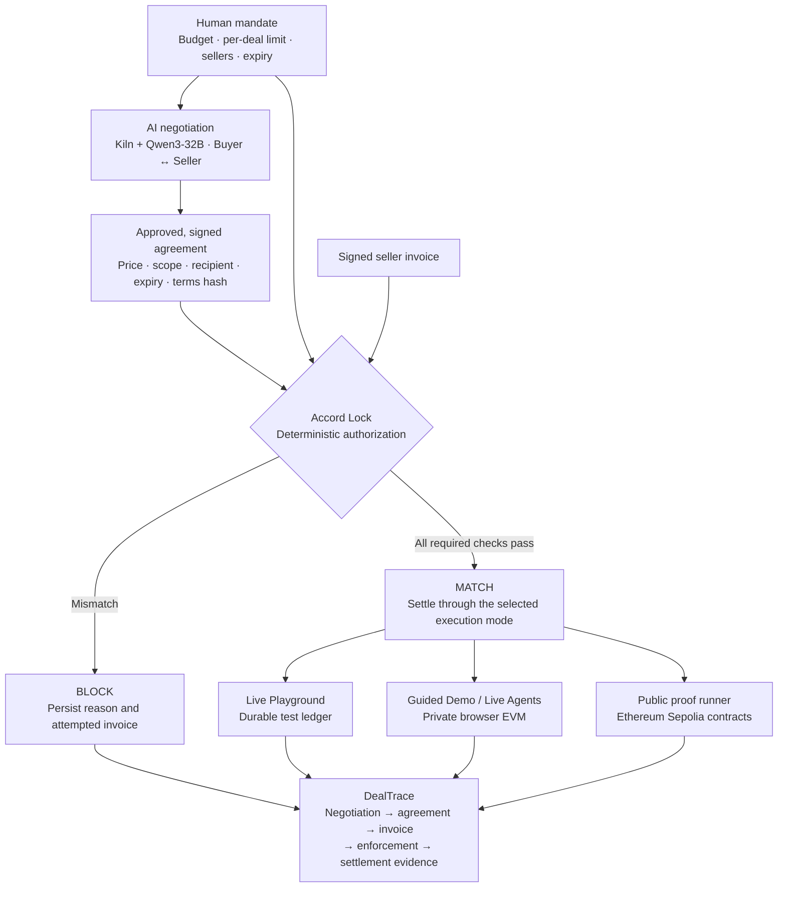

# Accord Lock

### The agreement decides what gets paid.

**AI agents can negotiate a deal. Accord Lock makes sure they can only pay for that deal.**

Accord Lock is the **agreement-aware authorization layer for agentic commerce**. It binds payment to approved, signed terms; DealTrace makes the path from negotiation to settlement inspectable.

```text
Human budget          Buyer ↔ Seller agreement          Seller invoice
    $40                         $20                           $25
                                                               │
                         Budget check:  $25 < $40   → PASS      │
                         Accord Lock:   $25 ≠ $20   → BLOCK ◀───┘

                         Correct invoice: $20       → PAY
```

**A spending budget does not authorize a seller to rewrite an agreed price.**

[**Live Demo**](https://agent-spending-firewall.vercel.app/#home) · [**233/233 recorded tests**](artifacts/deal-escrow/tests.json) · [**640 randomized cases**](GENERALIZATION-VALIDATION.md) · [**Kiln / Qwen**](docs/ACCORD-LIVE-VALIDATION.en.md) · [**Sepolia proof**](https://agent-spending-firewall.vercel.app/#evidence)

[Watch the 165-second demo](artifacts/accord-lock/submission/accord-lock-track-b-165s.ko.mp4) · [8-page pitch deck](output/pdf/accord-lock-track-b.pdf) · [Try Live Playground](https://agent-spending-firewall.vercel.app/#playground) · [GitHub](https://github.com/him55710-sudo/Furiosa-x-bricksum)

## Why now — agentic commerce is becoming real

Agents are moving from recommending purchases to initiating them. The infrastructure is already taking shape:

| Milestone | What changed |
| --- | --- |
| **September 2025 · OpenAI + Stripe** | Launched Instant Checkout in ChatGPT and the Agentic Commerce Protocol, connecting agents, buyers and merchants. [Announcement](https://openai.com/index/buy-it-in-chatgpt/) |
| **March 2026 · Mastercard in Korea** | Announced Korea's first live, authenticated agentic transaction: an AI agent searched, booked and paid for a ride from Incheon Airport to a hotel in Gwanghwamun. [Announcement](https://newsroom.mastercard.com/news/ap/en/newsroom/press-releases/en/2026/mastercard-completes-korea-s-first-live-agentic-transactions-unlocking-trusted-ai-powered-commerce/) |
| **April 2026 · Stripe** | Launched Link wallets for agents, with payment approvals and one-time-use payment credentials. [Announcement](https://stripe.com/newsroom/news/sessions-2026) |
| **June 2026 · Mastercard** | Launched Agent Pay for Machines, with more than 30 initial ecosystem participants including Adyen, Coinbase, Stripe and Cloudflare. [Announcement](https://www.mastercard.com/us/en/news-and-trends/press/2026/june/mastercard-launches-agent-pay-for-machines.html) |

Our thesis: as agents negotiate and submit invoices, applications need to preserve the agreement all the way to payment. **“Can this agent spend up to $40?” and “Did we agree to pay this seller $25?” are different authorization questions.**

These payment systems already provide controls, including amount- and merchant-bound authorization. Accord Lock focuses on enforcing the negotiated agreement across proposal, invoice and settlement. The announcements establish the market context; integrations with those networks are future work.

## Commercial Potential

Accord Lock is designed to become the **agreement-aware authorization layer between AI agents and payment infrastructure**.

### Initial users

Our initial target is teams beginning to delegate purchasing authority to AI agents:

- AI procurement and sourcing systems
- Research and data-purchasing agents
- API and cloud-resource purchasing agents
- Enterprise workflow agents
- Machine-to-machine commerce systems

As agents receive more autonomy, teams face a trade-off: **increase agent autonomy and accept more transaction risk, or keep humans in the approval loop.**

Accord Lock is designed to make greater autonomy possible without removing deterministic control over payment.

### Initial wedge: one API at the payment boundary

Accord Lock can sit between an existing agent workflow and its payment or settlement layer.

**Human mandate → Negotiated agreement → Seller invoice → Accord Lock → PAY / BLOCK**

Developers do not need to replace their models, wallets, or negotiation infrastructure. Accord Lock adds agreement-aware authorization at the point where an agent attempts to move money.

### Path to market

**Today — Authorization API**  
For AI-agent developers and autonomous procurement workflows.

**Next — Infrastructure integrations**  
Agent wallets, payment providers, procurement platforms, and enterprise agent infrastructure.

**Long term — Agreement infrastructure for agent-to-agent commerce**  
As autonomous agents increasingly negotiate and transact with other agents, Accord Lock can provide a common enforcement layer connecting agreements to payments.

We are not building another marketplace or payment network.

**AI negotiates. Accord Lock decides whether the money moves.**


## The missing control layer

**Budget control answers how much an agent may spend. Agreement control answers what it may pay for, to whom, and on which terms.**

The difficult boundary is between changing model-generated proposals and an immutable payment commitment. A valid seller signature alone cannot make a changed price valid. An invoice that fits the budget can still name the wrong recipient, currency, scope or deal.

Accord Lock checks both human authority and the signed agreement at the payment boundary. A mismatch produces a recorded stop with a specific reason. Correcting the invoice requires another check; an earlier approval is never a reusable permission to pay anything.

## How Accord Lock works

1. **Delegate.** The human sets the budget, per-deal limit, allowed sellers and expiry.
2. **Negotiate.** Buyer and Seller agents propose prices and delivery terms through Kiln. Deterministic validation rejects out-of-policy proposals.
3. **Lock the agreement.** Approved terms become a mutually signed commitment with a canonical hash.
4. **Enforce.** The seller submits a signed invoice. Code checks authority, signatures and agreement fields before authorizing payment.
5. **Settle and reconstruct.** The selected execution mode records a permitted payment or a blocked attempt. DealTrace preserves the evidence needed to inspect that decision.

The procurement implementation applies this to source-linked quarterly CAPEX data: agree on work, check delivery, reject an overcharge and pay the agreed amount.

## Architecture



These are separate execution paths. The Playground checks explicit currency and scope fields in its signed envelope; the EVM paths enforce their contract-specific signed terms and settlement rules. [Product workflow](docs/PRODUCT-WORKFLOW.en.md) · [Playground architecture](docs/LIVE-PLAYGROUND.en.md) · [Contract implementation](contracts/DealTraceVault.sol)

## Design principle

### Kiln where language matters. Code where money moves.

**Negotiation is probabilistic. Authorization must not be.**

| AI proposes | Deterministic code enforces |
| --- | --- |
| Offers, counteroffers and seller responses | Budget, per-deal limit and seller allowlist |
| Natural-language negotiation and task guidance | Active authority, expiry and revocation rules |
| Candidate prices and delivery terms | Signed agreement, invoice signature, exact amount and recipient |
| A preferred seller and proposed invoice | Currency and structured scope in the Playground; committed terms in EVM execution |
| Explanations of a proposal | Deal hash, settlement state and duplicate-payment prevention |

Model text has no independent payment authority. The [standalone Playground enforcement function](src/accord/playground-enforcement.mjs) has no model dependency; settlement rechecks its conditions. The [EVM vault](contracts/DealTraceVault.sol) verifies signed authority and deal commitments before funding, then enforces the matching claim at release.

## Technical stack

**Qwen negotiates. Solidity enforces the EVM payment path. DealTrace preserves the proof.**

| Layer | Technology | Purpose |
| --- | --- | --- |
| Agent reasoning | **Bricksum Kiln + Qwen3-32B** | Actual Buyer/Seller inference and negotiation |
| Policy engine | **Deterministic JavaScript + Solidity** | Enforce authority and agreement checks at execution boundaries |
| Cryptographic commitment | **Signed envelopes; EIP-712 on EVM** | Bind identities and payment claims to approved terms |
| Smart contracts | **Solidity 0.8.30 + OpenZeppelin** | Escrow, signature verification, settlement and withdrawal |
| Blockchain | **Private EVM + Ethereum Sepolia** | Interactive test execution and public transaction evidence |
| Blockchain client | **ethers.js 6** | Sign typed data, call contracts and verify receipts |
| Frontend | **React 19 + TypeScript + Vite; browser JavaScript modules** | Product interfaces and interactive negotiation/payment views |
| Backend | **Node.js 24 + Express 5** | Agent orchestration, APIs and local services |
| Evidence | **DealTrace** | Reconstruct signed terms, invoices, decisions and settlement |
| Verification | **Node tests + Playwright + Ganache + GitHub Actions** | Contract, policy, browser and adversarial regression coverage |
| Hosting and persistence | **Vercel + private Vercel Blob; SQLite / browser storage by mode** | Hosted sessions, local execution and retained evidence |

## Built, not mocked

The strongest claims below link to recorded executions. Test suites, live inference cohorts and public-chain proofs are reported separately.

| Validation | Recorded result | Evidence |
| --- | --- | --- |
| Integrated verification | **233 / 233 PASS** | [Committed test report](artifacts/deal-escrow/tests.json) · [Current CI](https://github.com/him55710-sudo/Furiosa-x-bricksum/actions/workflows/verify-system.yml) |
| Varied live negotiation | **20 primary cases · 46 actual Kiln calls** | [Cohort index and usage](artifacts/accord-lock/varied-live/index.json) |
| Financial checks using those signed agreements | **20 / 20 cases · 139 checks · 0 unauthorized settlements** | [Private-EVM financial report](artifacts/accord-lock/varied-live/466ad9f1-9d0b-48ef-921a-46b4e07fbfcf/financial.json) |
| Randomized financial scenarios | **640 cases · 16 classes · 2,985 checks** | [Generalization validation](GENERALIZATION-VALIDATION.md) |
| Canonical public proof | **5 actual Kiln calls · 5 Sepolia transactions** | [Execution report](artifacts/dealtrace/procurement/runs/fa5e107c-7a20-4a6d-9970-5f15e8d4f6e9/report.json) · [Usage audit](artifacts/dealtrace/procurement/usage-audit.json) |
| Adversarial signed invoice | **25 REVERTED** | [Mined Sepolia transaction](https://sepolia.etherscan.io/tx/0x255d855d5e19779fdc0fd12a02c924db0bb1980561fbc3dea98df230135e4e59) |
| Correct agreement payment | **20 SETTLED and withdrawn** | [Settlement](https://sepolia.etherscan.io/tx/0x00b1e35d51542daceacd191caabf6fd0e77b740ecb45eab0b4daa15965ecce2f) · [Withdrawal](https://sepolia.etherscan.io/tx/0x6a322e82f24b1fd1b3c2d40f2215ead29c9b0c4d1899b1bb6f87cecaf95cb7cc) |
| Finalized public-proof verification | **47 checks · VALID** | [Verification report](artifacts/dealtrace/procurement/runs/fa5e107c-7a20-4a6d-9970-5f15e8d4f6e9/finalized-verification.json) |
| Separate token-efficiency experiment | **20.57% fewer total tokens** | [Three-run cohort comparison](docs/ACCORD-ACCEPTANCE-READINESS.en.md#final-measured-decision) |

The public proof follows **three sellers → five calls → 22 negotiated to 20 → signed 25 invoice rejected → 20 settled → seller withdrawal**. It is a recorded execution, available for inspection from the Evidence screen.

The 20-case live cohort produced nine operator-approved agreements and nine legitimate payments; failed negotiations remain in the evidence. The **20/20** result measures financial checks, not autonomous negotiation success. The **233/233** figure is the committed regression snapshot, not a claim that every later source revision was rerun under that report. [Live validation details](docs/ACCORD-LIVE-VALIDATION.en.md)

## Live Playground

[**Open the Playground**](https://agent-spending-firewall.vercel.app/#playground) to run real Kiln / Qwen negotiation between a Buyer and three Seller test agents: Atlas, Nexus and Orbit.

Enter a task, budget, currency and limits. Inspect actual offers and counteroffers, approve an eligible agreement, request a seller invoice and watch the policy decision. A permitted payment settles once in the durable test ledger; its signed DealTrace evidence can be inspected and exported. Prices and outcomes come from inference, so a seller persona does not guarantee an overcharge or a successful negotiation.

| Experience | What executes | Start here |
| --- | --- | --- |
| **Guided Demo** | Deterministic conversation and private browser EVM; reproduce the 25-blocked / 20-paid example | [Presentation](https://agent-spending-firewall.vercel.app/#presentation) |
| **Live Playground** | Actual Kiln Buyer/Seller inference, signed terms, deterministic policy and a durable test ledger | [Playground](https://agent-spending-firewall.vercel.app/#playground) |
| **Live Agents** | Actual Kiln proposals imported into the existing signed-agreement / private browser-EVM workflow | [Operator workflow](https://agent-spending-firewall.vercel.app/#live) |
| **Public Proof** | Replay and inspect the recorded Kiln + Sepolia execution | [Evidence](https://agent-spending-firewall.vercel.app/#evidence) |

In the existing EVM workspace, **STOP AGENT** revokes future local commitments for that task while preserving already funded work on its original terms. In the Playground, stopping disables further inference and payment for the session. [Execution details and recorded Playground results](docs/LIVE-PLAYGROUND.en.md)

## DealTrace — explain why a payment was allowed or blocked

A payment receipt alone cannot explain whether an invoice matched a negotiation. DealTrace connects the relevant evidence:

**Human mandate → model messages and usage → signed agreement → delivery evidence where applicable → signed invoice → enforcement decision → settlement receipt.**

The Playground retains canonical hashes, chained events, signatures, rejected attempts and settlement records; its verifier recomputes recorded policy decisions. The public proof additionally binds evidence to contract calls, finalized receipts and the seller's withdrawal. Conversation/incident exports and EVM receipt verification remain separate, accessible views.

[Inspect a settled local receipt](artifacts/accord-lock/submission/run2-receipt.json) · [Inspect two distinct blocked demo tasks](artifacts/accord-lock/submission/track-b-runs.json) · [Inspect pre-inference boundary stops](artifacts/dealtrace/procurement/boundaries/report.json)

## Run locally

Requires **Node.js 24+** and **pnpm 11** (`package.json` pins pnpm 11.19.0).

```sh
pnpm install --frozen-lockfile
pnpm ade:spending:view
# Open http://127.0.0.1:3440 — deterministic local workspace / private EVM
```

To run the Live Playground, configure the ignored `.env.local` with `KILN_API_KEY` and `KILN_MODEL=qwen3-32b`, then use a separate terminal:

```sh
pnpm ade:hosted:build
node --env-file=.env.local scripts/start-playground.mjs
# Open http://127.0.0.1:3451/#playground — actual inference / test ledger
```

Live actions consume actual model API usage. Inspecting committed evidence and running the deterministic workspace need no Kiln key.

```sh
pnpm ade:test              # Integrated regression suite
pnpm ade:hosted:build      # Build the deployable client
pnpm dealtrace:boundaries  # Seller, all-in budget and expiry stops
```

The browser integration test builds an isolated hosted fixture; a fresh checkout needs no existing `dist-vercel` or historical test report. CI builds the deployable client again after tests. Source pushes do not automatically publish the manually managed Vercel project.

## Scope & limitations

- **Test assets and units.** The hero's dollar amounts illustrate the rule; they are not fixed limits, real USD or product pricing. The existing browser EVM displays test USD with one displayed dollar per local gwei. The public proof uses DEMO accounting units of 100 Sepolia gwei each. Playground currencies label integer minor-unit test balances with no FX conversion. None represents cash, a USD deposit or a stablecoin claim; operator gas is separate.
- **Execution provenance.** The Evidence screen shows historical Kiln and Sepolia records, not fresh calls or transactions from the current browser task. Guided Demo is deterministic. Playground inference and enforcement are real, but settlement is a test ledger, not an external purchase or blockchain transaction. Its live evidence did not observe a model-generated mismatched invoice; injected regression cases verify that rejection path.
- **Trust and semantics.** Signing identities are operator-owned test identities. The browser controller, identity registry and public delivery evaluator are trusted. Signatures bind approved bytes; they do not prove source truth or independent commercial identity. Both negotiating roles use the same model family and can misunderstand the same terms. Structured scope is checked; arbitrary natural-language preferences are not a general delivery validator.
- **Measured performance.** The canonical public run used 7,890 tokens and 64.056 seconds of API latency. The 20.57% token reduction came from a separate three-run-per-cohort capability-prefilter experiment with a 1,200-token output ceiling and 160-character message limit. It is a small-sample token observation, not a causal estimate isolated from model variance. Failures are retained. NPU wattage, occupancy and datacenter PUE were not measured; any energy estimate uses assumed allocated watts × observed API duration. No measured NPU energy savings are claimed.
- **Product readiness.** CAPEX processing is a concrete integration example; the procurement schema remains narrow. Customer demand and independent supplier operations are unvalidated. External-agent authentication, production custody, real payment integrations and an independent security audit remain future work.

## Detailed technical docs

| Document | Read it for |
| --- | --- |
| [Product workflow](docs/PRODUCT-WORKFLOW.en.md) | Human control, conversation, incidents and execution modes |
| [Live Playground](docs/LIVE-PLAYGROUND.en.md) | API, enforcement boundary, persistence and live-run evidence |
| [Live validation](docs/ACCORD-LIVE-VALIDATION.en.md) | Actual inference cohorts, failures and financial replay |
| [Generalization validation](GENERALIZATION-VALIDATION.md) | 640 financial cases, context experiments and external seller work |
| [Acceptance evidence](docs/ACCORD-ACCEPTANCE-READINESS.en.md) | Boundary stops, stop semantics and token-efficiency cohorts |
| [Technical README](README.technical.md) | Implementation details and historical scenarios |
| [Track B submission guide](docs/TRACK-B-SUBMISSION.ko.md) | Submission materials and judging path |
