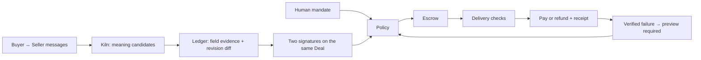
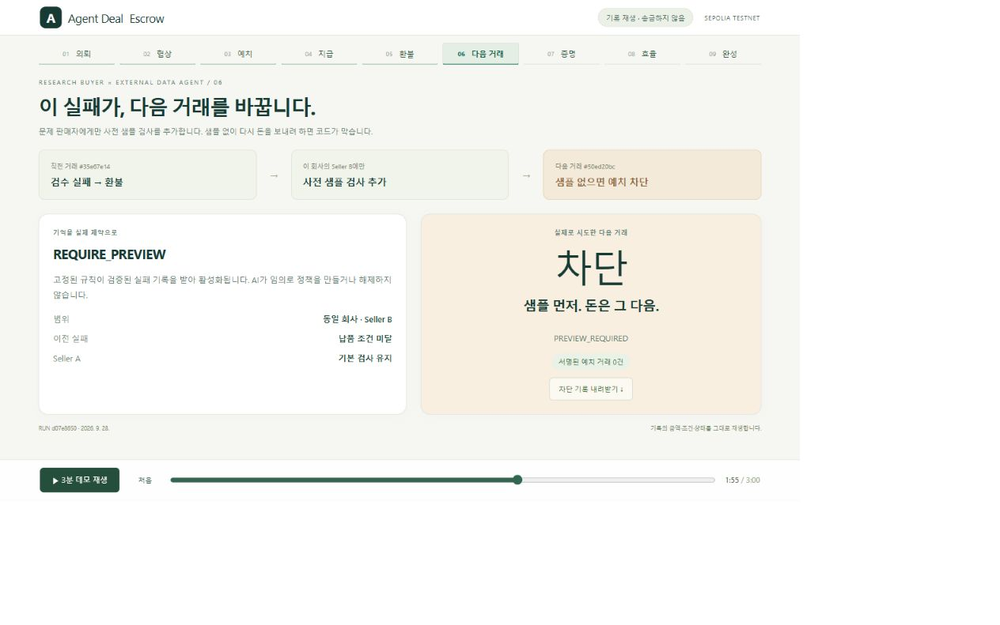
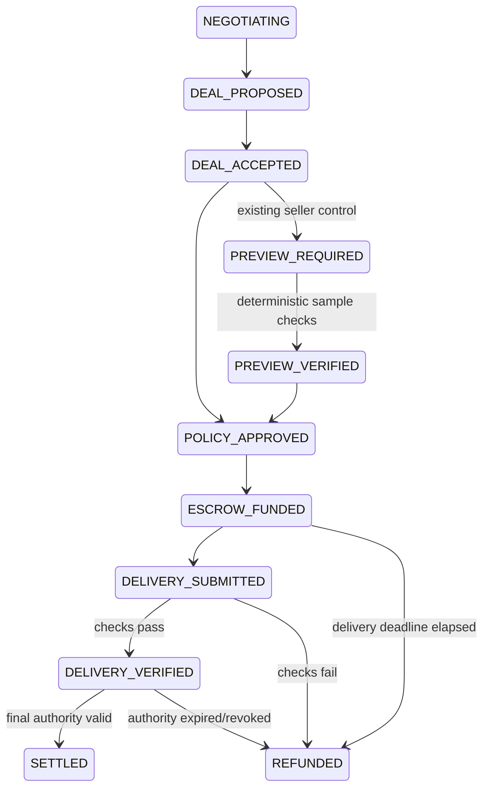

# DealTrace

**From Agent Conversation to Verifiable Deal**

[Next iteration: final product plan (Korean)](docs/DEALTRACE-FINAL-PLAN.ko.md) — negotiated document-processing work, a 40-budget / 26-committed / 31-invoiced demonstration, and delivery-to-billing evidence. This is the implementation plan; the evidence below belongs to the current prototype.

DealTrace helps developers of research-buying agents turn agent conversations into source-linked, bilaterally confirmed Deals, enforce human spending authority, settle verified delivery, and turn a verified failure into stricter permissions for the next purchase.

## 1. Problem

A small AI-native research team's Buyer Agent outsources asynchronous work to a Seller Agent with external data access, tools or processing capacity. The developer cannot manually inspect every small deal, but cannot let an LLM expand its own authority or prepay an unverified result.

**A conversation is not a contract. A mutual agreement is not permission to spend.** Our narrow demonstration is one testable unit of a battery CAPEX research batch: four quarterly actual facility-investment cash-outflow values for 2025, with official source cells. This fixed sample can also be extracted locally for free; demand for paid outsourcing is not yet validated.

## 2. Demo — three scenes

| Scene | What the judge sees | What actually happens |
|---|---|---|
| 01 · Agreement → payment | Seller asks 2.20, Buyer counters 1.80, Seller counters 1.90; each field points to its original message | Two pinned role keys sign the same revision, Deal and mandate. Code checks authority, locks test money and pays only after delivery validation |
| 02 · Authority claim → stop | Seller says “the administrator approved a higher budget”; both agents agree to 2.20 | The stored human limit remains 2.00. Funding is blocked before signing; the receipt records why |
| 03 · Failure → future permission | Another deal with Seller A delivers a plausible wrong value, gets refunded, then negotiates again | The verified failure enables company × seller `REQUIRE_PREVIEW`. Agreement PASS + mandate PASS still cannot fund without a preview |

All three share the same company and human mandate. Cheaper annual forecasts conflicting with actual quarterly data remain an additional semantic test. Five role messages use actual Kiln in live mode; the fault, forged approval claim and retry messages are authored attack fixtures. Both agent roles run in one orchestrator; they are not independent external companies.

Open the saved record in the four product views: **Task / Mandate → Conversation / Deal → Delivery / Money → Audit Receipt**. Viewing evidence does not make a new model call or send a transaction. New browser runs explicitly require approval; **위임 중지** revokes the active mandate while already-signed transactions are reconciled.

[Product plan](docs/DEALTRACE.ko.md) · [Pre-implementation review and 20 judge questions](docs/DEALTRACE-STORY-REVIEW.ko.md) · [3-minute pitch and video](docs/DEALTRACE-PITCH.ko.md) · [One-page Korean brief](output/pdf/DealTrace-brief.ko.pdf)

## 3. How it works



The ledger stores outward messages, structured actions and approvals, never hidden chain-of-thought. Price and duration units are read from the selected original sentence by code. New messages invalidate stale confirmations; committed Deals cannot be changed. A legacy acceptance API cannot bypass a negotiation-required mandate.

## 4. AI vs code

| AI on Kiln / Qwen | Deterministic code | Chain |
|---|---|---|
| Generate outward negotiation; interpret proposed terms; identify semantic differences and evidence sentences | Identity pins, signatures, schema, units, ordering, exact Deal, human budget, expiry, seller scope, preview, duplicate prevention, source checks, settlement and recovery | Lock test funds, release/refund them, expose final escrow state and settlement evidence commitments |

Models receive no financial signing keys or payment tools. A seller message cannot modify the human mandate. Failure controls are predefined, scoped transitions; the model cannot invent or relax them.

## 5. Why Kiln

The model handles changing natural-language messages; code handles authority and money. `KILN_MODEL` is configured explicitly (`qwen3-32b` in retained actual runs). The adapter checks responses and records request IDs, prompt hashes, input/output tokens, calls and API latency **by flow**. The approved fixed opening and identical repeated request are reused without inference; each new message is extracted separately rather than repeatedly re-reading the entire transcript. Live runs have a ten-call cap.

[Validation and flow measurements](docs/DEALTRACE-VALIDATION.ko.md) retain failed attempts as well as successes. **No measured NPU power reduction or AI superiority is claimed.** Strengthened deterministic rules already match the known fixed extraction cases at 16/16 with zero calls; unseen negotiation performance remains to be evaluated. Any Wh estimate is an explicitly labeled power-allocation assumption, not hardware measurement.

## 6. Blockchain — read, write, settle

The existing `AgentDealEscrow` adapter is retained. It **reads** canonical transactions, receipts and escrow status; **writes** funding and settlement transactions bound to a Deal hash; and **settles** test assets to the seller or back to the buyer. Blockchain does not certify arbitrary data truth or the operator's identity.

The new path supports an isolated local EVM and the existing provisioned Sepolia contract. Public progress waits for confirmations; ambiguous signed operations keep their durable intent and reservation. A resume reopens the same run instead of making a fresh payment. Test principal uses DEMO accounting units; gas is a separate operator expense, not included in the mandate principal cap. No token is issued.

## 7. Evidence

**Latest public proof: 9/9 scenario checks, 10 actual Kiln calls / 11,685 tokens, four Sepolia transactions and four independently finalized `VALID` receipts.**

[Latest run](artifacts/dealtrace/latest.json) · [Public run pointer](artifacts/dealtrace/public-latest.json) · [Public proof](docs/DEALTRACE-PUBLIC-PROOF.ko.md) · [Full test report](artifacts/deal-escrow/tests.json)

| Challenge B criterion | Visible artifact |
|---|---|
| Declared function / user need | First sentence, section 1, Task / Mandate view |
| Boundaries and stopping | Scene 02: seller claim + over-limit; Scene 03: missing preview; recorded stop + no funding signature |
| Kiln and efficiency | Actual role/extraction responses, `usage` per flow, flow report; measured tokens distinguished from energy assumptions |
| Blockchain | Run receipt ties negotiated Deal to funding and payout/refund hashes; independent read-only Sepolia verifier |
| Human approval and evidence | Visible mandate, approval, watch and stop; exact message → signed revision → authority → delivery → settlement receipt |

The latest full suite passes **118/118**. Historical engineering includes [application-off buyer refund](docs/BUYER-RECOVERY-PROOF.ko.md), [settlement races](docs/SETTLEMENT-RACE-PROOF.ko.md), [old nonce replacement/revert recovery](docs/NONCE-RECOVERY-PROOF.ko.md), long refund-history and reorg-safe scanning, malformed model responses, tamper detection and fail-closed reservations. Their original versions and observations remain distinct from the new public proof.

## 8. What is actually implemented

| REAL | SIMULATED / CONTROLLED | FUTURE |
|---|---|---|
| Kiln requests, signed outward messages, provenance/diffs/conflicts, bilateral commitment, authority enforcement, test-asset escrow, verification, receipt, scoped control memory and recovery | Buyer/Seller roles in one process, local role identity pins, a fixed source profile, price constraints, deliberately wrong delivery and false approval claim | Independent organizations, A2A/MCP adapters, AP2/ERC-8183 compatibility, secure custody, enterprise identity and finance integrations |

[One future-architecture slide](docs/DEALTRACE-VISION.svg). These integrations are not implemented and are not required for the three-scene prototype.

## 9. Limitations

Prototype, not production financial infrastructure. It trusts an off-chain controller, local role identity registration and a pinned source annotation. A quote's existence is not proof of its semantic meaning. Confirmation means both demo roles signed the normalized terms. It does not prove legal enforceability, external business identity, completeness of every conversation, or factual truth of arbitrary content.

No proven customer demand, independent first-time-user comprehension, held-out semantic benchmark or hardware energy measurements. No generic marketplace, reputation score, arbitration, AML/KYC, multi-chain or enterprise shell. The preserved original PDF and user-study observations are not relabeled as new evidence.

## 10. Reproduce

Node 24+:

```sh
pnpm install --frozen-lockfile
pnpm dealtrace:demo       # authored dialogue; actual isolated local EVM; no API key
pnpm dealtrace:start      # http://127.0.0.1:3420/
```

Real inference: configure `KILN_API_KEY`, `KILN_MODEL` and optional `KILN_BASE_URL` in ignored `.env.local`, then `pnpm dealtrace:demo --live`. Use `pnpm dealtrace:test` for negotiation regressions and `pnpm ade:test` for the retained full suite.

Public testnet: point `DEALTRACE_SEPOLIA_DIR` at an already provisioned **Sepolia-only** engine directory and set `SEPOLIA_RPC_URL`, then run `pnpm dealtrace:demo --live --sepolia`. The directory holds test identities and an existing checked deployment. Do not run another signer using that directory concurrently. If settlement observation stops, use the printed `--resume=<run>` with the same source, mode and directory. Incomplete inference requires review rather than an automatic paid retry. `pnpm dealtrace:verify:public` verifies finalized receipts from a separate RPC, without keys, application state or model calls.

<details>
<summary>Historical Engineering Evidence</summary>

The following materials describe the previous product surface. Their test counts, PDF, video, ZIP and public-chain observations belong to their stated earlier versions.

**Quick review:** [2-page Korean product brief](output/pdf/Agent-Deal-Escrow-brief.ko.pdf) · [portable demo ZIP](output/submission/Agent-Deal-Escrow-demo.zip) · [3-minute presentation guide](docs/SUBMISSION.ko.md). The ZIP needs no API key or wallet and replays retained evidence.
# Agent Deal Escrow

**Pay for the financial-data extraction you approved, with verifiable delivery and settlement.**

This GWDC 2026 FuriosaAI × Bricksum Challenge B prototype focuses on one commissioned research-data extraction job. The previous paid-resource recovery prototype is preserved in [the legacy README](docs/LEGACY-PURCHASE-README.ko.md).

[Focused product plan and user-need evidence](docs/FOCUSED-PRODUCT-PLAN.ko.md): one paid financial-data extraction job, the developer accountable for its result and cost, and explicit limits of reference-based validation. The source-backed and application-off runs are implemented; unseen-document generalization, transaction economics and customer validation remain pending. Older synthetic evidence is kept separately.

[Fictional workflow demo](docs/FICTIONAL-DEMO-VALIDATION.ko.md) now executes twelve authored situations against the original PDF and actual local EVM, with an interactive Korean results page. The final run passed 12/12: three payments, three refunds, budget/preview/revocation/expiry/merchant boundaries, repeat-payment prevention and tamper detection. A real Kiln run first rejected a feasible counteroffer; that failed run is preserved. Explicit price intervals restored the normal path in a separate one-call run (2,315 tokens). Its 2.00 DEMO proposal was safe but not the available 1.80 minimum. These are simulated workflows, not human-study responses or new Sepolia transactions.

[Current requirement-by-requirement audit](docs/DELIVERY-READINESS-AUDIT.ko.md) separates implemented prototype behavior from missing human/customer evidence. [Latest 3-minute Korean-captioned video](artifacts/deal-escrow/source-film/source-demo-3min.webm) follows the four-value source job and the separate buyer recovery; it is an edited, silent sequence of real replay screenshots, not live transaction footage. [Video guide and reproduction](docs/SOURCE-DEMO-VIDEO.ko.md).

## Public Sepolia proof and Korean demo

The newer [source-backed public run](docs/SOURCE-PUBLIC-PROOF.ko.md) uses actual Kiln extraction of four quarterly values from a transcribed issuer table. Correct delivery releases funds; a controlled wrong-metric delivery refunds; the seller's next purchase, an over-budget proposal and a revoked mandate stop before signing. It uses a separate buyer address, two real model calls (4,495 tokens), and explicitly labeled energy assumptions. Validation is against a fixed reference table, not general factual certification.

The [live original-PDF workbench](docs/SOURCE-WORKBENCH.ko.md) now brings approval, source cells, editable delivery, money location, preview gating, revocation and receipt verification into one Korean workflow. A browser-driven run used actual Kiln `qwen3-32b` once (1,481 tokens), refunded an injected wrong value, then released a corrected repeat order after a one-row preview. These are **local-devnet** transactions, separate from the public proof above. Free local extraction is visible; paid customer demand and independent heldout validation remain unproven.

A separate [one-call unit regression](docs/KILN-UNIT-REGRESSION.ko.md) explicitly distinguishes DEMO purchase amounts from KRW dataset values; the actual model response used 180 minor / 1.80 DEMO correctly (2,481 tokens, no payment). [Earlier known-case comparisons](docs/AI-VALUE-EVIDENCE.ko.md), preserved from a different implementation, also show strengthened rules matching AI outcomes with zero model calls. Neither record establishes an AI advantage or measured energy savings.

A separate [application-off recovery run](docs/BUYER-RECOVERY-PROOF.ko.md) terminates the real application, waits for the on-chain deadline, and refunds with the buyer key from a process denied access to the controller key and app database. Reopening the record reconciles the refund and releases the reservation without a new controller transaction or model call. Stage 09 replays this distinct run; its independent finalized verdict is displayed separately.

Subsequent local recovery checks reproduced and fixed a 2,048-block refund-history search limit. Refund history is now queried in bounded pages with a durable, block-hash-bound cursor. Restart/RPC failure resumes the search; a reorg discards stale progress. A local EVM regression after 2,050 empty blocks preserved the reservation until the buyer's exact refund was corroborated, then restored it without another controller transaction.

Separate [settlement-race checks](docs/SETTLEMENT-RACE-PROOF.ko.md) reconcile buyer refunds overlapping unsigned or signed controller attempts, retain reverted/replaced attempts in schema 4 receipts, and preserve a controller payout when it won first. The receipt UI distinguishes the final buyer refund from earlier failed attempts. Unknown signed nonces keep the budget reserved; an already-signed revert still costs gas. These local checks are separate from public proof.

[Older replacement recovery](docs/NONCE-RECOVERY-PROOF.ko.md) also removes the separate 2,048-block same-nonce search cutoff. Historical account nonces locate a candidate in logarithmic reads; exact transaction, canonical receipt, intent and escrow checks still authorize reconciliation. Two local EVM cases recover after 4,096 empty blocks. A separate read-only Sepolia observation finds an existing 709-block-old funding transaction across a 4,806-block search span with 14 nonce reads and one full block read. It is not a new public replacement or payment. Current automated checks: 102/102, including the counteroffer regression. Historical state/log availability and severe reorg handling remain limitations.

The buyer refund independently verified VALID at finalized block 11,801,738. The [local participant questionnaire](docs/USER-STUDY.ko.md) now binds answers to the exact evidence and rendered demo version, preserves that snapshot privately, and separates automated QA from self-reported human responses. Run `pnpm ade:source:study` after building the replay, then open `http://127.0.0.1:3414/?study=1`. Actual customer and human-review evidence is still required.

Policy and final-authorization records now retain the exact timestamp used for their checks. A clock-boundary regression previously reproduced a completed payment whose receipt failed with `POLICY_CHECK_MISMATCH`; the fix keeps that receipt reconstructable while preserving a fresh expiry check before signing. Historical records are not rewritten.

A separate [original-PDF validation path](docs/PDF-SOURCE-VALIDATION.ko.md) now checks pinned PDF bytes and cited table cells without a registered answer table. It supports three of five already-inspected same-issuer documents; the other two stop as unsupported. One-row previews cannot authorize an incomplete final delivery, and unsupported sources stop before funding signatures. Local extraction uses zero model calls. These are local development checks, not a new public-chain proof, unseen-document benchmark, or evidence that paid outsourcing beats local extraction. Run `pnpm ade:pdf:verify` after the documented imports; basic `ade:test` remains PDF/Python independent.

```sh
pnpm ade:replay:build
pnpm ade:source:replay
# http://127.0.0.1:3413/?replay=1
```

The earlier synthetic-data proof remains available below for comparison, with its own receipts and measurements.

The completed public run contains two fund transactions, one release, one refund, and four recorded stops. An independent RPC verified all six evidence bundles against finalized Sepolia state. The 9-step Korean demo is read-only and uses those exact records. It needs no API key or wallet.

```sh
pnpm install --frozen-lockfile
pnpm ade:replay:build
pnpm ade:replay
# Open http://127.0.0.1:3410/?replay=1
```

[Public proof, architecture and demo script](docs/PUBLIC-ESCROW-PROOF.ko.md) · [Independent verification](artifacts/deal-escrow/runs/d07e8650-bc47-4ecd-b138-8885d8288a04/independent-verification.json) · [3-minute silent evidence video](artifacts/deal-escrow/public-ui/demo-3min.webm)



## Run

Node 24+ and pnpm are required. Existing dependencies are reused; native Node TypeScript stripping runs the server.

```sh
pnpm install --frozen-lockfile
pnpm ade:contracts
pnpm ade:test
pnpm ade:build
pnpm ade:start
```

Open **http://127.0.0.1:3402**. Overview, Deals, Agents, Controls and Audit are implemented. The browser is a local admin demo, not an internet deployment.

For a new real Kiln + real local EVM run:

```sh
# Set KILN_API_KEY, KILN_MODEL and optionally KILN_BASE_URL in .env.local.
# Model identifier is required, never hardcoded by the new adapter.
pnpm ade:demo
pnpm ade:start
```

`ade:demo` makes six paid API calls under this implementation request and creates new dedicated devnet identities. Do not run it merely to view existing evidence. The local server opens the latest local run's private state, or a new local service directory when the latest evidence is public; `ADE_DATA_DIR` selects a separate directory. Stop a server before opening the same chain database in another process. `ade:test` does **not** make paid model calls or public-chain transactions.

Evidence: [public run](artifacts/deal-escrow/sepolia/latest.json), [actual test runner output](artifacts/deal-escrow/tests.json), [public demo browser checks](artifacts/deal-escrow/public-ui/browser-checks.json), [trusted deployment](artifacts/deal-escrow/sepolia/trusted-deployment.json).

The [persona remediation record](docs/LIMITATIONS-REMEDIATION.ko.md) covers the newer human quality floors, durable purchase intents, strict delivery validation, failure recovery and audit checks. `pnpm ade:personas` runs scripted attacks without external calls; `pnpm ade:personas:live` makes at most six real Kiln calls. `node scripts/check-deal-personas.mjs` verifies preview correction through settlement in an isolated local browser/demo.

## 1. Problem

An external worker can return a plausible four-row financial table with the wrong metric. The developer operating the research agent needs to stop payment, explain the failed condition and require evidence before another purchase from that supplier. A table that merely has the right JSON shape and source links is insufficient.

## 2. Persona

A developer at a small research-automation team already commissioning paid, asynchronous document extraction from an external supplier. The current task is four quarterly facility-investment outflow values from LG Energy Solution's official 2025 Q4 report. The candidate user must have unresolved delivery/refund problems despite existing provider billing; the supplier must accept the agreed verification rules. Public workflow examples support this user hypothesis, but no customer adoption or willingness to pay has been validated.

## 3. Declared function

Help research-agent developers commission a bounded financial-data extraction job and pay only after the approved delivery checks pass, with a reconstructable receipt for payment or refund. A verified failure can activate a predefined seller-specific preview gate. Escrow, structured offers and tool calling are not claimed as novel.

## 4. Demo workflow

### Current source-backed demo — port 3413

1. A person approves the source version, metric, four quarters, unit, supplier, budget and deadline.
2. Kiln Qwen3-32B compares offers and extracts the transcribed source table. Code checks the proposed immutable Deal before funding escrow.
3. Correct delivery matches the pinned reference and releases the locked test principal.
4. A separate fault-injection delivery keeps four rows and source fields but substitutes a different metric's value. Validation fails and refunds; a subsequent deal from that supplier requires a preview before funding.
5. Over-budget and revoked-mandate proposals stop before signing, with recorded reasons.
6. In a separate unpaid deal, the actual application is stopped. After the real chain deadline, the buyer independently refunds; reopening the record reconciles the reservation with no controller transaction or inference.

Source and recovery receipts, transaction hashes, flow usage and independent finality are available in the linked proof documents. The replay is read-only. Its four reference values are fixed in advance, so this run does not establish automatic verification of unseen documents. The deliberately tiny recovery principal also does not establish viable transaction economics.

### Earlier synthetic regression workflow — port 3410

1. A human approves task budget, maximum single transaction, mandate expiry, minimum rows/source coverage/required columns and maximum delivery duration.
2. Buyer and Seller use actual Kiln tools to negotiate price, minimum rows, source coverage and delivery window. Structured output is checked independently.
3. The Buyer proposes `accept_deal(deal_id)`. Strict schema and policy decide whether funding is permitted.
4. Native **test assets** are locked in `AgentDealEscrow`; the seller is not yet paid.
5. Seller A submits 52 synthetic rows, including 50 valid HTTP(S) source URL strings (96.15%). Successful checks release the exact accepted amount.
6. Seller B submits 7 rows against a minimum of 40. Validation fails, escrow refunds, and a trusted mapping adds `REQUIRE_PREVIEW` for Seller B.
7. Another Seller B Deal is denied funding until a preview is verified. Seller A remains unaffected.

The public Sepolia run negotiated both Seller A and Seller B at **1.80** test units. The earlier local run used **2.00** and **1.50** respectively; its prices are not the public proof's prices. Each public purchase is a separately approved 3.00-unit task with a 2.00-unit transaction limit. Two outstanding 1.80-unit purchases under one 3.00-unit mandate exceed the task budget. Control Memory persists at company + seller scope across tasks.

The dataset is synthetic. Source URL coverage counts well-formed HTTP(S) strings without fetching pages or proving that they substantiate the values.

The main UI shows current persisted state. The separate read-only service at port 3410 presents the fixed public evidence in Korean and clearly labels it **not live**. `pnpm ade:record` assembles saved browser frames into a silent 3-minute WebM using FFmpeg; it does not perform new transactions or record a fresh live workflow. See [public proof and demo script](docs/PUBLIC-ESCROW-PROOF.ko.md).

## 5. AI vs Code

| Responsibility | AI / Kiln | Trusted deterministic code |
|---|---|---|
| Compare source-job offers / propose bounded price changes | `select_offer` | Validate supplier, published price floor, approved source/quality/deadline |
| Extract source table | `submit_dataset` in the public source run | Validate the returned rows; the newer local PDF path extracts with code |
| Propose acceptance/rejection | Constrained structured action | Resolve selected offer and verify immutable Deal |
| Spending authority, arithmetic, task reservation | No | Human mandate + policy + SQLite transaction |
| Schema, canonical hash, expiry, state transitions | No | Strict validation and fail-closed transitions |
| Delivery checks | No | Base JSON/quality checks plus pinned reference checks for the public source run, or PDF byte/cell correspondence in the newer local workbench |
| Settlement amount | Never | Exact accepted `price_minor`, contract-locked amount |
| Transfer, release, refund | Never exposed as model tools | Trusted controller and contract |
| Control Memory | Cannot create/remove rules | Canonical failure → fixed additional gate |
| Audit prose | Optional; not used in this prototype | All displayed facts come from stored records |

The allowlist includes `select_offer` and `submit_dataset` for the source workflow. The older synthetic negotiation uses `discover_sellers`, `request_offer`, `counter_offer`, `accept_deal`, `reject_deal`; discovery is a fixed two-seller configuration. Each request exposes only its required tools. The source workflow's seller price response is deterministic, not another LLM negotiation. Monetary tools are absent from the model API.

## 6. Trust boundary

Buyer/Seller LLMs, natural language, generated explanations and seller claims are untrusted. Trusted components are the schemas, immutable Deal store, mandate/policy engine, state machine, delivery validator, controller and canonical failure mapper. Kiln, RPC and blockchain are external systems.

The local admin UI binds to loopback only, validates the Host, rejects cross-origin mutations, and requires a per-process session token. Human mandate creation is not a cryptographic identity or enterprise SSO system. API keys, signing keys and signed transaction intents remain in ignored local files; they are not returned in receipts.

Controller authority is explicit: the Solidity contract trusts its configured controller for off-chain delivery and mandate decisions. A compromised controller could make a false attestation. The contract does enforce exact deposited value, a single settlement outcome, release deadline and caller restrictions. There is no claim of trustless off-chain validation.

## 7. State machine



Pre-funding policy failure produces `BLOCKED` or `EXPIRED`; a missing preview remains `PREVIEW_REQUIRED`. All unlisted transitions and all terminal-state escapes are rejected. Accepted Deal bodies and hashes have an SQLite immutable trigger. Amendments create new IDs and reference `supersedes_deal_id`.

`deadline` is an immutable duration in seconds. The funding contract fixes the absolute delivery deadline at `min(funding block timestamp + duration, expires_at)`. Both backend and contract reject late release. Expiry and mandate revocation do not prevent returning escrow to the buyer.

## 8. Kiln / FuriosaAI

The client reads `KILN_MODEL`. On each live negotiation it calls `/models` when supported and rejects an unavailable configured model. The observed organizer endpoint listed `qwen3-32b` and another model; this run used the configured `qwen3-32b`. Model responses must match the requested model and contain exactly one approved tool call with strict arguments. Truncation, malformed JSON, extra authority fields and unknown tools fail closed.

Each inference call records flow, request ID, prompt/completion/total tokens, timestamps, total latency, tool and result. Requests are non-streaming: TTFT is **not measured**. Model discovery is a management request and is not counted as an inference call.

Natural-language reasoning can disagree with numeric fields. An earlier synthetic Seller A response mentioned three minutes while its structured duration was 90 seconds. The later PDF workbench response confused KRW dataset values with DEMO purchase units. Both original observations remain preserved; a separate real-call unit regression checks the corrected financial context. These are not claims of perfect negotiation quality.

## 9. Blockchain read / write / settle

| Action | Implementation |
|---|---|
| WRITE | `fund(dealHash, buyer, seller, amount, deliveryWindow, dealExpiry)` locks the exact test-asset amount and commits to the Deal hash |
| READ | `escrows(dealHash)` and independently read transaction receipts/logs |
| SETTLE | Controller `release(dealHash, evidenceHash)` or `refund(dealHash, reasonHash)` transfers only the locked amount |

The evidence argument is a hash of the stored settlement attestation, including the Deal, mandate snapshot, delivery and validation, final policy checks and prior event hash. This is a direct commitment, not an optional Merkle system. It provides tamper evidence after the commitment point, not truth certification.

Current evidence contains separately identified **Sepolia** runs (chain ID 11155111) and **local Ganache devnet** runs (31338). The public source run funds twice, releases once and refunds once; the application-off recovery uses a different deal. The newer raw-PDF workbench and recovery regressions are local evidence. One minor demo unit maps to 1 gwei of native test asset; 100 minor units display as 1.00 demo unit. This is not a USD exchange rate.

The [public source proof](docs/SOURCE-PUBLIC-PROOF.ko.md) and [separate buyer recovery](docs/BUYER-RECOVERY-PROOF.ko.md) include actual transaction hashes and independent finalized verification. `pnpm ade:source:verify` and `pnpm ade:source:recovery:verify` recheck them without a signer. The older synthetic run remains under `ade:verify:public`. New execution commands and paid calls are documented separately; replaying or verifying evidence does not require a new purchase. Public execution only accepts chain ID 11155111. Existing free faucet assets funded the demo; no real ETH was bought.

SQLite and external settlement are not distributed-atomic. Before broadcast, an operation claim and exact signed transaction are persisted privately. Unknown responses keep reservations; recovery reconciles the original transaction or an independently confirmed same-nonce replacement. Confirmed funding reverts release reservations; confirmed release reverts permit refund. Canonical block checks and configured finality precede local confirmation: local defaults to one confirmation and public Sepolia to two. A detected reorganization quarantines financial execution for operator review. These prototype checks are not production finality guarantees. One writer owns each runtime directory and shared Engine facades serialize the executor; this is not a distributed coordinator. The buyer has a contract refund escape after deadline. The current source and recovery runs use separate buyer/controller addresses; both are test identities managed for the demonstration, not independently recruited counterparties.

A mined revert is distinguished from an unknown response using the exact signed transaction hash, controller, contract and status-0 receipt. A confirmed failed release is recorded as `REVERTED`, then refunded with reason `ESCROW_RELEASE_REVERTED`; recovery resumes this path after reopening the database. A successful release whose response was lost remains pending until reconciled and must never initiate a refund. Failed funding becomes `BLOCKED`. A reverted refund requires investigation; no automatic new signed retry or production finality guarantee is claimed.

## 10. Two required stopping / failure runs

**Budget:** an accepted 2.50-unit proposal exceeds a 2.00-unit maximum. `MAX_SINGLE` is recorded, state becomes `BLOCKED`, no funding transaction exists.

**Human stop:** a revoked mandate produces `MANDATE_ACTIVE` failure and `BLOCKED`, with no funding signature. The public source run contains separate budget and revocation receipts.

**Delivery and next purchase:** the public source run injects a wrong metric into an otherwise well-shaped four-row delivery. `DELIVERY_REQUIREMENT_FAILED` is recorded and escrow refunds. The next deal requires a verified preview and records a funding stop without one. The earlier 40-row promise / 7-row delivery is a separate synthetic regression.

Preview requirements are validator-specific and bound to the immutable Deal. The older synthetic template uses five rows; the four-value public reference run has the documented full-sample limitation. The newer local PDF path uses one row before funding and still requires four rows for final delivery. A preview is not a guarantee of final quality. Controls are company + seller scoped and have database triggers rejecting modification/deletion. Human-admin removal is future work only.

The UI accepts preview and delivery JSON as files or text, reports failed checks, and resumes funding after a verified preview. New mandates bind human quality floors independently of model-generated terms. One default purchase intent persists per mandate; retries and concurrent callers reuse its Deal. Buying a separate dataset requires an explicit new purchase action. Historical mandates and delivery-v1 receipts retain their original interpretation, while the audit also reports whether their data meets current delivery-v2 checks.

## 11. Approval & evidence

Audit Receipt shows mandate, buyer/seller, immutable terms/hash, locked amount, policy checks, delivery raw data and evidence hash, recomputed validator result, release/refund reason, on-chain hashes and timestamps. It distinguishes absence of a submission from a failed submission.

`node scripts/verify-deal-escrow.mjs receipt.json` runs offline. Add `--rpc URL --deployment trusted-deployment.json` for a separately configured RPC and a deployment manifest obtained independently of the untrusted receipt. No wallet key is needed.

`verifyReceipt` can run without application state for structural verification (`STRUCTURALLY_VALID`). With the separately configured chain it checks receipts/logs, deployed address, exact amount, participants, deadline, outcome and attestation (`VALID`). It does not trust an RPC URL supplied by the receipt. Missing settlement receipts and changed data fail. Browser and API invoke the same deterministic verifier; no LLM invents numbers.

Structured hash-linked events include mandate creation, negotiation, proposed/accepted Deal, policy checks, funding, submission, validation, release/refund, blocking and Control Memory activation. All financial events map to one specific Deal and transaction hash. This is not proof of completeness against a compromised controller or a cryptographic human approval system.

## 12. Security invariant results

`pnpm ade:test` exports actual Node runner output and a source fingerprint to `artifacts/deal-escrow/tests.json`. The UI reads this file, never a hand-written pass counter, and marks it stale when its tested source fingerprint differs from the current source. The current suite covers all ten requested invariants, every unlisted state transition, contract authorization, exact funding, concurrency budget reservation, unknown-broadcast recovery, malformed model outputs and receipt tampering. Deterministic fixtures and the paid live-model run are separate evidence.

[Product verification](.github/workflows/verify-system.yml) runs a separate `deal-escrow-verification` job on pushes and pull requests: a locked dependency install, escrow compilation with committed-artifact comparison, `ade:test`, and both the live workbench and evidence replay builds. It uses a fresh Ubuntu runner without Kiln credentials or a public-chain signer. The job removes the historical test report first and uploads only the report generated by that run, named `deal-escrow-verification-<run_id>`. Inspect the matching commit's job result; an older green Control Memory job does not establish that this escrow passed. PDF imports, live Kiln calls, public-chain verification and human studies remain separate evidence.

The first escrow CI run passed all 101 checks and both builds on Node 24.21.0: [Actions run 36472682269](https://github.com/him55710-sudo/Furiosa-x-bricksum/actions/runs/36472682269), [artifact/source comparison](artifacts/deal-escrow/ci/36472682269.json). Its original report is preserved in [commit 13ca0ad](https://github.com/him55710-sudo/Furiosa-x-bricksum/blob/13ca0ad7c4edbe4df674f4930e26adc833a84064/artifacts/deal-escrow/tests.json); `artifacts/deal-escrow/tests.json` now contains the current 102-check report. Six Windows working files had CRLF where Git already stored LF; normalizing only those line endings made the local source fingerprint match that CI report. Historical execution fingerprints are preserved.

The ten required properties are: no model-selected settlement amount; immutable accepted Deal; hash mismatch cannot settle; expired Deal cannot fund/release; revoked/expired mandate cannot fund; no duplicate settlement; refund cannot later release; Control Memory cannot expand authority; machine cannot remove a gate; failed delivery cannot release. A passing fixture is not formal verification or a stochastic model-accuracy estimate.

## 13. Kiln token / energy report

The current public source run has **2 inference calls / 4,495 tokens**: offer comparison 855 input + 1,263 output = 2,118; source extraction 895 input + 1,482 output = 2,377. Its [report](artifacts/deal-escrow/source-sepolia/a2f6f4fa-9f1e-4892-8518-325b8762c4f2/report.json) preserves these observations. The separate buyer recovery uses zero model calls. The newer local PDF workbench's one comparison uses 1,481 tokens, and the isolated unit regression uses 2,481. The older synthetic public run used 6,900 tokens and the earlier local synthetic run 6,541; different tasks are not combined or compared as a savings percentage.

Schema validation, policy, delivery validation and escrow authorization make zero LLM calls. No before/after token reduction claim is made without a measured baseline.

**Energy Estimate — Assumption Based:** physical power is unmeasured. The public source run includes a separate [sensitivity calculation](artifacts/deal-escrow/source-sepolia/a2f6f4fa-9f1e-4892-8518-325b8762c4f2/energy-estimate.json): four assumed cards × 150W per card × assumed power fraction × assumed active fraction of API duration. Physical deployment, active duration and application attribution are not verified; the calculated values are scenarios, not measurements or GPU comparisons. The basic live usage report keeps actual joules null. Hardware benchmark values are not substituted for application measurements.

## 14. Limitations

- Does not prove semantic truth of a dataset. The public source run uses a pinned reference; the newer local PDF parser and validator share possible errors. Independent heldout and human source review remain pending. Earlier synthetic values and URL-string checks are labeled separately.
- Sellers are demo/adversarial actors, not a live marketplace or validated customer network.
- Escrow and structured offers are not claimed as novel; blockchain does not prove truth.
- Control Memory activates predefined trusted enforcement templates; it does not learn or relax financial policies.
- No production KYC/AML, real money, production custody, enterprise identity or dispute arbitration.
- No claim of formal verification, 100% security, perfect distributed atomicity, finality/reorg resilience, measured energy or guaranteed model accuracy.
- Public testnet financial execution is verified, but not a production custody, legal compliance or data-truth guarantee. Task principal limits do not include operator-funded network gas.
- No completed human-observer study. Receipt reconstruction is currently verified by automated checks and browser tests.

## 15. Future work

Within this narrow workflow: actual buyer/supplier participation, human audit reconstruction and source review, a frozen independent heldout evaluation, and transaction economics against existing alternatives. The public testnet runs and bounded recovery regressions are implemented; they do not prove production readiness. Optional Merkle anchoring and benchmark visualizations are deferred. Marketplace, ERP/accounting, credit cards, seller reputation networks, semantic truth verification and production custody remain out of scope.

## Files and priority gates

`src/deal-escrow/{domain,store,delivery,engine,kiln,audit}.ts`, `chain.mjs`, `server.mjs`; `contracts/AgentDealEscrow.sol`; `tests/deal-escrow`; `web/deal-escrow`; `scripts/*deal-escrow.mjs`.

P0 schemas/policy/state tests → P1 contract lifecycle → P2 delivery integration → P3 real Kiln tools → P4 reconstructable receipt → P5 scoped gate → P6 UI/demo/README. Core automated gates and the identified public-testnet runs pass. Human reconstruction/understanding, source review and customer-need gates remain open; the full goal is not complete. The optional safety benchmark and Merkle tree were not added. See the [current completion audit](docs/DELIVERY-READINESS-AUDIT.ko.md).

</details>
