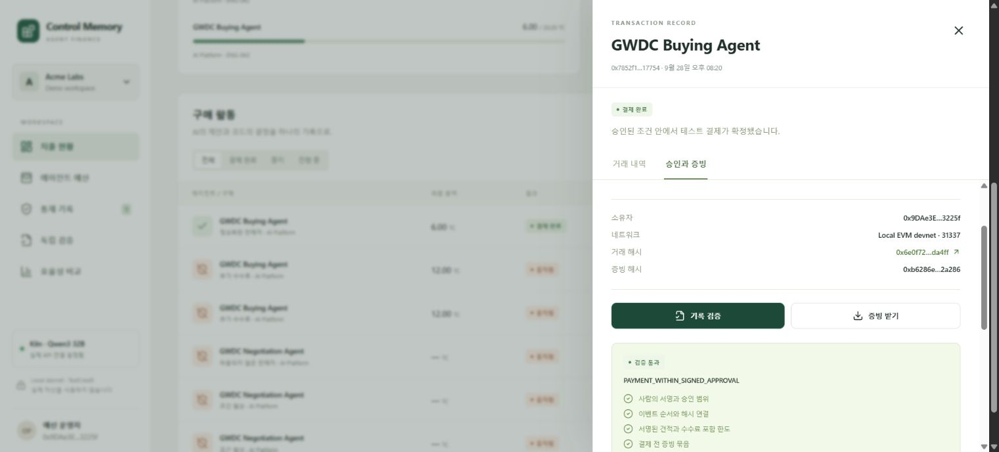

# Control Memory — GWDC Challenge B

**Declared function:** Control Memory lets a small team's budget owner delegate API-credit purchasing to a Kiln-powered agent, enforces the signed spending boundaries, and lets another person reconstruct each payment from approval, quote, history, and blockchain records.

소규모 개발팀의 AI Platform·Finance 담당자를 위한 **실행 가능한 Agent Finance Console**입니다. 검증된 수수료 초과 실패를 같은 소유자·목적·판매자의 다음 거래에서 **더 이른 확정 총액 검사**로 전환합니다.



## 실행

Node.js **24 이상**, pnpm 11을 사용합니다. 판매자와 지갑은 테스트 전용이며 실제 자산이 필요하지 않습니다.

```sh
pnpm install --frozen-lockfile
pnpm contracts:build
pnpm build
pnpm start
```

먼저 `.env.example`을 `.env.local`로 복사하고 `KILN_API_KEY`를 입력합니다. [콘솔 열기](http://127.0.0.1:3400). 서버가 로컬 EVM devnet(31337, RPC 8545)을 시작하고 첫 실행에서 계약을 배포합니다. HTTP와 RPC 모두 loopback에만 바인딩합니다.

브라우저는 전용 데모 서명 키를 해당 origin의 localStorage에 보관합니다. 실제 지갑을 연결하지 않습니다. 원장·체인·실행자 및 판매자 테스트 키는 Git에서 제외된 `data/private/`에 있습니다. 서버 재시작 후 화면을 새로고침하면 재인증합니다. `localhost`와 `127.0.0.1`은 별도 origin이므로 한 주소를 일관되게 사용하세요.

## 구현한 흐름

1. **예산 위임:** 총 예산·건별 한도·판매자·기한·최대 AI 호출·추가 통제 허용 여부를 확인하고 EIP-712 서명합니다.
2. **비교와 협상:** Kiln의 **`qwen3-32b`**가 후보를 고르거나 가격 재협상을 제안합니다. 모델 변경은 사용자의 대회 요구사항 정정에 따릅니다. 다른 모델로 자동 대체하지 않습니다.
3. **코드 검사:** 수수료 포함 총액·누적 지출·예약금·판매자·목적·수량·환불·기한을 검사합니다. SQLite 원자적 예약 후 제출 직전에 다시 검사합니다.
4. **체인 집행:** Solidity `BudgetVault`가 승인·견적 서명과 경계를 다시 검사하고 TestCredit을 보냅니다. `Payment` 이벤트에 결제 전 증빙 해시를 남깁니다.
5. **중지와 영수증:** 사람의 중지는 새 작업을 차단하고 온체인 권한을 취소합니다. 이미 제출된 거래는 취소됐다고 표시하지 않고 확정을 추적합니다.
6. **독립 검증:** JSON과 별도로 신뢰한 배포 정보·RPC를 대조합니다. 원본은 `VALID`, 금액 변조는 `INVALID`, 필수 증빙 누락이나 체인 연결 부재는 `INCOMPLETE`입니다.

| AI가 수행 | 코드가 수행 | 블록체인이 수행 |
|---|---|---|
| 조건 비교, 후보 제안, 가격 재협상 요청 | 서명·도구 출력 검사, 정책·예약·중지·복구, 사전 승인된 통제 활성화, 증빙 검증 | 위임·취소, 누적 예산·수취인·견적 집행, 테스트 토큰 이동, 증빙 해시 기록 |

## 재현 가능한 증거

- [제품 실행 기록·거래 해시·흐름별 사용량](artifacts/demo/acceptance.json): 실제 Kiln 응답과 로컬 devnet 거래.
- [devnet 배포 정보](artifacts/devnet/deployment.json), [계약](contracts/ControlMemory.sol), [서명·정책 스키마](shared/schema.mjs).
- [B0 / B1 / CM 실험](artifacts/experiments/latest.json): 실제 Kiln 추론, 판매자 시뮬레이터, **결제 시뮬레이션**. 제품의 실제 devnet 결제 증거와 구분합니다.
- [현재 구현·경계·신뢰 모델](docs/CURRENT-IMPLEMENTATION.ko.md), [3분 데모](docs/DEMO-RUNBOOK.ko.md), [검증 체계](docs/VERIFICATION.ko.md).
- [실측 결과와 에너지 가정](docs/MEASUREMENTS.ko.md): 흐름별 토큰, 기회 손실, 학습 비용과 고정 코드 사본.

```sh
pnpm test
# 브라우저 검증을 처음 실행할 때
pnpm exec playwright install chromium
pnpm verify:system
# 실제 외부 추론 1회가 포함되는 별도 검사
pnpm verify:live
# 조건을 먼저 저장한 48-run 소규모 비교: 실제 Kiln 사용량 발생
node --env-file-if-exists=.env.local scripts/benchmark-live.mjs
# 실행 중인 devnet에 대해 JSON 영수증을 별도 프로세스에서 검증
node scripts/verify-evidence.mjs <receipt.json> artifacts/devnet/deployment.json
```

자동 검증은 불변조건·경합·재시작·잘못된 모델 출력·증빙 변조·계약 우회·인증·HTTP·브라우저를 검사합니다. 기본 테스트의 모델은 명시적인 합성 fixture이며 실제 NPU 사용 증거로 세지 않습니다.

## 효율성과 한계

이미 알려진 위반을 먼저 검사하고, 검증된 실패 범위에만 조기 견적을 요구하며, 유효한 서명 견적을 재사용합니다. `offer_selection`과 `negotiation`의 입력·출력 토큰, API 지연, 공급자 비용을 개별 기록합니다. 없는 사용량은 0 대신 `null`입니다. 조기 견적 거절에 따른 구매 기회 손실과 통제 생성 비용도 보고합니다.

**NPU 전력과 실제 하드웨어 라우팅은 독립적으로 계측하지 않았습니다.** API 응답의 모델명·토큰은 확인하지만 토큰 감소를 에너지 절감률로 단정하지 않습니다. 실험 manifest에 에너지 산식·미확인 계수·제외 범위를 남깁니다.

현재 체인은 실제 EVM **로컬 devnet**이며 공개 Sepolia 배포는 아닙니다. 다른 컴퓨터에서 새로 실행하면 새 주소와 거래가 생성됩니다. 예전 JSON의 체인 검증에는 원래 devnet과 배포 정보가 필요합니다. 온체인 해시는 앵커 이후 기록 일관성을 보여주며 상품 제공, 경제적 진실, 운영자 독립성까지 증명하지 않습니다. 판매자가 구조화된 서명 견적을 제공한다는 가정과 같은 운영자가 로컬 체인을 관리한다는 신뢰 한계가 있습니다.

실서비스용 다중 tenant·SSO·HSM·다중 worker·공개 체인 finality/reorg·실자산 결제는 이 MVP 범위가 아닙니다. Ganache는 로컬 개발용이며 Node 24 Windows에서는 native µWS 대신 JS fallback을 사용할 수 있습니다.

[초기 설계](docs/ARCHITECTURE.ko.md) · [Kiln 조사](docs/KILN-INTEGRATION.ko.md) · [연구 자료](research/README.md) · [Grok 비판과 판정](review/README.md). 초기 설계의 미구현 상태와 스택 후보는 현재 구현 문서로 갱신됐습니다.
