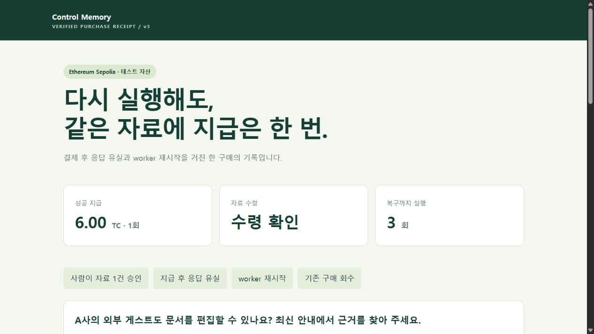

# Purchase v3 — 공개 Sepolia 증빙

이 폴더는 기존 자료 구매 복구 기능의 공개 실증이다. Agent Deal Escrow의 fund/release/refund 증거로 사용하지 않는다. 합성 자료·팀 운영 판매자·테스트 자산·하네스 전용 소유자 서명으로 실행했다. 사람의 승인 UI는 별도 로컬 브라우저 실행에서 검증했다.

**공개 관통 검증 PASS — 8개 검사.** [원본 보고서](runs/2026-09-28T13-47-16-518Z/report.json), [읽기 쉬운 영수증](runs/2026-09-28T13-47-16-518Z/receipt.html), [독립 판정](runs/2026-09-28T13-47-16-518Z/independent-verifier.json).

실제 결과: **6 TC 지급 1회 / 복구까지 실행 3회 / 자료 수령 및 인용 답변 완료**. 첫 실행은 공개 체인 확정 대기로 끝났고, 두 번째 실행에서 실제 HTTP 응답 socket을 끊었다. worker PID 22320 → 4004로 재시작한 세 번째 실행에서 회수했다. 네 번째 캐시 재실행은 추가 추론·지급이 없었다. recovered bundle은 세 번째 실행 시점이다.

독립 RPC의 finalized block **11800941**이 가장 늦은 취소 거래 block 11800926를 지난 뒤 복구했다. 별도 CLI는 앱 전체 종료 중 `VALID / PURCHASE_AUTHORITY_AND_PAYMENT / SIGNED_CONTENT_MATCH`를 반환했다.



## 공개 거래

- [배포 manifest](deployment.json), [금고 배포 거래](https://sepolia.etherscan.io/tx/0xc3eefc1d44f7e1517db91c1cb072560efba12effcd0d87814a262d182271695b).
- [6 TC 지급](https://sepolia.etherscan.io/tx/0x6b37765a3242e8755231866022b5c7e76d71fc44e6c6435144a10ab3a3ecda50).
- [수수료 포함 한도 위반 거부](https://sepolia.etherscan.io/tx/0xc888c40cd8aa7ff7dab45f546c8cf9d3b1b4d56fc06e2ddfbe26e16b124e854a).
- [허용하지 않은 판매자 거부](https://sepolia.etherscan.io/tx/0xcf734d65b30be046ff24494c6ae08fc7002f64cb38b65441d030ab0166beb2bf).
- [만료 견적 거부](https://sepolia.etherscan.io/tx/0xb980de8c84ef8e12d5cf9d5f9669fd30bcd14961fd7bf17cd3d21834b2620347).
- [새 견적을 쓴 두 번째 지급 거부](https://sepolia.etherscan.io/tx/0x8368ad4a148e8b5b56e1984548fcf07fc3636c5bd6b03b54c26540c1254b4f26).
- [앱 전체 종료 중 owner 직접 취소](https://sepolia.etherscan.io/tx/0x63ee0e0316030f910607420ec551711e534ef0e01c16a45c3b4be7594bdcd72a).

체인에 보낸 거부 거래는 상태 0으로 채굴됐다. 테스트 ETH 가스는 소모하지만 TestCredit 지급은 없다. 이 거래들은 통제 우회 검증을 위한 명시적 공격이며 Qwen이 생성한 행동이 아니다. 일반 실행 경계 검사는 추론·지급 전에 멈춘다.

## 재현과 판정 범위

[구현 실행서](../../docs/PURCHASE-IMPLEMENTATION.ko.md), [요구사항 감사](../../docs/PURCHASE-COMPLETION-AUDIT.ko.md), [구매 테스트 21/21](purchase-tests.txt).

```sh
node scripts/verify-purchase.mjs artifacts/purchase-sepolia/runs/2026-09-28T13-47-16-518Z/recovered.json artifacts/purchase-sepolia/deployment.json https://sepolia.gateway.tenderly.co
```

배포 manifest는 bundle과 다른 신뢰 경로에서 받아야 한다. 정상 공개 검증은 운영자 `ethereum-sepolia-rpc.publicnode.com`와 별도 `sepolia.gateway.tenderly.co`를 사용한다. 제3자가 같은 명령으로 서명·허용 범위·TestCredit Transfer·계약 latch·자료 bytes를 확인할 수 있다. 회사 신원, 판매 자료의 진실성, 모델 답변 품질, 사후 로그의 완전성까지 증명하지 않는다.

무료 [faucet 수령 기록](faucet-receipt.json)도 남겼다. API 키·개인 서명키·로그인 쿠키·Google 계정 화면은 공개 자료에 포함하지 않는다.

## 실제 Kiln 사용량과 에너지 범위

| Flow | 입력 | 출력 | 합계 | API 왕복시간 |
|---|---:|---:|---:|---:|
| need-assessment | 465 | 369 | 834 | 6,406 ms |
| evidence-answer | 616 | 315 | 931 | 4,796 ms |
| 확정 대조·자료 재조회 | 0 | 0 | 0 | 모델 호출 없음 |
| 네 번째 캐시 실행 | 0 | 0 | 0 | 모델 호출 없음 |
| 경계 이탈 3종 | 0 | 0 | 0 | 모델 호출 없음 |

합계 **1,765 tokens**, 실제 `qwen3-32b` 요청 2회다. 각 request ID·원문 응답은 recovered bundle에 있다. 복구 후 처음 만든 답변의 토큰은 evidence-answer에 포함하므로 ‘복구 전체가 0토큰’이라고 주장하지 않는다. 코드 사전 검사·저장된 판단과 결과 재사용·문단 ID 선택 후 원문 복사가 불필요한 추론을 줄인다.

NPU 라우팅과 물리 전력은 직접 계측하지 않았다. **설명용 에너지 가정**으로 요청에 할당된 평균 전력을 P W, API 왕복시간 합 11.202초를 추론 시간의 대리값으로 두면 E = P × 11.202 J다. 가상 P=5W에서는 56.010 J이며 5W는 실측·제품 TDP가 아니다. 큐·네트워크 지연이 포함되고 서버 공용 전력·체인·판매자·클라이언트 전력은 제외되어 서비스 전체 에너지나 GPU 대비 절감률로 해석할 수 없다.

## 실행 소스

- 지급 전: [manifest](source/e0506584c6e4c56ec418a3a317a058850a5d2308fec920b41129cdc048212057/manifest.json).
- 확정 후 복구: [manifest](source/4bd73cd18338e4a8fa8273f6d0b4768eb26984f1f9202f8f0b28f0f1a9a102f0/manifest.json).
- 두 사본의 차이는 공유 저장소에서 다른 앱의 실행 명령이 추가된 package.json뿐이다. 구매 엔진·모델·계약·판매자·검증기 bytes는 동일하다.
- 관통 실행 당시 [하네스 사본](runs/2026-09-28T13-47-16-518Z/harness.mjs), SHA-256은 [latest.json](latest.json)에 있다. 사본은 추적용이며 상대 import 때문에 그 위치에서 직접 실행하지 않는다.
- 최종 하네스는 완료된 journal을 다시 실행할 때 신규 거래·추론 없이 독립 검증만 반복한다. 이 경로도 실제 재실행하여 PASS를 확인했다. 원본 보고서는 보존한다.

이 결과는 구매 복구 P0의 기능 검증이다. 실제 고객 인터뷰·최신 x402 SDK와의 비교·상용 결제 연결·자료 진실성 검수는 수행하지 않았다.
