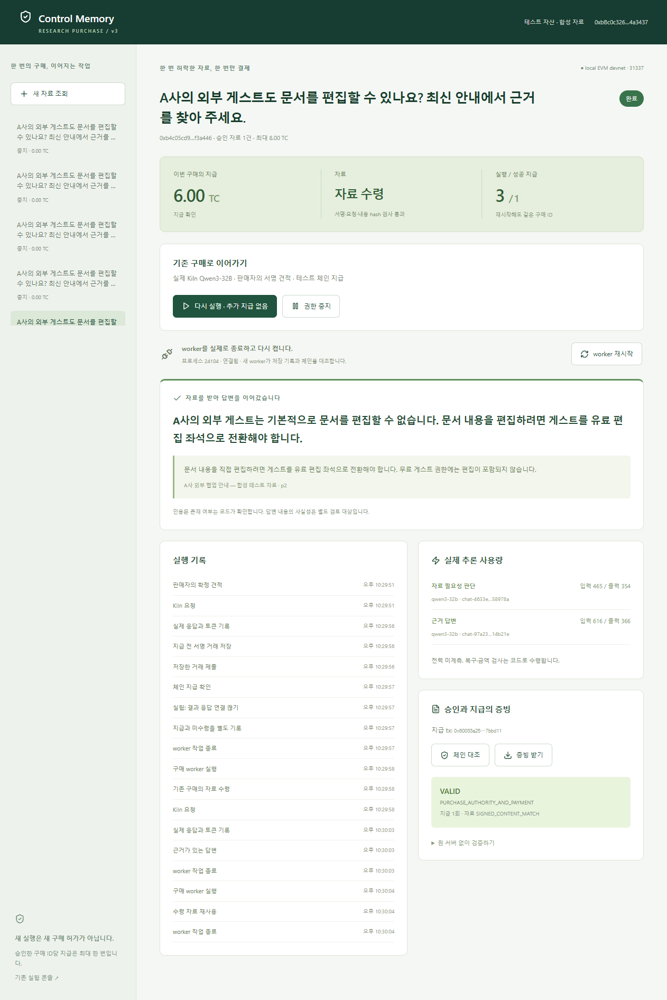

# Purchase v3 evidence

2026-09-28. 실제 Kiln Qwen3-32B와 **로컬 EVM devnet(31337)**을 사용한 증빙이다. 공개 Sepolia의 후속 검증도 [별도 증빙](../purchase-sepolia/README.md)으로 완료했다. 이 문서의 과거 로컬 hash·측정 수치는 보존하며 두 실행을 섞지 않는다.

## 최종 관통 실행

- [통합 검증 보고서](runs/2026-09-28T13-29-50-777Z/report.json): 11개 검사 항목 모두 PASS.
- [지급했지만 응답 유실](runs/2026-09-28T13-29-50-777Z/paid-response-lost.json) → [재시작 후 자료 회수](runs/2026-09-28T13-29-50-777Z/recovered.json).
- [앱 HTTP 중단 중 별도 프로세스 검증](runs/2026-09-28T13-29-50-777Z/independent-verifier.json): `VALID / PURCHASE_AUTHORITY_AND_PAYMENT`.
- [수수료 포함 한도 초과](runs/2026-09-28T13-29-50-777Z/over-budget.json), [허용 밖 판매자](runs/2026-09-28T13-29-50-777Z/unlisted.json), [만료](runs/2026-09-28T13-29-50-777Z/expired.json): 각각 지급 0회, LLM 0회, 중지 사유 기록. 코드 우회 시도의 실제 mined revert hash는 보고서에 있다.
- [owner 직접 취소](runs/2026-09-28T13-29-50-777Z/owner-revoked.json), [변조 증빙 INVALID](runs/2026-09-28T13-29-50-777Z/tamper-verifier.json).
- [배포 manifest](deployment.json), [정확한 실행 소스 bytes](source/f284f7c41825976c5aade8d2685d7d3f92c4a097f5f55e066c1912a22f8b6bda/manifest.json).

지급 tx: `0x60033a256e0b3770e73ede30831375fee491b32d0f3a0d4eb8093d9a457bbd11`. 실제 600 minor TC = **6 TC**가 판매자에게 전송됐다. worker PID **10036 → 24104**, 복구 시 실행 2회·지급 1회. 세 번째 실행은 캐시된 결과를 반환하여 추가 LLM/지급이 없었다. 최종 화면은 이 세 번째 실행까지 포함한다.

[390px 모바일 화면](07-final-mobile.png)도 확인했다. 가로 overflow 없음(scrollWidth 390), 브라우저 오류 없음. 이 화면의 ‘체인 대조’는 앱 서버를 사용하며 독립 CLI 검증과 구별한다. UI 검증은 harness 전용 테스트 지갑을 불러와 저장된 실제 결과를 확인했다.

## 토큰과 에너지

| 최종 실행 flow | 입력 | 출력 | 합계 | 관측 latency |
|---|---:|---:|---:|---:|
| need-assessment | 465 | 354 | 819 | 5,393 ms |
| evidence-answer | 616 | 366 | 982 | 5,476 ms |
| 복구 상태 확인·자료 재조회 | 0 | 0 | 0 | 별도 모델 호출 없음 |
| 세 번째 캐시 재실행 | 0 | 0 | 0 | 별도 모델 호출 없음 |
| 경계 이탈 3종 | 0 | 0 | 0 | 별도 모델 호출 없음 |

합계 1,801토큰은 이 한 관통 실행의 두 API 응답에 한정한다. 복구 뒤 답변을 처음 작성한 982토큰을 ‘복구 0토큰’에 숨기지 않는다. 이전 관통 실행·12개 평가 3차례의 비용은 각 원본 파일에 따로 기록했다. 새 호출은 구매당 최대 4회로 제한하고 이미 얻은 필요성 판단·자료·답변을 재사용한다.

NPU 전력과 실제 추론 시간은 미계측이다. 다음은 **실측 에너지가 아닌 가정 계산**이다. 해당 요청에 할당된 평균 전력을 가상의 `P W`, API 왕복시간 합 10.869초를 추론 시간의 대리값으로 가정하면 `E = P × 10.869 J`다. 예를 들어 **가상 P=5W이면 54.345J**다. 5W는 하드웨어 TDP·실제 할당전력·측정 범위가 아니며 설명용 가정이다. API 시간에는 네트워크·큐·호스트 작업이 섞이고 공유 서버 전력·idle·DB·판매자·체인 비용은 포함되지 않아 서비스 전체 에너지나 GPU 대비 절감률로 해석할 수 없다. 하드웨어 계측을 얻기 전에는 토큰·호출·latency만 실측 성과로 제시한다.

## 테스트와 모델 평가

- [최종 구매 관련 테스트 19/19](purchase-tests.txt): 실제 devnet 계약, 응답 유실·재시도·nonce 교체·경합·중지·접근제어·변조·모델 출력 검증. 테스트 모델은 명시적인 fixture다.
- [기존 전체 회귀 검사 52/52](unit-tests.txt): 인용 ID 복사 변경 직전 실행. 변경 후 관련 19개를 다시 검증했다. 빌드 `tsc --noEmit && vite build` 성공.
- [최종 실제 Kiln 12개 평가](evaluation/2026-09-28T13-28-31-239Z/report.json): 조회 필요성 6/6, 근거 문단 선택 6/6. 단순 키워드 기준선은 각각 3/6·2/6. [별도 의미 검토](evaluation/2026-09-28T13-28-31-239Z/manual-review.json).
- 초기 [명령문을 상충 정보로 인용한 실패](evaluation/2026-09-28T13-23-14-832Z/manual-review.json), 이후 [인용을 의역하여 안전하게 거부된 실패](evaluation/2026-09-28T13-25-18-677Z/manual-review.json)도 보존했다. 최종판은 모델이 문단 ID만 고르고 코드가 원문을 복사한다.

평가 사례는 개발 중 수정에 사용한 합성 사례이며 독립된 holdout이 아니다. 키워드 기준선은 상용 제품·최신 x402 SDK·유능한 rule engine이 아니다. 정답률 개선이 시장 우위나 일반적인 prompt injection 방어를 증명하지 않는다.

## 과거 기록과 재현 범위

`01`~`04` 이미지는 초기 UI 관통 실행이다. 당시 실행 소스의 정확한 snapshot은 없어 최종 소스의 증거로 사용하지 않는다. `05`는 새 서버의 초기 화면, `06`~`07`은 위 최종 실행의 실제 데이터다.

`runs/2026-09-28T13-20-52-308Z/report.json`은 harness의 Host 헤더 전송 문제로 실패한 기록이다. 제품 우회 성공으로 판정하지 않는다. Node fetch 대신 native HTTP로 검사한 후 13:21·13:29 실행이 통과했다. 13:21 실행은 인용 방식 변경 전이고 별도 소스 사본과 함께 보존한다.

로컬 체인은 운영자 원장 파일에 의존한다. Git만 clone한 다른 PC에서 이 과거 거래의 RPC를 조회할 수는 없다. 새 devnet 실행은 새 tx와 증빙을 생성한다. 공개 Sepolia의 후속 실증은 [별도 공개 증빙](../purchase-sepolia/README.md)에서 조회할 수 있다. [구현·재현 문서](../../docs/PURCHASE-IMPLEMENTATION.ko.md).
