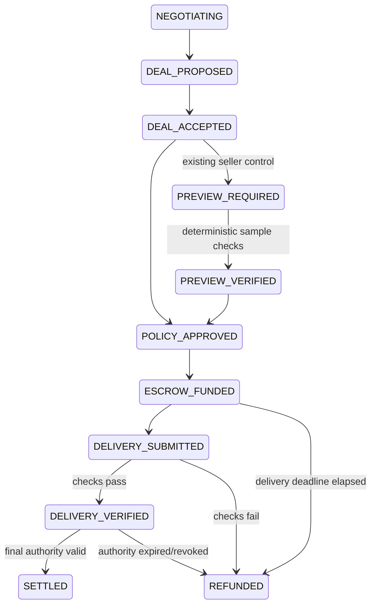

We built a verifiable escrow and financial-control layer for AI agents that negotiate digital work: AI negotiates the Deal, deterministic code enforces spending and delivery conditions, and blockchain escrow releases or refunds funds based on machine-verifiable evidence.

# Agent Deal Escrow

**Verifiable escrow and financial controls for AI-to-AI digital work transactions.**

This is the implementation of the user's frozen GWDC 2026 FuriosaAI × Bricksum Challenge B specification. The previous paid-resource recovery prototype is preserved in [the legacy README](LEGACY-PURCHASE-README.ko.md), not the scope of this product.

## Run

Node 24+ and pnpm are required. Existing dependencies are reused; native Node TypeScript stripping runs the server.

```sh
pnpm install --frozen-lockfile
pnpm ade:contracts
pnpm ade:test
pnpm ade:build
pnpm ade:start
```

Open **http://127.0.0.1:3402**. Overview, Deals, Agents, Controls and Audit are implemented. The browser is a local admin demo, not an internet deployment.

For a new real Kiln + real local EVM run:

```sh
# Set KILN_API_KEY, KILN_MODEL and optionally KILN_BASE_URL in .env.local.
# Model identifier is required, never hardcoded by the new adapter.
pnpm ade:demo
pnpm ade:start
```

`ade:demo` makes six paid API calls under this implementation request and creates new dedicated devnet identities. Do not run it merely to view existing evidence. The server opens the latest run's private state by default; `ADE_DATA_DIR` selects a separate directory. Stop a server before opening the same chain database in another process. `ade:test` does **not** make paid model calls or public-chain transactions.

Evidence: [latest real demo](../artifacts/deal-escrow/latest-demo.json), [actual test runner output](../artifacts/deal-escrow/tests.json), [browser checks](../artifacts/deal-escrow/browser.json), [Sepolia readiness](../artifacts/deal-escrow/sepolia-status.json).

## 1. Problem

When one AI agent hires another for digital work, paying before delivery creates avoidable financial exposure. An LLM can negotiate useful terms, but its language and tool proposals must not become unrestricted wallet instructions.

## 2. Persona

An AI Platform Lead at an AI-native research company delegates small dataset purchases to Research Agent 07. The concrete task is a 2025–2026 Korean EV battery CAPEX dataset. This is a research-data transaction prototype, not corporate finance or procurement software. No validated customer adoption is claimed.

## 3. Declared function

Negotiate an immutable structured Deal, enforce delegated spending, lock test assets, validate deterministic delivery conditions, and release or refund with reconstructable evidence. A verified failure can activate a predefined seller-specific preview gate. Escrow, structured offers and tool calling are not claimed as novel.

## 4. Demo workflow

1. A human approves task budget, maximum single transaction and mandate expiry.
2. Buyer and Seller use actual Kiln tools to negotiate price, minimum rows, source coverage and delivery window. Structured output is checked independently.
3. The Buyer proposes `accept_deal(deal_id)`. Strict schema and policy decide whether funding is permitted.
4. Native **test assets** are locked in `AgentDealEscrow`; the seller is not yet paid.
5. Seller A submits 52 synthetic rows, including 50 valid HTTP(S) source URL strings (96.15%). Successful checks release the exact accepted amount.
6. Seller B submits 7 rows against a minimum of 40. Validation fails, escrow refunds, and a trusted mapping adds `REQUIRE_PREVIEW` for Seller B.
7. Another Seller B Deal is denied funding until a preview is verified. Seller A remains unaffected.

The recorded run negotiated Seller A at **2.00** units and Seller B at **1.50**. These are actual model outputs, not the prompt's example prices. Each is a separately approved 3.00-unit task with a 2.00-unit transaction limit. Spending both under one 3.00-unit mandate is correctly blocked. Control Memory persists at company + seller scope across tasks.

The dataset is synthetic. Source URL coverage counts well-formed HTTP(S) strings without fetching pages or proving that they substantiate the values.

The main UI shows current persisted state. `/?replay=1` presents the recorded evidence on the requested 3-minute sequence and clearly labels it **not live**. `pnpm ade:record` records that replay as a silent WebM; the recording script requires Microsoft Edge and Playwright's video encoder. See [demo script](AGENT-DEAL-ESCROW-DEMO.ko.md).

## 5. AI vs Code

| Responsibility | AI / Kiln | Trusted deterministic code |
|---|---|---|
| Understand task and negotiate price/rows/coverage/deadline | Yes | Validate proposed terms |
| Propose acceptance/rejection | ID-only tool | Verify immutable Deal |
| Spending authority, arithmetic, task reservation | No | Human mandate + policy + SQLite transaction |
| Schema, canonical hash, expiry, state transitions | No | Strict validation and fail-closed transitions |
| Delivery checks | No | JSON array, required fields, row count, URL coverage, deadline |
| Settlement amount | Never | Exact accepted `price_minor`, contract-locked amount |
| Transfer, release, refund | Never exposed as model tools | Trusted controller and contract |
| Control Memory | Cannot create/remove rules | Canonical failure → fixed additional gate |
| Audit prose | Optional; not used in this prototype | All displayed facts come from stored records |

The tool allowlist is `discover_sellers`, `request_offer`, `counter_offer`, `accept_deal`, `reject_deal`. Actual negotiation uses `counter_offer`, `request_offer`, `accept_deal`; discovery is the fixed two-seller scenario configuration. There is no generic marketplace. Monetary tools are absent from the model API.

## 6. Trust boundary

Buyer/Seller LLMs, natural language, generated explanations and seller claims are untrusted. Trusted components are the schemas, immutable Deal store, mandate/policy engine, state machine, delivery validator, controller and canonical failure mapper. Kiln, RPC and blockchain are external systems.

The local admin UI binds to loopback only, validates the Host, rejects cross-origin mutations, and requires a per-process session token. Human mandate creation is not a cryptographic identity or enterprise SSO system. API keys, signing keys and signed transaction intents remain in ignored local files; they are not returned in receipts.

Controller authority is explicit: the Solidity contract trusts its configured controller for off-chain delivery and mandate decisions. A compromised controller could make a false attestation. The contract does enforce exact deposited value, a single settlement outcome, release deadline and caller restrictions. There is no claim of trustless off-chain validation.

## 7. State machine



Pre-funding policy failure produces `BLOCKED` or `EXPIRED`; a missing preview remains `PREVIEW_REQUIRED`. All unlisted transitions and all terminal-state escapes are rejected. Accepted Deal bodies and hashes have an SQLite immutable trigger. Amendments create new IDs and reference `supersedes_deal_id`.

`deadline` is an immutable duration in seconds. The funding contract fixes the absolute delivery deadline at `min(funding block timestamp + duration, expires_at)`. Both backend and contract reject late release. Expiry and mandate revocation do not prevent returning escrow to the buyer.

## 8. Kiln / FuriosaAI

The client reads `KILN_MODEL`. On each live negotiation it calls `/models` when supported and rejects an unavailable configured model. The observed organizer endpoint listed `qwen3-32b` and another model; this run used the configured `qwen3-32b`. Model responses must match the requested model and contain exactly one approved tool call with strict arguments. Truncation, malformed JSON, extra authority fields and unknown tools fail closed.

Each inference call records flow, request ID, prompt/completion/total tokens, timestamps, total latency, tool and result. Requests are non-streaming: TTFT is **not measured**. Model discovery is a management request and is not counted as an inference call.

Natural-language reasoning can disagree with numeric fields. The observed Seller A prose mentioned three minutes while its structured duration was 90 seconds. Code bound the Deal to 90 seconds. This demonstrates why prose is not authoritative; it is not a claim of perfect negotiation quality.

## 9. Blockchain read / write / settle

| Action | Implementation |
|---|---|
| WRITE | `fund(dealHash, buyer, seller, amount, deliveryWindow, dealExpiry)` locks the exact test-asset amount and commits to the Deal hash |
| READ | `escrows(dealHash)` and independently read transaction receipts/logs |
| SETTLE | Controller `release(dealHash, evidenceHash)` or `refund(dealHash, reasonHash)` transfers only the locked amount |

The evidence argument is a hash of the stored settlement attestation, including the Deal, mandate snapshot, delivery and validation, final policy checks and prior event hash. This is a direct commitment, not an optional Merkle system. It provides tamper evidence after the commitment point, not truth certification.

Current end-to-end evidence is a **real local Ganache devnet**, chain ID 31338, persistent blocks/receipts and dedicated demo identities. One minor demo unit maps to 1 gwei of native test asset; 100 minor units display as 1.00 demo unit. This is not a USD exchange rate. Deployment plus four financial transactions are recorded in the real demo.

Run `pnpm ade:sepolia` after the dedicated test wallet is funded. It executes the same six-call negotiation and escrow workflow on public Sepolia. Public Sepolia is supported only for chain ID 11155111. Mainnet fails closed. At the last check, RPC access succeeded but the dedicated wallet had zero test ETH, so **public testnet fund/release/refund are not yet demonstrated**. The address is in `sepolia-status.json`; never buy real ETH for this demo. [PublicNode's Sepolia endpoint](https://ethereum.publicnode.com/?sepolia) and [Ethereum's testnet/faucet documentation](https://ethereum.org/developers/docs/networks/) describe the external setup.

SQLite and external settlement are not distributed-atomic. Before broadcast, an operation claim and exact signed transaction are persisted privately. An unknown response keeps the operation pending and its budget reserved; restart recovery rebroadcasts/reconciles the same hash. A successful receipt is required before local terminal state. The implementation uses one controller worker and a local process lock, not a distributed coordinator. A single confirmation is used for this hackathon prototype; production finality/reorg handling is not claimed. The buyer has a contract refund escape after deadline, though this dedicated-wallet demo uses the same controller address as the buyer.

A mined revert is distinguished from an unknown response using the exact signed transaction hash, controller, contract and status-0 receipt. A confirmed failed release is recorded as `REVERTED`, then refunded with reason `ESCROW_RELEASE_REVERTED`; recovery resumes this path after reopening the database. A successful release whose response was lost remains pending until reconciled and must never initiate a refund. Failed funding becomes `BLOCKED`. A reverted refund requires investigation; no automatic new signed retry or production finality guarantee is claimed.

## 10. Two required stopping / failure runs

**Budget:** an accepted 2.50-unit proposal exceeds a 2.00-unit maximum. `MAX_SINGLE` is recorded, state becomes `BLOCKED`, no funding transaction exists.

**Delivery:** Seller B promises at least 40 rows and delivers 7. `DELIVERY_REQUIREMENT_FAILED` is recorded, funds return to the buyer, and `REQUIRE_PREVIEW` activates. A subsequent Deal cannot fund without a verified preview.

The preview template requires 5 rows, the accepted schema and coverage, before Deal expiry. It binds to that Deal hash. It is an additional machine-verifiable precondition, not a guarantee of the final dataset's quality. Controls are company + seller scoped and have database triggers rejecting modification/deletion. Human-admin removal is future work only.

## 11. Approval & evidence

Audit Receipt shows mandate, buyer/seller, immutable terms/hash, locked amount, policy checks, delivery raw data and evidence hash, recomputed validator result, release/refund reason, on-chain hashes and timestamps. It distinguishes absence of a submission from a failed submission.

`node scripts/verify-deal-escrow.mjs receipt.json` runs offline. Add `--rpc URL --deployment trusted-deployment.json` for a separately configured RPC and a deployment manifest obtained independently of the untrusted receipt. No wallet key is needed.

`verifyReceipt` can run without application state for structural verification (`STRUCTURALLY_VALID`). With the separately configured chain it checks receipts/logs, deployed address, exact amount, participants, deadline, outcome and attestation (`VALID`). It does not trust an RPC URL supplied by the receipt. Missing settlement receipts and changed data fail. Browser and API invoke the same deterministic verifier; no LLM invents numbers.

Structured hash-linked events include mandate creation, negotiation, proposed/accepted Deal, policy checks, funding, submission, validation, release/refund, blocking and Control Memory activation. All financial events map to one specific Deal and transaction hash. This is not proof of completeness against a compromised controller or a cryptographic human approval system.

## 12. Security invariant results

`pnpm ade:test` exports actual Node runner output and a source fingerprint to `artifacts/deal-escrow/tests.json`. The UI reads this file, never a hand-written pass counter, and marks it stale when its tested source fingerprint differs from the current source. The current suite covers all ten requested invariants, every unlisted state transition, contract authorization, exact funding, concurrency budget reservation, unknown-broadcast recovery, malformed model outputs and receipt tampering. Deterministic fixtures and the paid live-model run are separate evidence.

The ten required properties are: no model-selected settlement amount; immutable accepted Deal; hash mismatch cannot settle; expired Deal cannot fund/release; revoked/expired mandate cannot fund; no duplicate settlement; refund cannot later release; Control Memory cannot expand authority; machine cannot remove a gate; failed delivery cannot release. A passing fixture is not formal verification or a stochastic model-accuracy estimate.

## 13. Kiln token / energy report

The stored live run has **6 inference calls, 3,476 prompt tokens, 3,065 completion tokens, 6,541 total tokens**. Aggregate measured call latency is 45.919 seconds. Flow-level rows are in the report and UI; values are not benchmark projections.

Schema validation, policy, delivery validation and escrow authorization make zero LLM calls. No before/after token reduction claim is made without a measured baseline.

**Energy Estimate — Assumption Based:** no application power telemetry or organizer-provided attributable power assumption is available. Accordingly Joules and assumed watts remain null. If the organizer supplies an appropriate power assumption `P`, the documented illustrative method is `P × API-duration-seconds`; queue/network time, utilization and batching make that a limited estimate, not measured NPU energy. Hardware benchmark values are not substituted for application measurements.

## 14. Limitations

- Does not prove semantic truth of a dataset; synthetic example values and URL strings are used.
- Sellers are demo/adversarial actors, not a live marketplace or validated customer network.
- Escrow and structured offers are not claimed as novel; blockchain does not prove truth.
- Control Memory activates predefined trusted enforcement templates; it does not learn or relax financial policies.
- No production KYC/AML, real money, production custody, enterprise identity or dispute arbitration.
- No claim of formal verification, 100% security, perfect distributed atomicity, finality/reorg resilience, measured energy or guaranteed model accuracy.
- Public testnet financial execution remains unverified until test ETH is available. A local devnet transaction must not be labeled Sepolia.
- No completed human-observer study. Receipt reconstruction is currently verified by automated checks and browser tests.

## 15. Future work

Within this narrow workflow: public testnet completion, stronger RPC finality reconciliation, controlled model robustness experiments, and a human audit-reconstruction observation. Optional Merkle anchoring and benchmark visualizations are deferred. Marketplace, ERP/accounting, credit cards, seller reputation networks, semantic truth verification and production custody remain out of scope.

## Files and priority gates

`src/deal-escrow/{domain,store,delivery,engine,kiln,audit}.ts`, `chain.mjs`, `server.mjs`; `contracts/AgentDealEscrow.sol`; `tests/deal-escrow`; `web/deal-escrow`; `scripts/*deal-escrow.mjs`.

P0 schemas/policy/state tests → P1 contract lifecycle → P2 delivery integration → P3 real Kiln tools → P4 reconstructable receipt → P5 scoped gate → P6 UI/demo/README. Core local gates pass; the public-testnet portion of Definition of Done remains open. The optional safety benchmark and Merkle tree were not added.
