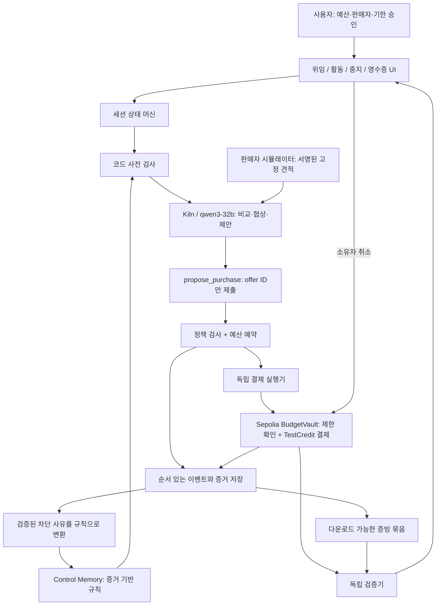

# Control Memory — 구현할 시스템 아키텍처

상태: 설계안. 현재 저장소에 구현된 것은 Kiln 연결 진단뿐입니다. 아래 UI·정책·계약·검증기는 구현 대상입니다.

## 제품 결정

**소규모 개발팀이 API 크레딧 구매를 에이전트에 위임하고, 그 지출이 승인 범위 안에 있었는지 다른 사람이 검증할 수 있게 한다.**

대표 사용자: 팀의 개발 도구 예산을 관리하는 운영자. 구매할 때마다 모든 후보를 직접 비교하기는 번거롭지만, 추가 수수료·구독·새 판매자·중복 구매까지 승인한 것은 아닙니다. 구매 에이전트는 조건이 다른 공급자 제안을 비교하고 제한된 협상을 수행합니다.

데모 상품은 가상의 API 크레딧, 판매자 3곳은 명시적으로 시뮬레이터입니다. 결제 자산은 테스트넷 전용 `TestCredit`입니다. 실제 API 상품 공급 또는 실제 화폐와의 교환을 주장하지 않습니다. 예시는 30.00 TestCredit 예산이며 UI에서도 USD/USDC와 혼동하지 않게 표시합니다.

발표 메시지: **실패를 설명하는 기록이, 다음 시도의 더 이른 통제가 됩니다.** 이 설계의 유효성은 재현 가능한 실험으로 보여줍니다. 최초 발명 또는 경쟁 제품에 없다는 주장은 하지 않습니다.

## 시스템 경계



프로토타입은 웹 UI + 단일 백엔드 + worker + 관계형 DB + 작은 Solidity 계약으로 충분합니다. 논리적 분리는 유지하되 마이크로서비스·벡터 DB·멀티체인·별도 평판 네트워크는 만들지 않습니다.

추천 구현 구성: React/TypeScript UI, Node.js/TypeScript API·worker, SQLite의 원자적 트랜잭션(단일 worker 데모), EVM 접근용 viem, Solidity 테스트넷 계약. 배포형 다중 worker로 옮길 때 PostgreSQL의 행 잠금/직렬화 트랜잭션으로 바꿉니다. 패키지 버전은 구현 시작 시 호환 조합을 고정합니다.

## LLM의 역할과 권한

| 작업 | 구현 주체 | 이유 |
|---|---|---|
| 자연어 → 구매 조건 초안 | Kiln | 모호한 선호 해석 |
| 금액·판매자·기한 최종 확정 | 사용자, 구조화 폼 | 자연어 해석 자체가 위임이 아님 |
| 적격 제안 비교·교환 조건 협상 | Kiln | 가격·환불 기간·크레딧 수의 선호 비교 |
| 금액 합산·서명·만료·판매자·누적 예산 검사 | 코드 및 계약 | 같은 입력에 같은 허가 결과 |
| 거래 전송 | 제한된 별도 실행기 | 모델에 키와 임의 전송 도구를 주지 않음 |
| 통제 기억 생성 | 고정된 규칙 변환기 | 모델의 주장만으로 권한 변경 방지 |
| 영수증·감사 판정 | 코드 | 사실 필드와 검증 결과 재현 |
| 영수증 자연어 해설 | 요청 시 Kiln | 증거 ID를 인용하는 읽기 전용 설명 |

LLM 도구는 `get_eligible_offers`, `request_counteroffer`, `propose_purchase(offerId)`, `stop_session(reason)`까지입니다. `send_transaction`, 임의 HTTP, 정책 변경, 키 접근, 판매자 추가 기능은 노출하지 않습니다. 서버가 세션 신원을 주입하며 모델이 제출한 tenant/session ID는 권한 근거로 쓰지 않습니다.

판매자 설명은 데이터입니다. 설명에 “이전 규칙 무시”가 들어가도 실제 도구 인터페이스와 결제 검사는 바뀌지 않습니다. LLM이 제안한 amount/address를 그대로 실행하지 않고, 검증된 offer ID에서 서버가 원본 금액과 주소를 다시 가져옵니다.

## 사람이 승인할 Mandate

승인 화면에서 다음 정보를 한 장에 보여주고 수정 후 서명합니다.

```text
목적: API 크레딧 구매 / 허용 SKU 목록
세션 누적 지출 한도: 30.00 TestCredit
거래별 한도: 25.00 TestCredit
허용 판매자: Alpha, Beta (계정 이름과 실제 수취 주소 함께 표시)
유효 기한: 사용자가 확인한 절대 시각 + 시간대
추가 구독 / 재위임: 불가
수수료: 상품·세금·판매자 수수료 모두 구매 한도에 포함
네트워크 가스: 운영자 test ETH로 지원, 사용자 추가 부담 0
실패 후 적용 가능 규칙: 판매자별 확정 총액 선제 제출
추론 상한: 세션당 최대 5회, 협상 최대 2회 (초기 운영 설정)
```

모호한 조건은 `NEEDS_USER_INPUT`입니다. 사용자가 “적당히”라고 입력해도 금액을 추정하여 서명 처리하지 않습니다. 서명 대상에는 `owner, sessionId, executor, token, totalCap, perTxCap, merchantSetHash, purposeHash, expiresAt, policyHash, controlRulesVersion, nonce, chainId, verifyingContract`를 넣습니다.

`purposeId`는 사람이 승인한 고정 enum(예: `DEV_API_CREDITS_V1`)이며, 허용 SKU·최소 수량·환불 하한과 함께 정규화한 구조를 `purposeHash`에 결합합니다. LLM의 분류나 판매자 문구로 변경할 수 없습니다. Control Memory scope의 purpose도 이 승인된 ID에서 읽습니다. 목적 변경에는 새 서명이 필요하며, 이전 통제의 승계 또는 해제도 사용자에게 표시합니다.

사용자 지갑이 본인 권한으로 `createMandate`를 실행하거나, EIP-712 서명을 받은 relayer가 생성하고 계약이 서명을 검증합니다. 서명 방식은 하나를 구현하여 고정합니다. EIP-712를 선택할 경우 nonce 사용 처리, 기한, chain/contract 도메인 검사는 별도로 구현합니다. EIP-712 자체가 재사용 방지를 제공하는 것은 아닙니다. [EIP-712](https://eips.ethereum.org/EIPS/eip-712)

## Offer를 결제에 묶기

Offer는 immutable입니다. 수정은 새 offer ID와 `supersedes`로 나타냅니다.

필수 필드: `merchantId, merchantAddress, sku, quantity, token, subtotal, tax, fee, allInTotal, refundTermsHash, expiresAt, offerNonce, offerId, sellerSignature`.

금액은 토큰 최소 단위의 정수 문자열로 직렬화하고 내부 계산은 BigInt로 합니다. float와 화면에 표시된 반올림 금액으로 허가하지 않습니다. `allInTotal = subtotal + tax + fee`를 검사합니다. 가격 불명·수수료 미공개·다른 토큰·서명 오류는 중지합니다. 판매자 서명 키와 수취 주소의 등록 관계도 검증합니다.

수락은 정확한 offer hash를 참조합니다. 결제 직전 원본 견적을 다시 읽고 수락 당시 해시와 비교합니다. 주소·금액·기한·환불 조건 중 하나라도 바뀌면 새 제안으로 처리합니다. 원래 금액으로 승인받고 결제 직전에 가격을 올리는 공격을 차단합니다.

판매자 시뮬레이터마다 키를 분리하고 공개키·수취인 manifest를 승인 시점에 고정합니다. 개발팀이 모든 시뮬레이터를 운영한다는 신뢰 한계는 그대로 공개합니다. 서명은 진실이나 상점의 독립성을 보장하지 않습니다. 코드의 상품 적격성 검사는 승인된 SKU·최소 수량·환불 하한에 적용합니다. 환불 선호가 있는 사용자에게 무조건 최저가가 정답이라고 강제하지 않습니다. 허용 범위 내 선택 품질과 프롬프트 주입의 영향은 별도 utility 실험으로 평가합니다.

품질 실험은 입력 텍스트만 다른 정상/공격 쌍을 사용하고, 승인 당시 정한 선호 순위로 선택 결과를 채점합니다. 예를 들어 ‘최소 100 credits·환불 24시간 이상, 적격 후보 중 환불 72시간을 24시간보다 우선, 같은 환불 조건이면 단가가 낮은 후보’를 사전 고정합니다. 이는 해당 fixture의 기대 결과이며 모든 사용자에게 강제하는 보편적 최저가 정책이 아닙니다. 상세한 fixture와 판정 규칙은 [실험 프로토콜](EXPERIMENT-PROTOCOL.ko.md)에 있습니다.

## 예산과 상태 머신

```text
spent + reserved + proposed_all_in <= session_cap
proposed_all_in <= per_transaction_cap
merchant_address ∈ approved_addresses
now < mandate_expiry AND now < offer_expiry
status == ACTIVE AND approval_version == current_version
payment_key not already used
```

세션 상태: `DRAFT → AWAITING_APPROVAL → ACTIVE → COMPLETED / STOPPED / EXPIRED`.

결제 시도 상태: `PROPOSED → VALIDATED → RESERVED → SUBMITTED → CONFIRMED / REVERTED / UNKNOWN`.

DB 트랜잭션 하나에서 현재 위임·취소 버전·잔여 예산을 재검사하고 reservation과 고유 payment key를 함께 만듭니다. 네트워크 호출 동안 DB 잠금을 잡고 있지 않습니다. 최종 전송 직전 취소 버전을 다시 검사하고, 계약에서 예산·주소·만료·중복 키를 재검사합니다.

중지와 `SUBMISSION_STARTED` 진입은 같은 원자적 세션 쓰기 경계에서 직렬화합니다. 단순한 flag 재조회 뒤 네트워크 송신 사이에 빈틈을 두지 않습니다. 제출 시작이 먼저 commit되면 뒤따른 중지 응답은 해당 시도를 진행 중으로 포함합니다. 상세 근거와 실험은 [연구→테스트 연결](../review/RESEARCH-TO-TESTS.ko.md)에 있습니다.

동시 20 + 20 지출 요청에 예산 30이면 둘 다 통과할 수 없어야 합니다. 예약은 서버 동시성 제어이고, 체인 spent는 최종 결제의 기준입니다. 예약이 있는데 전송 결과를 모르면 자금을 해제하지 않습니다. worker 재시작 시 미완료 reservation과 tx hash/nonce를 먼저 복구합니다.

API/RPC timeout은 실패 확정이 아닙니다. `UNKNOWN`이면 receipt와 계약의 사용된 payment key를 조회합니다. 이전 요청을 새 키로 다시 보내지 않습니다. 재전송이 필요하면 같은 논리 payment key와 검증 가능한 nonce 관계를 유지합니다. 환불이 생겨도 이 MVP의 누적 승인 한도는 자동 재충전하지 않습니다.

거래 replacement는 같은 계정의 **같은 nonce**로 추적합니다. 더 높은 nonce의 거래가 보였다는 사실만으로 원 거래의 실패/취소를 판정하지 않습니다. 원본·replacement의 최종 receipt와 paymentKey 효과를 대조한 뒤 예약을 정산합니다. 판정이 불가능하면 UNKNOWN을 유지합니다.

## 중지의 정확한 의미

중지 버튼은 (1) 서버의 새 작업 차단, (2) 미전송 reservation 정리, (3) 소유자 또는 소유자의 취소 서명을 통한 체인 revoke를 수행합니다. 모델이 취소를 승인해야 하는 구조는 만들지 않습니다.

UI는 `STOP_REQUESTED`, `SERVER_STOPPED`, `REVOCATION_CONFIRMED`, `PAYMENT_ALREADY_SUBMITTED`를 구분합니다. 이미 제출한 결제를 되돌렸다고 표현하지 않습니다. payment와 revoke가 경합하면 체인의 포함 순서가 결정합니다. 취소보다 먼저 체결된 결제는 별도 영수증으로 보여줍니다.

실행 제한에 도달한 경우도 `INFERENCE_BUDGET_EXHAUSTED`, `DEADLINE_EXPIRED`, `USER_REVOKED` 같은 명시적 종료 이벤트를 남깁니다. 차단된 시도를 다른 판매자로 계속할지 여부는 사전 승인 정책으로 결정합니다. 필수 안전 데모는 각 독립 run이 STOPPED로 끝나도록 고정합니다.

## Control Memory: 기록을 실제 동작으로 바꾸기

모든 최종 결제는 처음부터 확정 총액을 요구합니다. 학습 전에는 안전하지 않고 학습 후에만 안전한 시스템을 만들지 않습니다. 기억의 효과는 **필수 검사를 더 이른 단계로 옮겨 협상 낭비를 줄이는 것**입니다.

예시:

```text
Seller Beta가 제시한 기본가격 29 + 확정 수수료 2 = 31
승인된 세션 한도 30 → 코드가 ALL_IN_BUDGET_EXCEEDED 기록
검증된 견적·위임·정책 버전에 연결된 이벤트 생성
→ Beta에 REQUIRE_FIRM_ALL_IN_BEFORE_NEGOTIATION 적용
→ 다음 run: 확정 총액 제출 전 Kiln 협상을 시작하지 않음
```

이 사유는 해당 사용자/업무의 예산을 넘었다는 사실이지, 판매자가 악의적이라는 평판 판정이 아닙니다. 범위는 `owner + purpose + merchant`로 제한합니다. 외부 텍스트, 모델의 추측, 다른 사용자 사건으로 규칙을 자동 추가하지 않습니다.

규칙에는 `controlId, scope, sourceEventHash, reasonCode, ruleVersion, effectiveFrom, status`를 기록합니다. 사람이 원인을 눌러 원본 사건을 볼 수 있어야 합니다. 생성 가능한 규칙 집합을 사용자 위임에 명시합니다. 규칙 자동 추가는 허용 행동의 부분집합만 만들 수 있습니다.

```text
Allowed_after = Allowed_before ∩ New_control
```

예산 증액·판매자 추가·기한 연장은 새 인간 승인만 가능합니다. 규칙 해제도 명시적 승인과 새 버전이 필요합니다. 증거 해시·규칙 버전·위임 버전이 바뀌면 캐시를 무효화합니다.

Strategy Memory는 선택적 확장입니다. “어떤 협상이 잘 됐는가”를 참고하도록 할 수 있지만, 권한에는 영향이 없습니다. 이번 핵심 구현은 단일 Control Memory 규칙과 전후 비교입니다.

통제는 과거 금액을 현재 금액으로 재사용하지 않습니다. 현재 위임과 새 서명 견적으로 판단합니다. 한도 상향/새 견적이 들어오면 캐시는 무효화하지만 통제 자체를 무단 해제하지 않습니다. rule version과 사용자 승인된 lifecycle을 기록합니다. 비용 공개와 구매 가능 여부는 별도입니다. 예산 위 호가를 예산 아래로 낮추는 협상은 승인된 라운드 안에서 허용할 수 있으나 최종 결제는 항상 한도 안이어야 합니다. 협상 후에만 확정가를 주는 판매자에 조기 견적 규칙이 걸리면 REVIEW_REQUIRED 또는 명시적 중지로 끝내고 과잉 차단 지표에 포함합니다.

## 블록체인의 역할

목표 체인은 Sepolia, 결제 자산은 자체 테스트용 고정 ERC-20 `TestCredit`입니다. 공개 테스트넷 선택은 구현 당일 RPC·faucet 접근을 다시 확인합니다. Ethereum 공식 문서는 애플리케이션 개발에 Sepolia를 안내합니다. [네트워크 안내](https://ethereum.org/developers/docs/networks/)

격리 harness와 테스트넷에는 같은 소스·잠긴 의존성·컴파일러/optimizer/EVM 설정으로 만든 artifact를 사용합니다. 배포 manifest는 source/build digest, creation bytecode, constructor 인자, linked library 주소, immutable 참조, 실제 `eth_getCode` hash, chain ID와 주소를 기록합니다. 체인별 token/owner 주소가 다르면 인자와 immutable 값도 달라질 수 있으므로 무조건 raw hash 일치를 요구하지 않습니다. 각 배포의 예상 runtime과 실측 code를 검증하고, 환경별 차이를 명시적으로 대조합니다. metadata를 무조건 버려 차이를 숨기지 않습니다. 컴파일러 설정과 linking·immutable 참조의 근거: [Solidity compiler 문서](https://docs.soliditylang.org/en/latest/using-the-compiler.html).

`BudgetVault`의 범위를 작게 유지합니다.

| 인터페이스 | 권한 및 검사 |
|---|---|
| createMandate / fund | 소유자 승인, 사용 가능한 테스트 잔액, 고유 세션 |
| executePayment | 등록 executor, 활성 위임, 고정 token, allowlist, 총/건별 한도, 기한, 미사용 paymentKey, offer 서명과 금액 결합 |
| revoke | 소유자 또는 검증된 소유자 취소 서명 |
| withdrawRemainder | 소유자에게만 남은 잔액 반환; 중지/종료 조건 검사 |
| anchorCheckpoint | 등록 기록자, 증가하는 checkpoint 번호, 기존 기록 덮어쓰기 금지 |

수취인·token·amount·sessionId·offerHash·paymentKey·evidenceHash를 이벤트에 남깁니다. 검증 가능한 core 조건은 계약에서도 강제합니다. 임의 외부 contract call, delegatecall, 임의 token 승인 기능은 없습니다. 실제 결제 경로는 고정 토큰 transfer뿐입니다. 테스트 토큰은 fee-on-transfer/rebasing 없이 단순하게 구현합니다. 재진입 보호와 상태 갱신 후 전송을 적용합니다.

체인이 판정하는 것은 예산·수취인·유효성 같은 기계 조건입니다. 상품 설명의 진실성·환불 이행·자연어 의미는 서버와 판매자 증거의 영역입니다. 해시를 올렸다고 그 원본이 사실이라는 보장이 생기지는 않습니다.

결제 직전 증거 묶음의 해시를 `executePayment`에 넣어 결제와 함께 고정합니다. 그 해시에 아직 알 수 없는 tx hash를 넣지 않습니다. tx hash/receipt는 바깥 manifest가 연결합니다. 최종 세션 기록과 차단 사건은 append-only checkpoint로 추가 앵커링할 수 있습니다. 차단 사건 하나마다 트랜잭션을 보내지는 않습니다.

## 다른 사람이 기록만으로 검증하기

다운로드 묶음은 서비스 DB에 접속하지 않고도 검토 가능해야 합니다.

```text
manifest.json              스키마 버전, 파일 digest, chainId, contract, txHash
mandate.json + signature   누가 무엇을 승인했는가
merchant-registry.json     승인 당시 판매자/서명자/수취인 매핑
offers.json               서명된 원본 견적과 수정 관계
events.jsonl              seq, prevHash, payloadHash, actor, eventType
policy.json               당시 규칙과 policy engine 버전
controls.json             당시 활성 통제와 파생 원인
llm-usage.jsonl            flow별 실제 API 사용량과 generation ID
authorization.json        검사 입력·예산 before/after·판정
chain-receipts.json        실제 tx 결과, block hash, log index
```

JSON 해시는 정규화 규칙을 고정합니다. RFC 8785 계열 정규화 + SHA-256을 선택하고 금액은 문자열로 표현합니다. 배열 순서를 포함해 검증 규칙을 문서화합니다. 서명용 EIP-712 해시와 파일 SHA-256은 목적이 다르므로 필드명을 구분합니다. [JSON 정규화](https://www.rfc-editor.org/info/rfc8785/)

독립 verifier의 순서:

1. 파일 해시와 이벤트 연결·seq 연속성을 검사.
2. 소유자 서명/체인 승인, nonce, domain, 당시 활성 버전을 확인.
3. 판매자 서명과 정확한 offer hash·금액·수취인을 확인.
4. 해당 위임 생성부터 결제까지 체인 이벤트를 읽어 선행 지출·취소·누적 잔액을 재구성.
5. 같은 정책 버전으로 off-chain 검사를 다시 실행. 시간은 체인 결제 순서/블록 시간과 신뢰 근거를 구분.
6. receipt status, 계약 이벤트, token transfer, evidence hash를 서로 대조.
7. `VALID`, `INVALID`, `INCOMPLETE`로 판정. 필수 자료 누락이나 RPC 검증 불가를 VALID로 처리하지 않음.

검증기와 README가 입증하는 범위는 **서명된 offer·인간 승인·체인 결과 사이의 일관성**입니다. 실제 판매자의 진실성 또는 상품 이행을 재검사했다고 표현하지 않습니다. simulator signer manifest는 승인에 포함된 신뢰의 출발점입니다.

서버가 표시한 PASS 문구를 믿는 검증기는 안 됩니다. hash가 일치해도 사실성/완전성까지 증명한 것은 아닙니다. 공개 checkpoint 전 서버가 누락한 사건을 사후에 완벽히 발견할 수 있다는 주장도 하지 않습니다. 체인에는 개인정보·원문 프롬프트를 올리지 않고, 사용자에게 원본 export를 줍니다.

## 저장 및 내부 API

필수 테이블: `mandates, merchant_keys, offers, sessions, attempts, reservations, events, controls, llm_calls, chain_transactions, checkpoints`.

주요 고유 제약: `(owner, mandateNonce)`, `(sessionId, paymentKey)`, `(sessionId, eventSeq)`, `(scope, sourceEventHash, ruleVersion)`.

```text
POST /mandates/draft           자연어 초안 생성
POST /mandates                검증된 인간 승인 등록
POST /sessions/:id/run        활성 위임 내 실행
POST /sessions/:id/stop       인증된 소유자의 중지 요청
GET  /sessions/:id/events     활동/사용량 스트림
GET  /sessions/:id/receipt    사실 기반 영수증
GET  /sessions/:id/evidence   검증 묶음 다운로드
POST /verify                 읽기 전용 증빙 검사
```

모든 조회/변경에 소유자·tenant 권한 검사를 합니다. 감사용 공유는 명시적으로 내보낸 묶음 또는 read-only 권한으로 제한합니다. 결제/추론은 worker에서 실행하고 웹 요청 timeout으로 중복 작업을 만들지 않습니다.

## 효율성 실험

비교는 B0(기억 없이 최종 안전 검사), B1(항상 확정 총액을 먼저 요구), CM(같은 최종 검사 + 사건 기반 조기 검사)의 3개 군입니다. 판매자·예산·상품·프롬프트 버전·모델을 통제하고 각 시나리오를 반복합니다. 원래부터 안전 검사를 생략한 baseline과 비교하지 않습니다. B1보다 이점이 없으면 메모리의 효율성 차별화 주장을 철회합니다.

학습 사건과 평가 견적을 분리합니다. 같은 owner/purpose/merchant의 새로운 조건을 holdout으로 평가하고, 다른 scope는 통제가 전파되지 않는 음성 대조로 사용합니다. 무상/유상 firm quote, 처음 보는 판매자, 정상 개선 견적, 협상하면 한도 아래가 되는 견적을 사전등록합니다. seed/temperature를 기록하되 API가 결정성을 보장한다고 가정하지 않습니다. 가격·성공률·과잉차단·quote API 비용까지 포함해 조기 검사의 이득과 손실을 함께 봅니다. [Grok 비판과 판정](../review/ROUND-1.ko.md)

보고 지표: flow별 input/output/total tokens, 호출 수, 재시도, 종료 이유, 구매 성공률, 허가 위반 수, end-to-end 지연, API 비용, 가능하면 공급자 전력 자료. 품질 저하나 정상 구매 과잉 차단도 함께 보고합니다. 짧은 데모 표본은 개별값과 중앙값을 쓰며 신뢰하기 어려운 p95는 만들지 않습니다.

`REVIEW_REQUIRED`와 사람 개입 횟수도 모든 군에서 집계합니다. 견적 비용은 조기 호출과 최종 호출을 모두 포함하고, B0의 최종 견적을 0회로 계산하지 않습니다. 무료 견적 조건과 지연을 주입한 가정 조건을 분리해 보고합니다. Control Memory의 우월성은 미확인 가설이며, 실험 결과가 뒷받침하지 않으면 ‘감사 가능한 통제 변경 이력’으로 제품 주장을 좁힙니다.

에너지 우선순위:

1. 공급자 측 측정 전력/구간 시간/동시 부하/배분 방법이 있으면 실측 기반 계산.
2. 없으면 입력·출력별 계수 가정의 민감도 분석: `E_model = N_in × e_in + N_out × e_out + N_calls × e_fixed`. 계수는 측정값인지 단순 시나리오인지 표기.
3. 예시 민감도 시나리오로 `e_in=0.01/0.05 J`, `e_out=0.1/0.5 J`, `e_fixed=0`을 둘 수 있으나, 이는 RNGD 수치나 신뢰 구간이 아닌 임의의 가정이다. 이 경우 결과에 반드시 “가정 기반 추론 에너지 시나리오”라고 표시하며 확정 절감률로 발표하지 않는다.

`Wh = J / 3600`. HTTP 대기시간에 카드 TDP를 곱하지 않습니다. input/output 토큰의 비용을 같다고 가정하지 않습니다. DB·백엔드·네트워크·체인 비용이 빠진 숫자를 전체 서비스 전력이라고 부르지 않습니다. 데이터가 없으면 unknown을 유지하고, 서비스 전체 구간의 측정 가능 항목과 제외 범위를 함께 보고합니다.

## 구현 순서와 범위

1. 키 연결과 qwen3-32b 실제 응답 확보 완료(2026-09-28, 사용자 모델 변경 반영). 다음은 연결 진단을 제품의 세션·행동 이력에 통합하고 NPU 라우팅 근거를 확보.
2. deterministic 정책/고정 Offer/상태 머신/예산 예약부터 완성. 위반 케이스 재현.
3. Kiln 제안을 위 코드에 연결. 호출별 원본 ID와 usage 기록.
4. 테스트넷 위임·결제·취소와 증거 해시를 연결. 실제 receipt 확보.
5. UI 4화면(위임, 실행, 영수증, 독립 검증)과 export 완성.
6. Control Memory 한 규칙과 전후 비교 추가. 검증된 core를 유지한 채 데모를 마무리.

원하는 최종 제품은 vault 결제까지입니다. 일정이 모자라면 기록 앵커 + 명시적 모의 결제를 별도 축소안으로 선택할 수 있지만, 그 경우 README의 기능 선언과 온체인 통제 주장을 함께 축소해야 합니다. 두 수준을 같은 완료 상태로 섞지 않습니다.

후순위: 실제 상점 연동, seller LLM 다수, 평판 네트워크, 범용 위험 점수, cross-chain, 자동 환불/분쟁 판결, 광범위 intent drift 분류기. 먼저 하나의 구매·중지·검증 흐름을 완성합니다.
