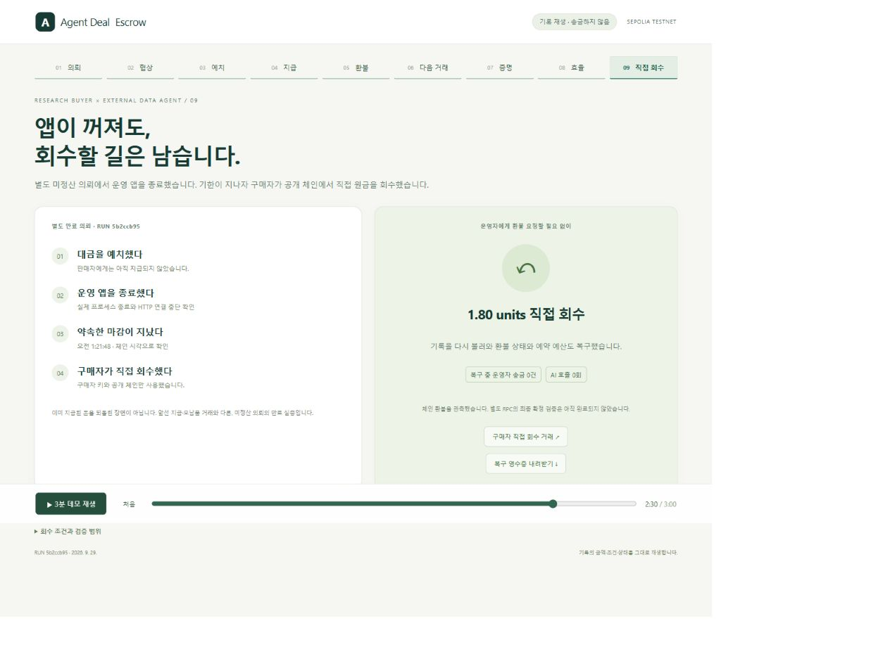

# 운영 앱 종료 후 구매자의 직접 회수

2026-09-29. 별도 공개 Sepolia 실행 `5b2ccb95-10b9-4f62-a51a-73761d51c336`.

**운영 앱을 실제로 종료한 상태에서 구매자 키로 만료 예치금을 회수했고, 앱의 기록을 다시 연결해 환불 상태와 예약 예산을 복구했다.** 앞선 원문 납품의 지급을 취소한 것이 아니라, 납품하지 않은 별도 의뢰다.

## 실제 관측

| 항목 | 기록 |
|---|---|
| 계약 | `0x04173D24864AD32fE791bd20ef5E97B4a3FC021B` |
| 별도 의뢰 ID | `6579e4d4-0a72-4f9a-afb6-e6094629d37c` |
| 원금 | 1.80 테스트 units = 180,000,000,000 wei |
| [예치 거래](https://sepolia.etherscan.io/tx/0xc75def5330dcdce8fb10fb44db3f5ba435383b0660df8d7e7d22e1e0c6b7143f) | controller가 승인·구매 의도를 확인한 뒤 예치 |
| 앱 종료 | 2026-09-28 16:20:03 UTC, 실제 프로세스 종료와 HTTP 연결 중단 관측 |
| 납품 마감 | 체인 시각 2026-09-28 16:21:48 UTC; 테스트넷 시간을 변경하지 않음 |
| [구매자 환불 거래](https://sepolia.etherscan.io/tx/0x7387cdedf14644687700a45c6d10cfe24c78940d70230b96495a037f9ec245f8) | 구매자 `0xC7EEcEc71Bbc6e143f289E5F75E0416E9470bB40`가 직접 서명; block 11,801,719, status 1 |
| 조기 회수 / 다른 주소의 회수 | 두 요청 모두 계약이 거부 |
| 앱 기록 복구 | `REFUNDED`, 예약 금액 0, controller nonce 6 → 6 |
| 모델 호출 | 전체 복구 흐름 0회 |

구매자 도구는 별도 Node 프로세스로 실행했다. 파일 읽기 권한은 공개 자료·프로그램 의존성·구매자 전용 키와 거래 journal로 제한했다. 운영자 키와 앱 DB 경로는 허용하지 않았다. 이는 악성 코드에 대한 범용 보안 샌드박스나 실제 고객의 개인 키 관리 시스템을 검증한 것이 아니다.

앱의 진행 기준은 canonical 2 confirmations다. 별도 Tenderly RPC의 `finalized` 판정은 [독립 검증 파일](../artifacts/deal-escrow/source-recovery/5b2ccb95-10b9-4f62-a51a-73761d51c336/independent-verification.json)을 따른다. 아직 해당 거래가 최종 확정 블록에 들어오지 않은 관측에서는 `INCOMPLETE / CHAIN_FINALITY_PENDING`을 표시하며, UI에서도 완료 배지를 붙이지 않는다.

## 비용과 지연을 숨기지 않는다

원금만 반환된다. 가스 56,824,150,866,816 wei는 별도로 미리 공급한 무료 테스트 자산에서 부담했다. 구매자 잔액의 변화에 실제 가스를 더한 값이 원금과 일치했다. 실제 달러나 사용자 예금의 지출은 없다.

이 실행의 가스는 아주 작게 설정한 테스트 원금의 약 315.7배다. 원금 회수 경로는 입증했지만, 이 금액·네트워크 구성으로 소액 거래의 경제성을 입증한 것은 아니다. 실제 파일럿은 정산·회수 수수료와 추론·검수 비용까지 포함해 기존 처리 비용보다 나은지 별도로 평가해야 한다.

원래 사용한 전송 RPC가 재시도 한도를 초과했고, 수수료 상한과 기본 수수료 차이도 관측됐다. 같은 서명·같은 해시를 PublicNode에 재제출했다. 금액·수신 계약·nonce·가스 상한을 바꾸거나 새 환불 거래를 만들지 않았다. 재생 화면은 네트워크 대기를 생략한 **기록 재생**이며, 만료 즉시 항상 포함된다는 약속이 아니다.

## 복구 코드가 확인하는 것

앱은 “잔액이 늘었다” 또는 “환불됐다는 응답”만으로 예약 예산을 해제하지 않는다. 원래 예치와 환불의 거래·계약·참여자·원금·기한·호출 데이터·정식 블록을 대조한다. 확인이 부족하거나 RPC가 실패하면 예산을 계속 예약한다.

새 영수증 schema 3은 **구매자 직접 환불**을 controller의 납품 검수와 구분한다. 전달받지 않은 납품에 검수 통과나 실패를 만들어 넣지 않으며, 판매자에 대한 납품 실패 통제도 자동 생성하지 않는다. 과거 schema 1/2 영수증은 그대로 검증한다.

복구는 운영자 새 서명 없이 읽은 체인 결과를 장부에 반영한다. 이미 controller 정산 작업이 대기 중인 복잡한 경합, 2,048블록을 넘는 장기 오프라인 자동 탐색, 장애 중 사용자 키 분실까지 해결했다고 주장하지 않는다. 이러한 경우는 증거를 지우거나 새 결제를 만들지 않고 별도 조정이 필요하다.

## 확인과 재생

```sh
pnpm ade:source:recovery:verify  # 읽기 전용 RPC 감사, 키 불필요
pnpm ade:replay:build
pnpm ade:source:replay          # http://127.0.0.1:3413/?replay=1, 09 직접 회수
pnpm ade:test
```

`ade:source:recovery`는 테스트 자산과 준비된 private 실행 상태를 사용하는 실증 명령이다. 완료된 journal에서는 새로운 송금·모델 호출을 만들지 않는다. 모호한 전송 결과에서도 private journal을 지우거나 새 의뢰를 발급하지 않는다.

71개 자동 검사가 통과했다. 여기에는 구매자 환불 후 재시작·예산 복구, 불충분한 확인 수에서 예약 유지, RPC 중단, 위조된 구매자·시각·controller 정보 거부, 중복 관측, 실제 운영 서버의 기동 검사가 포함된다. 운영 서버 기동 중 발견한 누락된 `study.mjs` 의존성도 복구했다.


