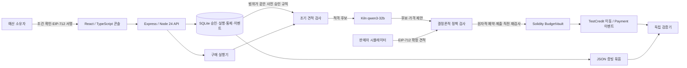

# 현재 구현과 집행 경계

2026-09-28. 실행 기준은 이 문서와 README입니다. 초기 아키텍처의 viem·SHA-256·Merkle·공개 테스트넷 계획을 그대로 구현했다고 주장하지 않습니다.

## 코드 위치

| 구성 | 구현 | 책임 |
|---|---|---|
| 화면 | web/App.tsx, web/styles.css | 위임 확인·서명, 예산과 실행, 중지, 영수증, 변조 검사, 비교 결과 |
| API | src/app.mjs, src/server.mjs | 서명 challenge 로그인, 소유자 확인, Host/Origin 검사, 서버 키 관리 |
| 실행기 | src/engine.mjs | bounded workflow, 호출 예산, 후보/협상, 예약·제출·정산·복구 |
| 정책 | src/policy.mjs | 서명·정수 금액·수수료·누적 예산·예약·목적·판매자·기한·중지 |
| 원장 | src/store.mjs | SQLite WAL, BEGIN IMMEDIATE 예약, 순번/이전 해시로 연결한 이벤트 |
| 추론 | src/kiln.mjs | 고정 주소/모델, 60초 timeout, 단일 도구·후보 ID 검사, 흐름별 사용량 |
| 체인 | src/chain.mjs, contracts/ControlMemory.sol | ethers 6, Solidity 0.8.30, OZ 5.4, 로컬 EVM, 서명·전송·영수증 |
| 검증 | src/verifier.mjs, scripts/verify-evidence.mjs | 서버 DB 없이 증빙·서명·신뢰한 RPC의 기록 대조 |

## 넘을 수 없는 선

사용자가 서명한 totalCap/perTxCap에는 견적의 상품·세금·서비스 수수료가 포함됩니다. 네트워크 가스는 **별도의 운영자 테스트 ETH로 지원**하며 이 조건도 policy에 명시합니다. TestCredit은 소수 2자리인 테스트 ERC-20입니다. 금액은 minor-unit 정수 문자열과 BigInt로 처리합니다.

코드는 `spent + reserved + quote.total <= totalCap`을 원자적으로 검사합니다. 계약은 `spent + total <= totalCap`, 건별 한도, 활성 승인, 기한, 허용 판매자, purposeHash/SKU, 최소 수량·환불, 견적 합계와 판매자 서명을 별도로 검사합니다. 모델에 서명 키·실행자 권한은 주지 않으며 임의 주소를 결제 인수로 쓰지 않습니다.

`QUEUED → RUNNING → RESERVED → SUBMISSION_STARTED → SETTLED`가 정상 전이입니다. 거절은 STOPPED, 조기 견적 거절은 REVIEW_REQUIRED, 제출 후 영수증 유실은 UNKNOWN입니다. UNKNOWN에서 예약금을 풀지 않고 저장한 **동일 raw transaction**의 hash를 조회/재전송합니다. 송신 전 중지는 예약을 해제하지만 송신 후 중지는 진행 중인 결제를 되돌린다고 약속하지 않습니다. 실행자 거래를 직렬화하고 제출 시 회계 snapshot을 다시 잡습니다.

## Control Memory

`REQUIRE_ALL_IN_PRICE` 한 종류만 구현합니다. 소유자가 policy의 autoHarden을 먼저 서명해야 합니다. 유효한 판매자 서명과 검증된 예산 초과로 발생한 사건에서만 생성하며 scope는 owner + purposeId + merchant입니다. 악성 자연어 주장이나 판매자 평점으로 규칙을 만들지 않습니다.

같은 scope에서 확정 총액을 추론 전에 요청합니다. 새 정상 견적은 통과할 수 있고 예산을 늘리거나 목적을 바꾸지 않습니다. 규칙이 적용된 결제에는 통제 목록과 source event hash가 증빙에 포함돼 체인에 앵커됩니다. **과거 실패 기록 자체는 별도의 독립 온체인 체크포인트가 아닙니다.** 원천 사건의 현실성까지 증명했다고 주장하지 않습니다. 범위 밖 독립 mandate에는 규칙을 적용하지 않는 테스트가 있습니다.

내보내기에는 controlSources도 포함합니다. 이전 사건의 사용자 승인·서명 견적·해시 이력·당시 정책 입력으로 실패를 재현하고, 원천 승인도 체인에서 확인합니다. 초기 기록처럼 회계 context가 없는 경우에는 서명된 건별 한도를 직접 초과한 사실만 재증명할 수 있습니다. 누적 예산 실패의 과거 잔액을 임의로 추정하지 않으며 자료가 없으면 INCOMPLETE입니다.

## 증빙의 정확한 의미

결제 전에 승인 서명·정책·서명 견적·회계 snapshot·AI 제안·사용량·통제·이벤트 prefix를 묶어 canonical sorted JSON의 **Keccak-256**을 계산합니다. Payment 이벤트에 기록하며 별도 Merkle tree나 NFT는 만들지 않습니다.

검증기는 bundle의 RPC URL을 따라가지 않습니다. 별도로 신뢰한 배포 manifest와 RPC로 chainId·도메인·배포 코드 hash, 승인 이벤트, 결제 이전 누적 지출과 취소, 블록 기한, offer digest, evidence hash, ERC-20 Transfer를 검사합니다. 복사한 receipt만으로 VALID가 되지 않습니다. DB 없이 JSON과 원래 devnet으로 확인할 수 있습니다.

중지 기록의 VALID는 ‘사유가 기록됐고 해당 paymentKey로 결제가 관찰되지 않았다’는 의미입니다. 모든 중지 이유가 현실적으로 옳았다는 완전한 판정은 아닙니다. 결제와 중지의 검증 scope를 응답 reason으로 구분합니다. RPC가 없는 경우 INCOMPLETE입니다.

현재 session.spent/status/reserved는 가변 요약으로 표시하고 검증된 서명 원본과 구분합니다. verifier는 특정 블록에서 체인으로 재구성한 observedSession을 별도로 반환합니다. 현재 세션 요약을 바꿨다고 과거의 올바른 결제 서명이 달라지는 것은 아니며, 가변 요약이 암호학적으로 검증됐다고 표시하지 않습니다.

## 데이터와 운영 범위

브라우저의 데모 owner key는 localStorage의 cm-devnet-wallet-v1에 저장하며 같은 origin의 탭끼리 공유합니다. 서명 challenge와 HttpOnly SameSite 쿠키로 API를 사용합니다. 실행자·판매자 테스트 키와 SQLite/체인 DB는 data/private/에 저장하며 Git·모델 요청·브라우저 config에 넣지 않습니다. 같은 origin의 스크립트를 통제하는 사용자는 데모 키에 접근할 수 있으므로 실제 지갑·자산용 설계가 아닙니다.

단일 프로세스·로컬 devnet 프로토타입입니다. 데이터 디렉터리를 삭제하면 원래 체인 증거도 사라집니다. ABI/bytecode/source digest를 보관하고 계약 source가 바뀌면 기존 체인과 혼용하지 않습니다. 다른 컴퓨터에서는 새 실행 증거와 해당 배포 manifest를 사용합니다.
