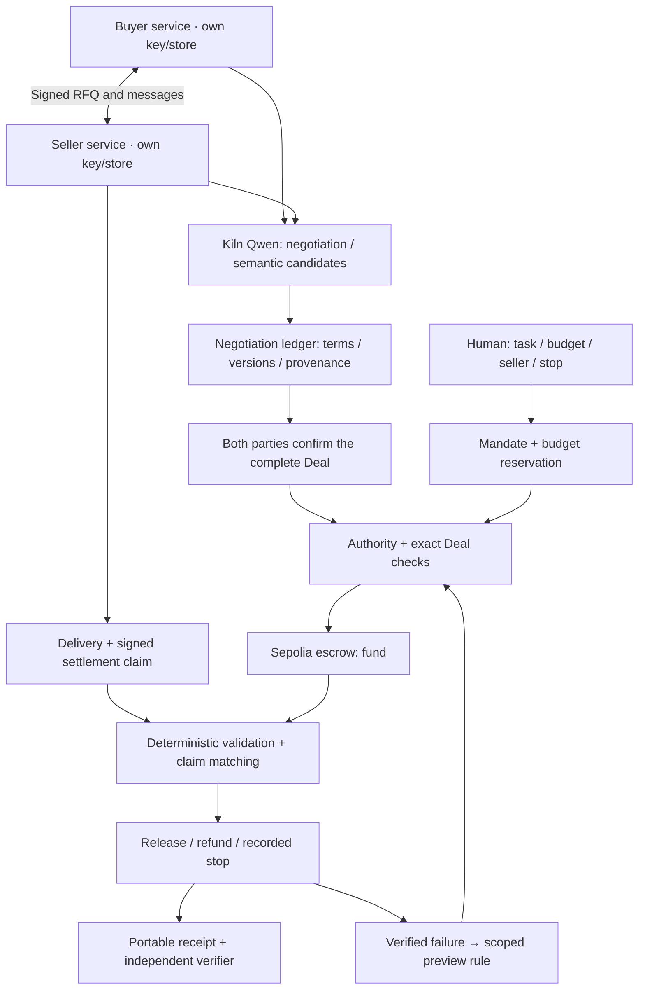

# DealTrace — 최종 제품 기획

> **2026-09-29 구현 현황:** 이 기획의 40/26/31 workflow를 v3 `34d1da0d-e842-4f44-acfd-4d97728c81f0`에서 실제 Kiln + Sepolia로 실행했다. 17/17 검사, 정정 지급·오납품 환불, 독립 프로세스와 portable receipt를 구현했다. 상세 수치와 한계는 [검증 결과](DEALTRACE-VALIDATION.ko.md)에 있다. 아래 문서는 구현 당시의 최종 설계 결정이며 미래 확장은 구현 완료를 뜻하지 않는다.


2026-09-29 · 사용자 최신 첨부 방향을 반영한 설계 기준과 구현 현황

기획 작성 당시에는 새 청구 불일치 시나리오가 미구현이었다. 이후 v3에서 구현하고 실증했으며, 현재 상태는 위 안내와 연결된 v3 증거를 기준으로 한다. 이전 버전 실행·영상은 각자의 당시 증거로 보존한다.

## 1. 확정할 제품

제품명은 **DealTrace**, 제품 범주는 **Agent Deal Assurance**로 유지한다.

> DealTrace는 리서치 에이전트가 외부 문서 처리 에이전트와 협상한 작업·가격·납기를 양측이 확인한 거래로 확정하고, 납품과 청구가 그 조건에 맞을 때만 지급하며, 그 이유를 원 대화까지 추적하게 한다.

영문 한 문장:

> DealTrace binds negotiated agent work to a mutually confirmed deal, checks delivery and billing against it, and preserves the evidence behind every payment.

발표에서 기억시킬 문장:

> **예산이 남아 있어도, 합의하지 않은 돈은 나가지 않습니다.**

핵심 질문은 다음 세 개다.

1. 무엇에 합의했는가?
2. 그 합의대로 납품하고 청구했는가?
3. 다른 사람이 기록만 보고 확인할 수 있는가?

`Outcome → Permission`은 유지하되 두 번째 차별점으로 둔다. 대표 장면은 `Budget PASS / Deal Integrity FAIL`이다. 가격 비교, 할인 성공률, 범용 자율 쇼핑이 주력 성능은 아니다.

## 2. 첫 사용자를 한 종류로 좁힌다

**소규모 리서치 자동화 서비스를 운영하며, 작업 일부를 외부 문서 처리 worker에 맡기는 개발자·운영자.**

상황: 밤새 산업 보고서를 만드는 Buyer Agent가 처리량이나 도구의 한계로 공시 문서 추출 작업 하나를 외부 Seller Agent에 맡긴다. 작업마다 문서 수, 필요한 지표, 출처 수준과 마감이 달라 견적도 달라진다. 운영자는 모든 흥정을 지켜볼 수 없지만, 공급자가 납품 후 조건을 바꾸거나 잘못된 자료를 보냈을 때 비용과 책임을 설명해야 한다.

구매하는 것은 공개된 숫자 자체가 아니라 **지정 문서를 지정 형식으로 처리하고 근거를 붙여 기한 안에 반환하는 작업**이다. 반복 배치나 외부 처리 능력이 없는 상황에서는 직접 추출하는 편이 나을 수 있다. 이 수요는 아직 가설이다.

첫 고객 조건:

- 이미 문서 처리 자동화를 운영한다.
- 외부 유료 서비스/사람/worker에 실제로 맡긴 작업이 있다.
- 고정 API 호출만으로 해결되지 않는 범위·납기·출처 요구가 있다.
- 결과 또는 청구를 확인하느라 사람이 개입한 경험이 있다.

MVP에서는 검색 크레딧, GPU 임대, 데이터 라이선스까지 묶지 않는다. 각 서비스는 검수와 과금 방식이 달라 범위가 세 배 이상 늘어난다. 공급자는 사전 등록한 두 demo provider로 한정하며 공개 marketplace는 만들지 않는다.

## 3. 한 건의 거래를 끝까지 보여준다

검수 가능한 최소 작업은 기존 출처 자료를 활용한다.

**작업:** 지정한 공식 문서에서 2025년 분기별 실제 시설투자 현금유출 네 값을 추출한다. 각 값에 원본 문서 해시·페이지·표/셀 위치·단위를 붙여 JSON으로 납품한다.

네 숫자는 실제 유료 시장 규모의 증거가 아니라 작은 실행 단위다. 제품 화면은 이를 보고서 생성 과정에서 외주한 한 작업으로 보여준다. 지원하지 않는 문서나 지표는 자동 검수 가능하다고 주장하지 않는다.

| 항목 | 데모 결정 |
|---|---|
| 사람의 예산 | 한 작업에 최대 40 DEMO, 승인된 판매자 A/B |
| 고정 요구 | 분기 실적 네 값, 공식 원본 근거, 정해진 JSON 스키마 |
| 협상할 조건 | 총액, 납기, 근거 제공의 구체적 범위 |
| 지급 정책 | 납품 전체가 검수를 통과할 때 정액 지급; 실패 시 전액 환불 |
| 대표 합의 | 수수료 포함 총액 26 DEMO, 예치 후 300초 내 납품, 모든 값에 출처 |
| 잘못된 청구 | 같은 Deal에 31 DEMO 청구 — 예산 40 안이지만 합의 26과 다름 |
| 자산 | DEMO는 표시용 회계 단위. Sepolia 테스트 자산과 명시적 환산, 실제 USD나 자체 토큰 아님 |
| 가스 | 별도 운영비로 표시하고 별도 한도 적용. 사용자 구매 예산에 포함된 것처럼 표현하지 않음 |

MVP는 건별 성공 과금과 부분 환불을 하지 않는다. `실패 호출 비과금`을 표현하려면 호출 ID, 성공 판정, 중복·재시도, 사용량 증명이 모두 필요하다. 여기서는 **완료된 한 작업의 고정 가격**으로 검증 범위를 고정한다.

## 4. 대표 데모 — 세 장면, 180초

### 장면 1 · 대화가 하나의 거래가 된다 (0–65초)

운영자가 작업, 40 DEMO 한도, 판매자, 만료를 보고 승인한다. Buyer가 같은 RFQ를 두 판매자에게 보낸다.

- Seller A: “원본 표 위치까지 제공하면 30 DEMO, 10분입니다.”
- Buyer: “다섯 분 안에, 출처를 그대로 포함해서 25에 가능합니까?”
- Seller A: “26이면 가능합니다. 네 값 모두에 원본 위치를 붙이겠습니다.”
- Buyer: “26, 다섯 분, 네 값의 원본 근거 조건으로 수락합니다.”
- Seller B: 더 저렴한 연간 전망치를 제시해 작업 범위 충돌로 제외된다.

가격 `30 → 25 → 26`, 납기 `600 → 300초`가 원문 옆에서 바뀐다. Kiln이 만든 후보를 코드가 형식·단위·근거·충돌 검사하고, Buyer와 Seller가 **전체 정규화 거래를 각각 검토한 뒤 동일 버전을 서명**한다. 단순히 같은 해시를 복사해 두 번 서명하는 연출은 충분하지 않다.

사람이 승인한 범위, 거래의 두 서명, 충돌 없음이 모두 확인되면 26을 예치한다. 화면은 `예산 40 / 예치 26 / 판매자 수령 0`으로 바뀐다.

위 문장은 데모 목표 예시다. 실제 Kiln의 모든 실행이 정확히 이 표현·가격 순서로 나왔다고 주장하지 않는다. 실시간 추론 모드와 이미 검증한 실행의 재생 모드를 분리한다.

### 장면 2 · 예산 안의 잘못된 청구를 막는다 (65–115초)

Seller가 결과와 함께 31 DEMO 청구서를 제출한다. Buyer 모델이 지급 의향을 보이는 공격 fixture를 추가해도 금융 요청은 동일한 검사를 통과해야 한다.

```text
사람의 한도       40 DEMO   PASS
양측 확정 가격   26 DEMO
판매자 청구       31 DEMO
합의와 청구 일치            FAIL

추가 예치 0 · 판매자 지급 0 · 기존 예치 26 유지
```

이때 자동으로 5를 추가 예치하거나 26을 부분 지급하지 않는다. 거절된 청구를 기록하고 판매자가 **같은 Deal에 26으로 정정 청구**하도록 한다. 잘못된 청구 한 번으로 즉시 환불/영구 낙인을 만들지도 않는다.

핵심 설명: **“이 에이전트는 돈을 쓸 수 있습니다. 하지만 방금 다른 조건에 동의했다고 해서 이미 확정한 거래를 덮어쓸 수는 없습니다.”**

### 장면 3 · 정상 지급하고, 다른 사람이 재구성한다 (115–180초)

정정 청구 26 + 유효한 납품이 확인되면 예치금 26을 지급한다. 화면에서 실제 Sepolia transaction과 판매자 수령 상태를 연다.

감사 화면에서 가격이나 납기를 누르면 아래 경로가 펼쳐진다.

```text
Buyer의 요청
→ Seller 제안 / Buyer 역제안 / 대체된 이전 조건
→ 최종 26·300초·네 출처
→ 양측 서명과 사람의 권한
→ 납품 검수
→ 31 청구 거절 → 26 정정 청구
→ 지급 transaction
```

마지막에는 앱 DB 없이 내보낸 증거 묶음과 별도 RPC로 검증한다. 로컬 사본의 가격을 바꾸면 검증 실패하는 것도 보조 버튼으로 보여준다.

### 별도 검증 장면

주요 180초 흐름과 분리해 잘못된 납품 → 환불 → 같은 회사·판매자의 다음 작업에 `REQUIRE_PREVIEW`가 적용되는 장면을 둔다. 이미 26을 쓴 예산 40에서 다시 26을 쓰려 하지 않는다. 새 작업에는 별도 승인 예산을 부여하되 회사·판매자 제한은 이어진다.

추가로 위임 만료, 판매자 미허용, 포함 수수료로 한도 초과, 사용자 중지를 기록한다. Challenge의 최소 두 중단 실행은 실제 새 버전 로그로 제출한다. 단순히 예시 화면만 만들어 충족했다고 하지 않는다.

## 5. 우리가 새로 깊게 만들 부분

### A. 협상 기록 → 확정 거래

한 조건은 값만 갖지 않는다. `현재 값 / 제안한 메시지 / 대체된 값 / 수락한 당사자 / 버전`을 갖는다. 제안, 역제안, 대화상 수락, 암호학적 확정은 서로 다른 사건이다.

LLM은 의미 후보를 제시한다. 코드의 스키마 검사만으로 자연어 의미가 맞다고 입증할 수는 없다. 모호하거나 중요한 조건이 빠지면 확인 질문으로 돌아가고 돈을 잠그지 않는다. 마지막 권위 있는 기록은 **양측이 전체 조건을 확인한 동일 버전의 Deal**이다.

### B. 확정 거래 ↔ 납품 ↔ 청구

새 `SettlementClaim`은 최소한 `claim_id, deal_hash, seller_id, payee, amount_minor, asset, delivery_hash, issued_at, signature`를 가진다.

정산 직전 다음을 검사한다.

1. 현재 잠긴 거래와 claim의 Deal hash가 같은가?
2. 판매자 신원, 수령 주소, 자산, 총액이 확정 거래와 같은가?
3. 납품이 그 거래에 지정된 입력·출력 요구를 충족하는가?
4. 검수 규칙 버전과 결과가 증거에 묶였는가?
5. 만료·중지·재지급·경합 상태를 통과하는가?

거절은 청구의 상태이고 곧바로 거래 전체의 종료를 뜻하지 않는다. 새 claim ID를 가진 정정 청구는 검수·기한 안에서 재검사할 수 있다. 기존 claim ID의 내용을 바꾸면 변조로 거절한다.

**금액 일치 검사는 새로운 발명이 아니다.** 차별점은 그 기준 금액과 작업 조건이 어떤 여러 차례의 대화에서 만들어졌고, 양측이 무엇을 확인했으며, 이행·지급과 어떻게 연결되는지를 하나의 증거로 제공하는 것이다.

### C. 증거만으로 거래 재구성

사용자가 받는 것은 영수증 한 줄과 선택적으로 펼치는 증거 묶음이다.

- 사람이 승인한 mandate와 검증 가능한 승인 근거
- 두 당사자의 키 등록 정보·서명한 원문 메시지
- 조건별 근거와 revision 연결
- 양측 최종 확인
- 입력 문서 manifest, 납품, 검수 규칙·결과
- 거절·정정 청구와 정확한 정산 이유
- chain ID, contract, 거래 해시, 확인 상태

Verifier는 `VALID / INVALID / INCOMPLETE`를 구분한다. 파일이나 신뢰할 수 있는 키 연결이 없을 때 유효하다고 추정하지 않는다. 서명된 기록도 모든 외부 대화가 빠짐없이 포함되었다거나 원문이 의미상 참임을 증명하지는 않는다.

## 6. 거래 모델과 상태

최종 Deal에는 다음이 들어간다.

| 묶음 | 주요 필드 |
|---|---|
| 식별·권한 | schema_version, deal_id, revision, buyer/seller identity, mandate_hash |
| 작업 | source_manifest_hash, metric, periods, quantity, output_schema, required_evidence |
| 가격 | amount_minor, asset, seller_fee_included, payee |
| 시간 | offer/funding expiry, delivery window와 기산점, 정산 마감 규칙 |
| 검수 | validator_profile_id/version/hash, pass/fail 기준 |
| 지급 | fixed_price_all_or_refund, buyer refund 조건 |
| 이력 | prior revision hash, 원문 근거 bundle hash |

금액은 정수 minor unit이다. 통화·단위 없는 숫자는 확정하지 않는다. 가격만 같아도 다른 문서·다른 기간·다른 수령인·다른 버전이면 같은 거래가 아니다.

```text
RFQ → NEGOTIATING → CANDIDATE → BILATERALLY_COMMITTED
                                       ↓
                               AUTHORIZED → FUNDED
                                              ↓
                                          DELIVERED
                                              ↓
                               VERIFIED + MATCHING_CLAIM
                                              ↓
                                           SETTLED

불일치 청구 → CLAIM_REJECTED (FUNDED 유지)
검수 실패 / 기한 종료 → REFUNDED
자연어 애매함 / 서로 다른 서명 버전 → 확정·예치 중단
```

금융 상태와 모델의 대화 상태는 분리한다. 양측이 다시 대화했다고 기존 확정 조건이 바뀌지 않는다. MVP는 예치 후 계약 변경을 지원하지 않는다. 예치 전 변경도 새 revision·두 서명·권한 재검사를 요구한다.

납기는 메시지의 “지금부터”에 맡기지 않는다. 원칙은 **funding transaction의 block timestamp + 합의한 window**다. 실제 컨트랙트의 만료·마감 계산과 이 규칙이 일치하도록 adapter와 검사를 맞춘다. 만료 때문에 기간이 줄어들면 조용히 5분이라고 표시하지 않고 예치를 거절하거나 줄어든 기한으로 다시 확인한다. 현재 contract는 `min(block time + window, dealExpiry)`이므로 이 경계는 구현 시 별도 확인 대상이다.

## 7. 전체 구조와 신뢰 경계



현재는 두 역할을 한 orchestrator가 실행한다. 다음 버전은 Buyer와 Seller를 별도 프로세스, 별도 키와 저장소로 나눠 HTTP로 실제 메시지를 전달한다. 두 프로세스로 나눴다는 이유만으로 외부 두 회사의 독립성이나 검증된 조직 신원이 확보된 것은 아니다. 실제 공급자 한 곳의 통합은 이후 파일럿에서 검증한다.

판매자 통합은 RFQ 수신, 정규화 Deal 확인/서명, 납품·청구 제출만으로 좁힌다. A2A/MCP/AP2 어댑터 전체를 먼저 만들지 않는다.

## 8. Blockchain의 역할을 정확히 둔다

오프체인에는 원문, 문서, 납품, 상세 검수 자료를 보관하고 양측에 동일한 묶음을 전달한다. 온체인에는 Deal에 묶인 예치, 수령인, 금액, 기한, 지급/환불 및 증거 commitment를 남긴다.

**체인이 확정하는 것:** 어느 거래의 자금이 어디에 얼마만큼 잠겼고, 언제 누구에게 지급되거나 환불됐는가. 나중에 제출한 자료가 고정된 commitment와 일치하는가.

**체인이 판단하지 않는 것:** 자연어 해석의 정확성, 자료의 일반적 진실, 공급자의 실제 사업자 신원, 법적 계약 유효성.

현재 escrow는 trusted off-chain controller가 Deal binding·권한·검수를 확인하는 구조다. 컨트랙트는 잠긴 금액과 지급/환불 상태를 집행하지만 원문이나 양측 Ed25519 서명을 직접 확인하지 않는다. 중립적인 자금 기록과 **완전히 신뢰가 필요 없는 상거래**는 다르다. 현재 controller 신뢰 가정을 문서·발표에 명시한다.

데모에서는 한 건의 funding과 release를 동일한 협상·납품·청구 기록에 연결하고 별도 RPC에서 검증한다. 불일치 청구 때 on-chain 지급이 없다는 사실도 보여준다. 앱 종료 후 구매자 만료 환불은 기존 근거를 보조로 사용하되 새 버전에서 재현 여부를 구분한다.

## 9. Kiln/Qwen을 어디에 쓰는가

모델은 사용자 최신 지시대로 **Kiln의 qwen3-32b**를 사용한다. 최초 공유된 Challenge 문구의 모델명과 다르므로 제출 문서에는 실제 요청 model ID를 남기고, 주최 측 변경 안내를 확보해 버전 차이를 설명한다.

| Kiln으로 하는 일 | 코드로 하는 일 |
|---|---|
| 요구·역제안·모호한 수락을 읽고 조건 후보 제시 | 타입·단위·버전·서명·예산·원자적 예약 |
| 제한된 협상 범위 안에서 다음 제안 작성 | 허용 판매자·만료·중지·최종 일치 검사 |
| 실적 vs 전망, 원문 근거 vs 단순 링크의 의미 차이 제시 | 지원하는 문서의 검수·정산·환불·중복 방지 |

검수 재현, 청구 금액 비교, 영수증 재검증, 예산 조회에 LLM을 부르지 않는다. 설명 문장도 가능한 한 기록을 직접 렌더링한다.

협상 라운드·호출 수·토큰 예산을 설정한다. 새 메시지와 최소 상태만 전달하고 매번 전체 대화를 다시 읽히지 않는다. 동일 입력/스키마/모델/문맥 hash일 때만 추출 결과를 재사용한다. 협상이 수렴하지 않거나 모델이 중단되면 미완료로 기록한다.

NPU 활용 근거는 실제 요청이 최종 조건에 영향을 주는 기록과 흐름별 usage다. 효율 비교는 성공·실패·재시도를 모두 포함한 입력/출력 토큰, 지연, 호출 수로 한다. 전력 telemetry가 없으면 에너지는 가정식으로만 표시하고 실측 NPU/GPU 우위라고 하지 않는다.

고정 숫자만 다른 템플릿으로 “AI가 필요하다”를 입증하지 않는다. 구현 전 동결한 미관측 표현 사례를 이용해 단순 규칙, 전체 대화 재추출, 증분 Kiln 해석을 비교한다. 조건 정확도·근거 정확도·모호할 때 보류율·토큰을 함께 보고한다. 양측 확인이 의미 오류를 완전히 없앤다고 가정하지 않는다.

## 10. 제품 화면

네 개 메뉴 대신 **한 거래의 세 패널**을 기본 화면으로 한다.

| 패널 | 사용자가 이해할 내용 |
|---|---|
| 대화 | 두 Agent가 어떤 제안과 역제안을 했는가 |
| 확정 거래 | 현재 조건, 변경 이력, 양측 확인, 조건별 원문 링크 |
| 실행과 돈 | 예산/예치/지급, 납품 검수, 합의 vs 청구, 거절·정정·영수증 |

가격을 클릭하면 대화가 해당 메시지로 이동한다. 모든 claim에는 확정 거래와의 차이를 보여준다. 정상 결과물 JSON과 출처를 다운로드할 수 있어야 한다. 사용자는 추상적 PASS 목록이 아니라 사용할 수 있는 결과물을 받는다.

상단에 `사람이 승인한 범위`, `위임 중지`, `현재 돈의 위치`를 고정한다. 중지는 새 서명을 막고 이미 제출된 거래를 추적한다. 제출된 chain transaction을 즉시 없애는 버튼이라고 표현하지 않는다.

## 11. 경쟁 구도 — 과장 없이 말할 것

2026-09-29 공식 문서 확인 기준:

| 대상 | 이미 다루는 것 | DealTrace가 집중할 검증 범위 |
|---|---|---|
| AP2 | 서명된 Checkout, 열린/닫힌 Checkout·Payment Mandate, 거래·권한 연결 | 여러 차례 협상에서 나온 조건별 근거와 납품·청구 연결 |
| x402 | HTTP 결제, 다양한 settlement scheme; exact/upto/batch-settlement 설명도 있음 | 결제 전에 생성되는 맞춤 작업의 조건과 이행 증거 |
| Nevermined | agent 지출 위임·한도·metering·다양한 과금 | 한 협상 건의 조건 변경부터 정정 청구까지 재구성 |
| Pactum | 공급자 협상, 정책·감사, 조달 workflow | 작은 외부 machine job을 서로 다른 agent 실행 환경에서 확정·검수 |

이는 **우리의 범위 선택**이지 경쟁사가 못 한다는 증명은 아니다. “최초”, “아무도 계약을 다루지 않는다”, “결제는 이미 완전히 해결됐다”는 표현은 쓰지 않는다. Web2에서도 서명·원장·검증을 만들 수 있다. 핵심 구분은 상품 카탈로그 결제와 **작업마다 새로 만들어지는 조건**이다.

첨부의 AP2 `Intent / Cart / Payment` 설명을 최신 규격 이름으로 단정하지 않는다. 현재 공식 흐름은 Checkout·Payment와 open/closed mandate를 사용한다. 특정 버전과의 호환성은 어댑터와 상호운용 테스트가 있을 때만 주장한다.

출처:

- [AP2 Flow Examples](https://ap2-protocol.org/ap2/flows/)
- [AP2 Agent Authorization](https://ap2-protocol.org/ap2/agent_authorization/)
- [x402 공식 저장소 — Schemes](https://github.com/x402-foundation/x402#schemes)
- [Nevermined 지출 위임·결제 인프라](https://nevermined.ai/use-cases/agentic-payments-infrastructure/)
- [Pactum Procurement Agents](https://pactum.com/procurement-agents)

확인하지 않은 endpoint 수·거래량·시장 규모는 기획의 근거로 사용하지 않는다.

## 12. 기존 코드와 다음 변경

| 유지 | 추가/강화 | 발표 중심에서 내릴 것 |
|---|---|---|
| Mandate, Policy Engine, 원자적 예산 예약 | RFQ와 작업 manifest를 명시 | 단순 예산 초과가 대표 혁신이라는 설명 |
| Ledger, revision, provenance, 양측 서명 | 분리된 Buyer/Seller 프로세스와 각자 확인 | 한 프로세스의 역할을 독립 기업이라 부르기 |
| Escrow, buyer recovery, durable intents | signed SettlementClaim + correction + exact matching | 에스크로 자체가 차별점이라는 설명 |
| Delivery validator, receipt, 별도 RPC verifier | claim까지 포함한 휴대 가능한 감사 묶음 | 고정 네 숫자를 유료로 살 수요가 입증됐다는 설명 |
| 회사×판매자 Control Memory | 거래와 청구 상태 분리, 부족한 의미 근거는 보류 | Memory를 범용 신용점수·자동 정책 학습이라 부르기 |

기존 공개 실행은 Kiln 10회/11,685토큰, Sepolia 4건, 독립 검증 VALID 네 영수증, 전체 검사 118/118을 보유한다. 이는 재사용할 기반이다. 새 40/26/31 데모, 외부 프로세스 경계, signed claim lifecycle은 새 증거가 필요하다.

권장 구현 순서:

1. **거래·청구 규칙:** Deal schema를 고정하고 immutable SettlementClaim/정정/거절 상태를 추가한다. 기존 executor의 모든 지급 경로에서 일치 검사를 강제한다.
2. **실제 통신 경계:** Buyer/Seller 각자 키·저장소·확인 로직을 가진 HTTP 프로세스로 나눈다. 재시도, 서명 불일치, 메시지 누락은 중단한다.
3. **대표 UI:** 40/26/31 비교와 조건별 원문 이동, 실제 결과물·영수증을 보여준다.
4. **실증:** live Kiln 협상 + 실제 Sepolia 예치/지급, 별도 실패/환불/중지, 앱 DB 없는 검증까지 한 버전으로 묶는다.
5. **발표물:** 위 실행에서 180초 영상·한 장 설명서·README Acceptance Matrix를 다시 만든다. 이전 증거를 새 데모 영상으로 재명명하지 않는다.

계획을 위해 금융 코드를 새로 실행하거나 테스트 자산을 추가로 소비할 필요는 없다. 다음 구현은 이 순서에 따른다.

## 13. 완료 판정

다음은 목표이며 현재 달성 수치가 아니다.

| 검증 | 통과 조건 |
|---|---|
| 협상 재구성 | 최종 가격·납기·작업을 원문 메시지와 양측 확인까지 추적 |
| 양측 divergence | 같은 가격이라도 다른 문서·납기·수령인·버전이면 확정 불가 |
| 핵심 공격 | 예산 40, Deal 26, claim 31에서 추가 예치·지급 모두 0 |
| 정정 청구 | 같은 거래의 새 26 claim + 유효 납품은 정확히 한 번 지급 |
| 금융 경계 | 만료·미허용 판매자·수수료 초과·중지 중 최소 두 실제 중단 실행과 영수증 |
| 재시도 | 중복 청구/재전송/관측 timeout으로 이중 지급하지 않음 |
| 환불·Memory | 검증된 실패 환불 후 새 위임에서도 회사×판매자 preview 통제 유지 |
| 온체인 | 동일 실행의 fund/release 또는 refund 해시와 최종 상태를 별도 RPC로 확인 |
| 독립 검증 | 앱 DB와 비밀키 없이 증거 묶음 검증; 변조는 INVALID, 자료 누락은 INCOMPLETE |
| Kiln | 실제 요청·응답이 조건 후보/협상에 사용되고 모든 시도 usage가 흐름별 집계 |
| 사람 이해도 | 처음 보는 사람이 누구의 어떤 작업인지, 왜 31을 막고 26을 냈는지 기록만으로 설명 |

사람 이해도 검사는 실제 3명 이상에게 진행하고 원 답변을 보존한다. 자동 테스트 성공은 사람의 답변으로 대체하지 않는다. 의미 성능 평가에서는 정답 사례만 고르거나 중단을 숨기지 않는다.

## 14. 실제 사용으로 넘어갈 조건

해커톤 결과물은 **지원하는 문서·미리 등록한 판매자·테스트 자산에서 동작하는 한 거래의 end-to-end prototype**이다. 범용 실전 금융 인프라로 소개하지 않는다.

파일럿 전에는 운영자 5명과 실제 최근 외주 건을 확인한다. 지급의사 질문보다 기존 작업 명세, 견적, 납품/청구 불일치, 사람 개입 시간을 먼저 받는다. 최소 한 팀의 실제 작업과 한 공급자 endpoint를 연결해 입력부터 usable output까지 재현한다. 대상자가 고정 가격 API만 쓰거나 직접 처리가 늘 더 싸고 빠르다면, 맞춤 협상의 고객 가설을 다시 좁힌다.

상용화 전에는 조직 신원과 키 관리, provider onboarding, 외부 검수 신뢰, 자료 보관·삭제, 장애 대응과 결제 운영을 별도로 해결해야 한다. 법적 계약 생성, 범용 분쟁 중재, DAO, 자체 토큰, 다중 체인, enterprise ERP 연결은 이번 범위에서 제외한다.

최종 발표는 이렇게 닫는다.

> **두 에이전트가 합의한 조건이 돈이 움직이는 기준이 됩니다. DealTrace는 그 조건이 어디서 왔고, 이행됐으며, 왜 지급됐는지를 함께 남깁니다.**
