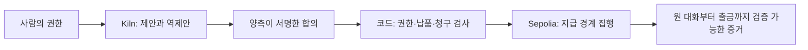

# Accord Lock — 현재 5분 발표

현재 발표의 기준이다. 이전 26/31, 150/180 영상은 역사적 실행으로 분리한다.

## 0:00–0:40 · 문제

“AI에게 40까지 쓰라고 했습니다. 두 에이전트는 20에 합의했습니다. 판매자가 25를 청구하면 지급해도 될까요? 예산 안이지만 합의한 거래는 아닙니다.”

Accord Lock은 연구 자동화 팀이 분기 CAPEX 표 작업을 에이전트에 맡길 때, 합의한 작업과 금액에 맞는 청구만 지급하도록 돕는 제품이다. 합의 금액이 지급의 경계다.

## 0:40–2:20 · 직접 사용

고정 주소: https://agent-spending-firewall.vercel.app/

1. **Try with a sample task → Create task.** 예산 40 / 거래당 한도 30 / 네 분기 원자료.
2. **Request offers.** 샘플의 35 제안이 자동 차단된다. 서명과 자금 이동이 없는 로그를 확인한다.
3. **Atlas → counteroffer 20 → Approve & lock funds.** 22가 20으로 바뀌고 브라우저 EVM 잠금 영수증이 생긴다.
4. **Run worker.** 샘플이 주입한 25 청구는 두 한도 안이지만 합의 20과 달라 차단된다.
5. **Use agreed invoice: 20 → Approve & pay → Verify on local chain.** 정확한 지급과 영수증을 확인한다.

“지금은 반복 체험용 데모입니다. 규칙 기반 워커와 테스트 자산을 사용합니다. 애플리케이션이 청구를 검사하고 로컬 컨트랙트가 잠금·지급을 실행합니다.”

## 2:20–3:20 · 실제 Kiln와 공개 체인

**See the matching Sepolia proof →**를 연다.

“DealTrace는 이 원리를 실제 AI와 공개 체인에서 검증한 경로입니다. 저장된 실행에서 Kiln의 qwen3-32b가 22에서 20으로 협상했습니다. 판매자와 검수자가 실제 서명한 25 청구도 Sepolia 컨트랙트가 거절했습니다. 수정한 20만 정산·출금됐습니다.”

- 5개 실제 Kiln 호출, 흐름별 토큰, 총 7,890 토큰.
- 5개 공개 트랜잭션: 위임, 잠금, 25 거절, 20 정산, 판매자 출금.
- 원본 JSON과 47개 finalized 검사. 새 실행인 것처럼 말하지 않는다.
- 공개 실행의 거래당 한도는 40이다. 브라우저의 30 한도는 첫 초과 제안 체험용이다.
- 로컬 1 test unit = 1 gwei, 공개 1 DEMO = 100 Sepolia gwei. 의미상 금액을 맞췄으며 원장 단위와 네트워크는 다르다. 가스는 별도 기록한다.

## 3:20–4:10 · 왜 이 구조인가

“AI가 협상하지만 AI의 말만으로 돈을 움직이지 않습니다. 예산·서명·청구·재시도·정산은 코드가 검사합니다. 블록체인은 서명된 합의와 권한을 집행하고 결과를 독립적으로 확인하게 합니다. 납품의 사실성까지 체인이 알아내는 것은 아닙니다.”

## 4:10–5:00 · 사용자와 다음 검증

첫 사용자는 외부 워커의 단기 작업을 구매하는 연구 자동화 팀이다. 실제 독립 판매자 수요와 유료 고객은 아직 검증하지 않았다. 원문 근거가 붙은 분기 CAPEX 표에 집중한다. API·컴퓨팅 조달은 확장 방향이며 현재 고객으로 제시하지 않는다.

NPU 전력 측정값은 없다. 언어가 필요한 협상만 Kiln에 맡기고 계산 가능한 결제 검증에서 추론을 없앤 설계를 설명한다. 측정하지 않은 절감률은 주장하지 않는다.

“Accord Lock makes the negotiated agreement the boundary for payment.”

## 질의응답 자료

EIP-712, ERC-1271, replay/nonce, 철회, 직접 환불, V3 metering 우회 차단, 과거 83검사 증거는 질문받을 때 설명한다. V3 최신 검증은 로컬이며 현재 public V2 proof와 구분한다. 사람 3명 이해도 검증은 실제 응답이 생기기 전까지 **0명·미실시**로 표시한다. Grok Bot 후기는 AI 사전 검토이며 인간 응답으로 세지 않는다.
