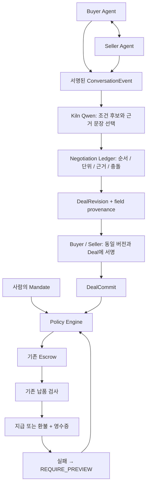

# DealTrace

**From Agent Conversation to Verifiable Deal**

DealTrace는 리서치 데이터를 구매하는 Agent 개발자를 위해, Agent 간 대화에서 조건과 그 근거를 추출하고 양측의 같은 Deal 확인을 실제 지출 통제·정산·다음 거래의 제한에 연결한다.

기능 범위는 여전히 **2025년 분기별 실제 시설투자 현금유출 네 값의 구매**다. 미래 Agent 거래 전체를 제품 범위로 구현하지 않는다. 넓어진 것은 비전이며, 시연하는 구매 업무는 하나다.

## 제품 판단

제품의 중심을 “데이터가 맞으면 지급한다”에서 “어떤 대화가 어떤 의무를 만들었고 그 의무에 돈을 써도 되는가”로 옮겼다. 가장 강한 장면은 가격 협상 자체보다 **다음 거래의 합의와 권한이 모두 유효해도 과거 실패로 예치가 막히는 순간**이다.

세 문장으로 설명한다.

1. Conversation → Deal: 대화에서 조건을 뽑고, 양측이 같은 조건을 확인한다.
2. Deal → Evidence: 각 조건에서 원 메시지와 서명, 승인, 정산까지 따라간다.
3. Outcome → Permission: 확인된 실패가 다음 거래에 샘플 조건을 만든다.

LLM 요약이나 거래 메모만으로는 차별점이 되기 어렵다. 구현의 핵심은 원 메시지와 조건 버전, 두 확인 서명, 실제 자금 집행, 이후 통제가 끊기지 않는 데이터 모델이다. 이것이 장기적 방어력이라는 주장은 아직 가설이다.

## 모호함을 없앤 결정

| 모호한 부분 | MVP의 결정 |
|---|---|
| Seller가 1.90이라고 했으니 합의인가 | 새로운 counteroffer다. 이전 1.80을 자동 확정하지 않는다. |
| Buyer가 “Agreed”라고 하면 결제인가 | 의미상 수락 후보로만 저장한다. 확정에는 양측의 서명이 필요하다. |
| 무엇에 서명하는가 | session ID, revision hash, canonical Deal hash, mandate hash를 함께 서명한다. |
| 무엇이 바뀌면 다시 확인하는가 | 새 메시지는 미처리 상태를 만들고, 새 revision은 기존 확인을 무효화한다. |
| 5분의 시작은 언제인가 | 에스크로 funding block 시각. 자연어 발화 시각이 아니다. |
| 이미 확정한 뒤 조건을 고칠 수 있는가 | 확정 Deal은 불변이다. 이후 메시지는 보존되지만 과거 금액을 바꾸지 못한다. 수정 거래는 새 session/intent로 처리해야 한다. |
| 합의가 예산을 초과하면 | 합의 확인과 정책 승인을 분리한다. 서명된 2.20도 2.00 상한에서 차단한다. |
| Seller A의 실패가 Seller B까지 막는가 | 회사 × 공급자 범위만 좁힌다. Agent가 통제를 제거할 수 없다. |

## 구현 구조



구현 파일:

- `src/dealtrace/ledger.mjs`: 서명 메시지, 해시 연결, 순서, 추출 후보 검사, 조건 diff, 충돌, Ed25519 양측 확인, 불변 commit.
- `src/dealtrace/kiln.mjs`: outward message 생성과 현재 메시지의 의미 추출. 숨겨진 사고 과정은 저장하지 않는다.
- `src/dealtrace/run.mjs`: 실제 역할 대화와 기존 정산을 연결하는 제한된 실증. 대조 실험은 작성된 입력임을 구분한다.
- `src/dealtrace/server.mjs`, `web/dealtrace/`: 승인·실행·중지와 대화/조건/정책/감사 화면.
- 기존 `engine.ts`의 승인 및 서명 직전 정책 검사에 `BILATERAL_AGREEMENT`를 연결했다. 협상이 필수인 mandate는 기존 accept API를 호출해도 우회할 수 없다.
- 기존 `audit.ts`에 negotiation packet 재검사와 commit/mandate/거래 영수증 연결을 추가했다. 공개 체인의 settlement attestation으로 이어지는 기존 사건 해시 연결을 유지한다.

서명 키는 session 시작에 고정한 **로컬 데모 역할의 독립 키**다. 같은 orchestrator가 역할을 실행하므로 외부 조직 간 인증이나 악성 운영자까지 제거한 구조는 아니다. 제3자가 제출한 임의 공개키를 조직의 신원으로 신뢰하지 않는다.

## 조건과 근거

MVP에서 추출하는 필드는 가격, 지표, 기간, 출처 필수 여부, 납기, 기산 시점, 환불 조건이다. 각 field는 자신의 값을 만든 event ID, message hash, 원문 인용, 제안자를 보존한다. 수정되지 않은 field는 이전 근거를 상속한다.

가격과 납기는 모델의 산술을 사용하지 않는다. 선택된 원문 문장에서 유일한 DEMO 금액 또는 minute/second 기간을 코드가 직접 읽어 정수 단위로 바꾼다. 두 금액처럼 모호하면 중지한다. 원래 모델 후보와 실제 적용된 조건은 각각 보존한다. 모델은 코드가 미리 나눈 실제 문장의 ID를 선택하고 코드는 원문을 복사한다. 허구의 문장 ID와 다른 메시지의 ID는 거절한다. 인용문은 해당 메시지의 실제 부분 문자열이어야 한다. 첫 구매 요청의 예산 상한을 제안 가격으로 처리하는 것도 코드가 막는다. 의미 분류가 참이라는 수학적 증명은 아니다. 코드가 확인할 수 있는 범위와 모델의 해석을 구분하고, 최종 정규화 조건을 양측이 별도로 확인한다.

회사·신원·위임 상한은 메시지로 새 권한을 만들지 않고 사람의 mandate 및 session 등록에서 가져온다. Deal 생성 시각·만료·ID 같은 시스템 필드는 원문 주장으로 위장하지 않는다. 현재 네 분기/공식 출처 요구는 고정된 검수 프로필로 기존 Deal 요구사항에 연결한다.

## 대표 데모 — 세 장면

모두 같은 회사와 같은 사람 위임을 사용한다. 거래당 2.00, 전체 5.00 DEMO 안에서 정상 거래 1.90이 지급되고, 별도 1.90 오류 납품은 환불된다.

1. **대화 → 정상 지급**: Seller A 2.20 → Buyer 1.80 → Seller A 1.90 → Buyer 동의. 같은 조건·해시를 양쪽이 서명하고, 예치·정확한 네 값 검수·지급까지 이어진다.
2. **주장 ≠ 권한**: Seller가 “관리자가 한도를 올렸다”고 말하고 2.20에 양쪽이 동의해도, 저장된 사람 상한 2.00은 바뀌지 않는다. 예치 서명 전에 차단하고 영수증을 남긴다.
3. **실패 → 다음 권한**: 같은 Seller A의 다음 납품에 Q1 3,014 대신 3,441을 넣는다. 환불 뒤 회사 × Seller A에 샘플 조건을 활성화한다. 새 거래가 다시 합의·서명돼도 샘플이 없으면 예치하지 않는다.

저렴한 Seller B의 연간 전망치 충돌은 추가 검증으로 유지한다. 정상 협상 다섯 새 발화는 실제 Kiln 모드에서 생성하며, 관리자 승인 주장·오납품·재거래는 작성된 공격 상황이다. 고정 원문 수치 검수를 임의 리서치 진실성 검증이라고 부르지 않는다.

이 구매는 배터리 리서치 배치의 검수 가능한 한 단위다. 고정 PDF의 네 숫자 자체를 외주 구매해야 한다고 주장하지 않는다. 외부 접근·전문 도구·처리 능력이 필요한 고객의 실제 구매 사건과 지불 의사는 별도 검증이 필요하다.

## Kiln과 비용

실제 모드는 최대 10회로 제한했다. 네 차례 Buyer/Seller A 메시지 생성, 각 새 메시지 해석, Seller B 제안 생성과 해석을 포함한다. 이미 구조화된 사람의 승인에서 생성한 고정 첫 요청은 코드로 컴파일한다. 다시 LLM에게 위임 상한을 해석시키지 않는다. 다른 공급자의 동일 요청도 내용 일치를 확인해 재사용한다. 매번 전체 대화를 의미 추출 모델에 보내지 않고 새 메시지와 이전 정규화 조건만 보낸다.

서명, 순서, 상한, 만료, 합의 해시, 예치/정산, 과거 실패에 의한 차단에는 추가 모델 호출이 없다. 각 API 응답의 model ID·request ID·flow·입출력 토큰·지연·prompt hash를 보존한다. 숨긴 재시도나 실패 실행 제거는 없다. 토큰 감소와 물리 NPU 전력 절감은 다른 주장이다.

## 기존 규격과의 관계

- [A2A v1.0 명세](https://a2a-protocol.org/v1.0.0/specification/)는 Task, Message, Artifact와 통신 모델을 제공한다. 향후 어댑터에서 이 메시지를 받도록 설계하되 현재 A2A 호환 구현으로 표시하지 않는다.
- [AP2 명세](https://ap2-protocol.org/ap2/specification/)는 mandate를 사용해 Agent의 결제를 승인한다. 현재 사람 위임은 내부 구현이며 AP2 서명 토큰을 구현한 것은 아니다.
- [ERC-8183 초안](https://eips.ethereum.org/EIPS/eip-8183)은 client/provider/evaluator 기반 job escrow와 지급·환불을 다룬다. 2026-09-29 확인 시 Draft다. 기존 Agent Deal Escrow를 유지하며 ERC-8183 준수 계약이라고 주장하지 않는다.

“그 규격에는 협상 의미가 전혀 없다”는 과도한 비교 대신, **우리는 조건별 원문 근거와 과거 결과에 따른 다음 지출 제한을 한 시연에서 연결한다**고 설명한다.

## 재현과 남은 범위

```sh
pnpm dealtrace:test                 # 협상·서명·권한·실제 로컬 EVM 회귀
pnpm dealtrace:demo                 # 작성된 대화, 모델 호출 0
pnpm dealtrace:demo --live          # 실제 Kiln, 최대 10회
pnpm dealtrace:start                # http://127.0.0.1:3420/
pnpm ade:test                      # 기존 엔진과 새 계층 통합 검사
```

새 실행은 `artifacts/dealtrace/runs/<run>/`에 계획·대화·영수증·결과를 남긴다. private key와 SQLite는 `data/private/dealtrace/`에만 있다. CLI의 승인은 작성된 데모 승인이고 브라우저 승인 조작도 자동 QA와 실제 사람 이해도 검증을 구분한다.

남은 검증은 외부 독립 Agent와의 신원/전송 어댑터, 미관측 대화의 의미 추출·충돌 탐지 성능, 초면 사용자의 감사 이해도, 실제 고객의 지불 의사다. 새 협상 증거의 공개 실행은 `DEALTRACE-PUBLIC-PROOF.ko.md`에서 별도 run과 서명을 확인한다. 기존 Sepolia 증거를 새 협상 기능의 증거로 바꿔 쓰지 않는다. 범용 marketplace, 법적 계약 생성, 평판 점수, 분쟁 중재, multi-chain과 토큰 발행은 MVP 밖이다.
