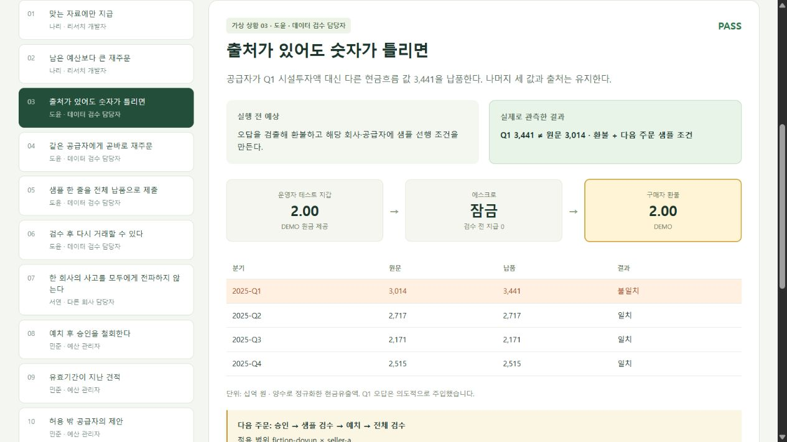

# 가상 업무로 실행한 데모 검증

2026-09-29. 사용자의 요청에 따라 가상의 발주자·공급자 상황을 만들고 실제 제품 코드, SQLite, 원본 PDF, 로컬 EVM으로 실행했다. **최종 실행 12/12 통과.** 실제 사람의 인터뷰나 사용성 평가로 집계하지 않는다.

- [클릭 가능한 데모](../artifacts/deal-escrow/fiction/e33869e3-ffb2-4e1f-9956-30a5634dd3be/index.html)
- [실행 보고서](../artifacts/deal-escrow/fiction/e33869e3-ffb2-4e1f-9956-30a5634dd3be/report.json), [실행 전 계획](../artifacts/deal-escrow/fiction/e33869e3-ffb2-4e1f-9956-30a5634dd3be/manifest.json)
- [브라우저 검사](../artifacts/deal-escrow/fiction/e33869e3-ffb2-4e1f-9956-30a5634dd3be/ui/browser-checks.json), [화면과 실행 자료의 연결](../artifacts/deal-escrow/fiction/e33869e3-ffb2-4e1f-9956-30a5634dd3be/presentation.json)

## 가상의 하루

리서치 개발자 나리는 보고서 마감 전에 LG에너지솔루션의 2025년 분기별 시설투자 현금유출 네 값을 발주한다. 데이터 검수 담당자 도윤은 그럴듯한 숫자 하나를 잘못 받은 뒤 같은 공급자에게 다시 맡긴다. 예산 관리자 민준은 위임을 철회하거나 오래된 견적·허용 밖 공급자의 제안을 막는다. 다른 회사의 서연과 가상 감사 검증자는 통제 범위와 기록 변조를 확인한다.

이름·회사·승인·공급자 동작은 모두 작성한 시나리오다. 승인 입력은 스크립트가 제출했다. 데이터는 고정된 원본 PDF의 16쪽에서 읽었고, 첫 견적 비교는 실제 Kiln `qwen3-32b` 호출이었다. 이후 승인·공격·재주문은 코드로 작성한 입력이며 추가 모델 판단이라고 표시하지 않는다.

| 상황 | 실제 관측 |
|---|---|
| 정상 발주 | 모델이 2.00 DEMO를 제안. 네 분기 원문 일치 후 공급자 지급 |
| 누적 예산 초과 | 첫 지급 후 남은 1.00보다 큰 2.00 주문을 `TASK_BUDGET`으로 중지 |
| 출처는 유지한 오답 | Q1 3,014를 3,441로 교체. 환불 후 회사·공급자별 `REQUIRE_PREVIEW` 생성 |
| 샘플 없는 재주문 | `PREVIEW_REQUIRED`. 새 서명·잔액 변화·모델 호출 모두 0 |
| 샘플을 최종 납품으로 재사용 | 한 행 샘플로 예치한 뒤 최종 1/4행 미납을 검출하여 환불 |
| 정상 샘플과 전체 납품 | 같은 공급자에게 지급. 샘플 조건은 유지 |
| 다른 회사 | 첫 회사의 통제를 전파하지 않고 정상 지급 |
| 예치 후 위임 철회 | 데이터 검수는 통과해도 지급하지 않고 환불 |
| 만료된 견적 | `DEAL_NOT_EXPIRED`. 새 서명·잔액 변화 0 |
| 허용 밖 공급자 | `SELLER_ALLOWED`. 새 서명·잔액 변화 0 |
| 완료 요청 반복 | 기존 지급 해시 유지. 추가 지급 0 |
| 영수증 금액 변조 | 실제 200 minor를 201로 바꾼 사본 INVALID, 원본 VALID |

서로 다른 Deal 10건 중 지급 3건·환불 3건이며 나머지는 예치 전에 멈췄다. 로컬 체인에서 예치 6건과 정산 6건, 합계 12개 controller 거래를 관측했다. 마지막 계약 잔액은 0이다. 동일 지급을 다시 관찰한 중복 요청 사례를 새 지급으로 세지 않았다. 배포 거래는 12건에 포함하지 않는다.

모든 거래 영수증은 보고서의 `results[].receipt`에서 찾을 수 있다. 판정은 화면의 PASS 표시만 읽은 것이 아니라, 실제 수신 주소의 잔액 증가, 예치 중 공급자 지급 0, 계약 상태, nonce 변화, 중지 이벤트, 원금 예약 해제와 영수증 재계산을 대조했다. 코드의 원문 추출과 검수가 같은 파서를 사용한다는 한계는 남는다.

## 데모가 발견한 문제와 수정

초기 [실제 Kiln 실행](../artifacts/deal-escrow/fiction/a2cd03c6-103a-4f87-b16c-14933b335d2f/report.json)은 8/12였다. 모델이 표시 가격 210 minor가 한도 200을 넘는다는 이유로, 180까지 허용된 counteroffer를 놓치고 정상 주문을 거절했다. 정상 사례 1개가 실패했고 이에 의존하는 3개 사례도 진행하지 못해 당시 실행기가 FAIL로 기록했다. 안전하지 않은 지급이 발생한 것은 아니다. 원응답과 실패 기록을 보존했다.

`KilnClient.selectOffer`에 구조화된 `counter_interval_minor`를 추가했다. 코드가 공급자 최저가와 위임 상한의 교집합을 계산하고, 모델이 표시 가격만 보고 거절하지 않도록 설명한다. 이 값은 제안용 정보이며 공급자·품질·마감·남은 예산·결제 승인을 대체하지 않는다. 기존 `resolveSelection`과 최종 집행 정책은 그대로 검사한다. 새 회귀 검사는 범위 하한 미달·한도 초과·마감 초과가 여전히 거부되는지 확인한다.

수정 후 새 실행 `e33869e3`는 12/12였다. **모델은 최저가 1.80 대신 허용 범위의 2.00을 제안했다.** 정상 거래 가능성은 회복했지만 최저가 선택이나 모델의 전반적 우위를 입증하지 않았다. 이 약점을 성공률 숫자로 감추지 않는다.

| 실제 호출 | 입력 | 출력 | 합계 | 지연 |
|---|---:|---:|---:|---:|
| 수정 후 견적 비교 | 1,253 | 1,062 | 2,315 | 15,181 ms |
| 나머지 11개 상황 | 0 | 0 | 0 | 추론 없음 |

실패 실행은 별도 1회·1,971토큰이다. 이번 개발 검증의 실제 호출 총합은 **2회·4,286토큰**이며, 수정 후 실행 하나의 사용량과 구분한다. 사전 코드 점검 실행 `8e7971a7`은 작성된 제안만 사용해 12/12였고 실제 모델 호출은 0이다. 전력은 측정하지 않았다.

## 화면 검증과 재현

12개 상황 전환을 브라우저에서 확인했다. 390px 모바일과 1280px 데스크톱에서 페이지 가로 넘침이 없었고, 상황을 고르면 결과로 바로 스크롤하도록 개선했다. 다운로드한 영수증은 원본과 바이트가 일치했다. 수집된 브라우저 오류·경고는 0이었다. 화면은 저장된 관측을 재생하므로 버튼 선택만으로 추가 추론·거래를 만들지 않는다.

실행 당시 화면 `execution-index.html`과 기록은 유지한다. 현재 `index.html`은 같은 기록의 표시를 다듬은 버전이며 `presentation.json`이 렌더러·입력 보고서·HTML 해시를 연결한다. 변조 설명은 실제 협상 금액 200→201을 표시한다. 거래 당시 소스 지문은 실행 보고서의 값을 보존하고, 이후 화면 정리를 과거 거래 실행으로 바꾸지 않는다.

```sh
# 원본 PDF import 환경은 PDF-SOURCE-VALIDATION.ko.md 참조
pnpm ade:fiction                  # 작성된 제안, 모델 호출 없음, 새 로컬 EVM
pnpm ade:fiction --live           # 실제 Kiln 견적 최대 1회, 나머지는 동일 시나리오
```

각 실행은 새로운 비공개 지갑·DB와 별도 공개 증거 폴더를 만든다. 최신 위치는 `artifacts/deal-escrow/fiction/latest.json`이다. 화면만 보려면 아래처럼 이미 만들어진 폴더만 제공한다.

```sh
python -m http.server 3418 --bind 127.0.0.1 --directory artifacts/deal-escrow/fiction/e33869e3-ffb2-4e1f-9956-30a5634dd3be
```

로컬 테스트 자산·작성된 알려진 사례다. 실제 고객·공급자 참여, 사람의 이해도, 미관측 문서 성능, 경제성 또는 실전 수탁 안전성을 입증한 결과는 아니다. 이번 요청의 **가상 상황을 통한 데모 검증은 완료**했다.


