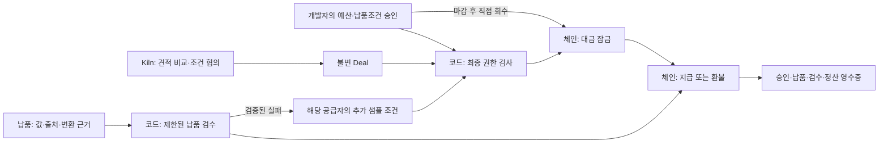

# Agent Deal Escrow — 리서치 자료 한 건의 납품과 지급

2026-09-29. 최근 「해커톤 규칙 정리」의 맞춤형 데이터 납품·에스크로·실패 후 추가 검사 방향을 유지하며, 사용자와 검증 범위를 좁힌 제품 결정안이다. **제안·현재 구현·실측을 구분한다.** 공개 사례는 아래 사용자 가설을 뒷받침하지만, 우리 제품의 구매 의향을 확인한 인터뷰는 아니다.

## 1. 제품 문장과 첫 사용자

**외부 AI 작업자에게 공시 수치 추출을 유료로 맡기는 리서치 자동화 개발자가, 승인한 납품 조건을 확인한 뒤에만 대금을 지급하고 실패한 작업의 환불·재발 방지 근거를 남기는 도구.**

첫 사용자는 재무팀 전체나 일반 투자자가 아니다. 소규모 리서치 자동화 팀에서 외부 데이터 작업자를 연결하고, 결과 누락·재시도·비용을 직접 처리하는 개발자다. 그 개발자의 고객인 분석가는 최종 표와 출처를 사용한다. 한 사람이 설정하는 승인 화면과 한 건의 업무 화면에 집중한다.

첫 사용자 후보는 아래 조건을 모두 만족해야 한다.

- 이미 외부 공급자에게 문서 추출·정규화 작업을 유료로 맡긴다.
- 요청 즉시 끝나는 정형 API보다 비동기 맞춤 작업이 필요하다.
- 최근 오납품 또는 미납품의 검수·재요청·과금 문제를 실제로 겪었다.
- 기존 공급자의 결과별 과금·환불만으로 문제가 충분히 해결되지 않는다.
- 공급자도 사전에 정한 검수 조건과 에스크로 거래에 참여할 의사가 있다.

마지막 두 조건이 없으면 에스크로 고객으로 세지 않는다. 익숙한 공급자의 월정액 데이터 API가 충분한 사용자에게 별도 지갑과 거래 절차를 강요하지 않는다.

**사용자의 질문:** “보고서에 필요한 수치를 아직 못 받았는데 왜 돈은 나갔고, 다시 맡기면 또 비용이 들까?”

**완료 결과:** 출처를 따라 확인할 수 있는 표와 지급 영수증, 또는 미완료 이유·환불 상태·다음 작업의 추가 조건. 환불 성공을 리서치 업무 성공으로 세지 않는다.

## 2. 실제 수요 신호와 반증

| 확인한 공개 사례 | 확인되는 사실 | 우리에게 주는 함의와 한계 |
|---|---|---|
| [Daloopa 창업자의 업무 경험](https://daloopa.com/blog/company-news/ceo-note-what-daloopa-does), [출처 연결 기능](https://daloopa.com/how-our-ai-works) | 실적 발표 자료의 수작업 입력과 데이터별 원문 확인을 다룬다. 공급자 본인의 설명이다. | 추출·검수 업무는 실재한다. 이미 해결책이 있으므로 단순 PDF 추출기나 출처 링크만으로 차별화하기 어렵다. 에스크로 수요의 증거는 아니다. |
| [Kensho 팀의 금융 데이터 에이전트 사례](https://www.langchain.com/blog/customers-kensho) | 분산된 금융 데이터 검색, 인용, 전문 에이전트 라우팅과 평가를 설명한다. | 리서치 자동화 개발자는 실제 역할이다. 이 팀이 외부 에이전트 에스크로를 원한다는 의미는 아니다. |
| [Apify의 Actor 과금 문서](https://docs.apify.com/actors/running/actors-in-store) | 결과 생성 등을 포함한 이벤트 과금, 실행별 최대 과금 한도, 지원 경로를 제공한다. | 이미 충분한 대안이 있다. 이 안에서 잘 작동하는 작업은 첫 고객 대상에서 제외한다. 외부 작업자 연결·맞춤 검수 문제가 남는 팀을 찾아야 한다. |
| [ERC-8183 초안](https://eips.ethereum.org/EIPS/eip-8183) | 작업 예치·제출·평가·지급·만료 환불을 다룬다. 평가자 신뢰도 명시한다. | 에이전트 에스크로 발명을 주장하지 않는다. 특정 납품 실패를 다음 의뢰의 집행 가능한 조건으로 연결하는 사용자 경험과 검증에 집중한다. 현재 계약의 ERC 준수는 별도 검증하지 않았다. |

**실제 모집 경로:** 유료 문서처리 Actor를 운영하는 개발자, 금융 리서치 에이전트 구축 사례를 공개한 팀의 실무 개발자, 외부 데이터 작업을 연결하는 소규모 자동화 구축사. 위 회사들은 업무 존재의 근거이며, 확보한 고객이나 도입 의향자로 표기하지 않는다. 이번 조사에서 누구에게도 연락하지 않았다.

사용자 탐색에서는 최근 실제 사건을 먼저 받는다. 사용한 도구, 주문 내용, 청구 내역, 받지 못한 결과, 해결에 쓴 시간을 익명화해 확인한다. “이 제품이 좋으세요?” 대신 “최근에 잘못 받은 결과를 어떻게 처리했나요?”를 묻는다. 실제 응답 절차는 [사람 검증 절차](USER-STUDY.ko.md)를 따른다.

**진행 기준(제안):** 대상 개발자 5명 중 3명이 최근 반복 문제를 설명하고, 2명이 익명 작업 한 건으로 시험에 참여하며, 공급자 한 곳도 조건부 정산을 수용할 때 파일럿 가치가 있다고 판단한다. 표본이 작으므로 시장 검증으로 일반화하지 않는다. 기존 서비스로 충분하다는 응답이 우세하면 금융 제품 확장을 멈춘다.

## 3. 데모 업무를 네 개의 값으로 좁힌다

의뢰는 **“LG에너지솔루션의 공식 2025년 4분기 실적 발표 자료에서 2025년 각 분기의 시설투자 현금유출을 추출해 달라”** 한 건이다. 결과는 4행 JSON/CSV와 원문 위치다. 회사 10개·기간 2년·40행이라는 넓은 조건을 대표 데모의 중심에서 뺀다.

[공식 자료 16쪽](https://www.lgensol.com/upload/file/irEvent/25_4Q_LGES_business_performance_F_EN.pdf#page=16)의 `Investment in Facilities` 행을 대상으로 한다. 투자활동 현금흐름 전체, 2026년 전망, 연간 합계를 같은 지표로 취급하지 않는다. 해당 문서는 감사보고서 현금흐름표와 작성 방식이 다르다는 주석도 보존한다.

| 사전 승인하는 조건 | 납품에 필요한 증거 |
|---|---|
| 회사·지표·2025년 Q1–Q4 | 네 기간 각각 한 행; 전망치 대체 금지 |
| 단위: 십억 원 | 원 단위와 변환 규칙; 음수 원문값과 양수 지출액을 함께 보존 |
| 공식 문서의 지정 버전 | 문서 URL·해시·페이지·행 식별자 |
| 가격·작업 마감·허용 공급자 | 불변 Deal 및 승인 기록 |
| 지급 조건·환불 조건 | 버전이 고정된 검수 결과와 체인 정산 |

공개 PDF 자체를 판다고 설명하지 않는다. 사람이 반복하는 **탐색·추출·정규화 작업의 대가**라는 가설이다. 이 네 값은 이해하기 쉬운 데모 단위이며, 네 값의 추출에 실제로 지불할 의향이 있는지는 미확인이다.

가격은 테스트 자산 단위다. 원금과 공급자 수수료의 상한, 별도 운영자가 부담하는 체인 가스·Kiln 비용을 구분한다. 재의뢰 시 새 예산을 몰래 만드는 대신 같은 사람의 승인 범위와 이미 잠긴 금액을 다시 검사한다. 확정되지 않은 환불을 가용 예산으로 잡지 않는다.

## 4. 파격은 '7행밖에 안 왔다'보다 그럴듯한 오납품에서 나온다

대표 공격은 **4행·정상 JSON·공식 출처 링크가 모두 있는데 지표가 틀린 납품**이다. 공개 Sepolia 실험의 fault injection은 첫 분기의 시설투자 3,014 대신 투자활동 현금흐름 3,441을 넣었다. URL 유무·행 수만 보면 통과하지만 승인한 지표와 다르다.

이는 실제 모델이 저지른 실수라고 꾸미지 않는다. 모델의 자연 발생 오류와 의도적인 공격 실험을 화면에 구분한다. 기존 공개 Sepolia의 52행/7행 실증은 별도의 구조 검수 증거로 보존한다.

기억할 장면은 세 개다.

1. **그럴듯한 표인데 지급되지 않는다.** 원문과 납품의 다른 셀을 나란히 보여주고 환불 경로를 따라간다.
2. **같은 판매자가 “이번엔 맞다”고 해도 바로 돈을 잠글 수 없다.** 이전 검수 실패에 연결된 샘플 검사 조건이 funding 전이를 막는다. 샘플을 통과하면 그 거래는 진행할 수 있지만 규칙 자체가 삭제되지는 않는다.
3. **운영 앱을 꺼도 구매자가 만료 후 돈을 회수한다.** 별도 구매자 키·독립 RPC·체인 상태로 확인한다. 이미 지급된 돈을 되돌리는 기능으로 표현하지 않는다.

두 번째 장면이 블랙리스트와의 차이를 보여준다. 공급자를 영구 배제하는 대신 사전에 합의한 복구 경로가 있다. 세 번째 장면이 체인을 쓰는 이유를 보여준다. 악성 검수자까지 해결했다는 주장은 아니다.

## 5. 반드시 먼저 풀어야 할 제품 논리의 구멍

**정답표를 이미 알고 있다면 왜 작업을 사는가?** 현재 `referenceChecks`는 저장된 네 정답값과 대조한다. 이는 재현 가능한 검수 시험에는 유효하지만, 새 문서의 값을 알아내는 제품 효용을 입증하지 않는다. 운영자가 매 의뢰 전에 정답 전체를 만들면 절약 효과는 사라진다.

따라서 다음 두 단계를 분리한다.

- 해커톤의 현재 증거: 고정 원문·고정 참조표에 대한 제한된 일치 검증. 사람의 참조표 검토는 별도 완료 상태다.
- 실제 파일럿의 진입 조건: 납품에 원문 좌표·인용값·단위·변환 규칙을 포함시키고, 허용한 문서 형식에서 원문 대응을 독립 검사한다. 정답값을 코드에 추가하지 않은 보류 문서로 결과와 실제 절약 시간을 평가한다. 지원하지 않는 표 구조나 불명확한 대응은 자동 지급 대상에서 제외한다.

검증 가능한 범위를 넘어서는 의미 판단은 사람에게 넘긴다. **출처 일치 검증도 원문 자체의 진실성을 증명하지 않는다.** 보류 문서 검증이 실패하면 “범용 자동 검수” 문구와 실전 사용 주장을 삭제한다.

**샘플 네 행이면 이미 납품 전체 아닌가?** 맞다. 현행 네 행 전체를 요구하는 preview는 통제 데모에는 편하지만 판매자에게 무상 선납품을 요구한다. 실제 공급자 파일럿에서는 한 행 또는 합의된 제한 샘플과 증거 메타데이터로 범위를 정해야 한다. 샘플 통과는 전체 납품 통과가 아니며, 최종 네 행은 다시 검수한다. 공정한 비밀 정보 교환·암호화 에스크로는 이번 범위에 추가하지 않는다.

**검수자가 마음대로 환불하면 판매자는 왜 참여하나?** 현재 controller를 신뢰한다. 검수 규칙·버전·마감·샘플 요구를 주문 전에 명시하고 양측이 확인하는 제한된 시험만 주장한다. 판매자 동의·진짜 서명·평가자 신뢰가 없는 모의 견적을 실제 외부 거래 계약이라고 부르지 않는다.

## 6. 최소 아키텍처와 남는 신뢰

AI는 문서와 견적의 조건을 해석하고, 선택·거절·조건 변경을 제안한다. 구매·검수·감사라는 이름의 LLM을 모두 따로 띄우지 않는다. 감사 화면의 사실은 기록 재계산으로 만들고, 자연어 요약이 필요할 때만 선택적으로 모델을 사용한다.

코드는 금액 계산·예산 예약·중복·중지·마감·Deal 불변성·증거 검사·통제 적용을 맡는다. 체인은 보관된 금액과 지급/환불의 단일 결과를 집행한다. 온체인에 PDF와 회사 비밀을 올리지 않는다.

현재 계약의 예산·납품 판단은 off-chain controller를 신뢰한다. 과거 합성 데모에서는 구매자와 controller가 같은 주소였고, 신규 원문 실증에서는 둘을 분리했다. 운영자가 두 테스트 키를 관리하므로 실제 독립 당사자 거래를 입증한 것은 아니다. 사용자 중지는 새로운 작업/예치를 막는 것과 이미 예치된 돈의 정산을 구분한다. 만료 전의 즉시 무조건 환불이나 확정 지급 취소를 약속하지 않는다.

## 7. NPU를 많이 부르는 대신 필요한 판단을 맡긴다

[Furiosa의 공식 Qwen3 문서](https://developer.furiosa.ai/latest/en/furiosa_llm/models/qwen3.html)는 Qwen3-32B와 tool calling 지원을 설명한다. 이는 Kiln의 특정 요청이 어떤 물리 장비에서 처리됐는지나 우리 서비스의 소비전력을 확인한 증거가 아니다.

모델의 의미 있는 선택은 “가장 싼 견적” 찾기를 넘어야 한다. 실제 분기 실적, 연간 전망을 나눈 값, 마감이 늦는 정확한 작업처럼 차이가 있는 제안을 비교한다. 다만 공개된 최저가를 그대로 선택하는 협상은 고정 코드로도 가능하다. 고정 규칙 기준선과 결과를 비교하고 동률 또는 열세도 공개한다.

- 기본 원칙: 명백한 예산·만료·기존 통제 위반은 추론 전에 차단한다. 새 정보가 없으면 같은 질문을 다시 보내지 않는다.
- 견적 선택, 조건 협의, 실제 추출을 flow별로 나눠 입력/출력 토큰·호출·지연·결과를 기록한다.
- 동일 사례에서 고정 규칙 / AI / AI+통제 이력을 비교한다. 최종 안전 검사는 모두 같다.
- 정상 작업 완료율, 잘못 지급한 건수, 정상 작업 오차단, 수동 개입, 결과 한 건당 토큰·시간을 함께 보고한다. 차단만 늘려 토큰을 줄이는 설계는 개선으로 판정하지 않는다.
- provider가 제공하는 배치·이용률·전력 자료가 있으면 응용에 귀속 가능한 에너지를 추정한다. 없으면 요청별 시간·토큰과 가정식을 분리하고 전력 절감률을 주장하지 않는다. API 지연을 장비 활성 시간으로 쓰지 않는다.

신규 원문 공개 실행에서는 견적 비교 1회/2,118토큰, 표 추출 1회/2,377토큰을 실제로 사용했다. 총 2회/4,495토큰이다. 모델 입력은 원문에서 전사한 표이며 PDF 전체를 직접 읽은 실행이 아니다. 과거 합성 시나리오의 6회/6,900토큰과 과업이 다르므로 절감률을 계산하지 않는다. 전력은 미측정이고, 별도 에너지 계산은 4카드·명목 전력·API 지연 중 활성 시간 비율을 명시한 가정이다. 단일 사례로 RNGD의 GPU 대비 우위를 주장하지 않는다.

## 8. 3분 시연과 화면 설계

첫 화면은 **완성되지 않은 4칸짜리 표, 맡긴 돈, 다음 행동**만 크게 보여준다. 통합 회사 대시보드는 발표의 시작점으로 쓰지 않는다. 한 페이지에서 `의뢰 → 계약 → 납품 → 지급/환불`을 따라가며 자세한 증거는 옆 패널로 연다.

| 시간 | 장면 | 관객이 이해해야 할 사실 |
|---|---|---|
| 0:00–0:20 | 비어 있는 분기 표, 예산과 조건 승인 | 어떤 업무를 누구 대신 하는가 |
| 0:20–0:45 | 실제 Kiln의 비교·조건 제안, 잠금 | AI가 선택한 조건과 사람이 허락한 조건, 판매자는 아직 미수령 |
| 0:45–1:15 | 정상 납품의 값→원문 셀, 실제 지급 | 사용할 수 있는 결과와 그 대가 |
| 1:15–1:45 | 형식은 맞지만 지표가 다른 공격 납품, 환불 | 숫자가 그럴듯해도 승인한 납품이 아니면 지급되지 않음 |
| 1:45–2:10 | 같은 판매자 재의뢰, 샘플 전 차단/검사 후 진행 가능 | 실패가 다음 거래의 허용 조건을 바꿈 |
| 2:10–2:35 | 별도 만료 의뢰에서 앱 종료 후 구매자 직접 회수 | 운영 앱이 사라져도 남는 자금 회수 경로 |
| 2:35–3:00 | 영수증과 flow 측정, 남는 신뢰 | 제3자 재구성, 필요한 추론과 코드 검사 분리 |

하나의 지급 완료 거래를 나중에 앱 종료로 환불한 것처럼 편집하지 않는다. 정상·오납품·만료는 식별 가능한 별도 거래이며, 마감 대기는 표시된 시간 이동 또는 기록 재생으로 보여준다. 공개 체인 확정 시간을 생략한 영상을 실시간 실행이라고 하지 않는다.

UI 문구는 `4개 값 검수 완료`, `판매자 수령 0`, `원금 회수 완료`, `추가 샘플 필요`로 통일한다. 사용자는 tx hash보다 현재 돈이 누구에게 있는지 먼저 본다. `LIVE / 기록 재생`, `Sepolia / 로컬 devnet`, `모델 출력 / 공격 입력` 라벨을 각 장면에 유지한다.

## 9. 현재 증거와 다음 완료 기준

| 항목 | 현재 확인한 범위 | 다음에 필요한 증거 |
|---|---|---|
| 공개 체인 | 신규 원문 실행에 예치 2·지급 1·환불 1, 추가 샘플·건별 예산·사람 중지 3건의 차단을 연결; 별도 buyer 및 독립 RPC finalized 검증 PASS | 앱 없는 구매자 직접 회수는 별도 공개 실증 필요 |
| 실제 원문 | LGES PDF 버전 해시 재확인, 전사 표를 실제 Kiln으로 추출하고 납품 해시·검수·공개 체인 정산 연결 | 사람의 참조표 확인과 보류 문서 검증; 전사 입력을 raw PDF 처리로 표현하지 않기 |
| 검수의 일반성 | 네 값의 저장된 참조표 대조 | 정답값을 운영 코드에 추가하지 않는 보류 문서 시험 |
| 운영 앱 없는 복구 | 계약에 buyer 만료 환불 경로; 별도 로컬 복구 기록 존재 | 독립 buyer와 공용 RPC를 쓰는 공개 체인 실행 및 위임 범위 확인 |
| AI의 추가 가치 | 실제 모델 선택·추출 기록은 있음 | 동일 입력·안전 경계의 공정 비교; 현재 미완료 비교를 승리로 표시하지 않기 |
| 실제 사용자 | 공개 사례 조사, 질문지 준비 | 실제 문제 원자료·외부 공급자 참여·초면 관객 이해도 |

신규 원문 공개 실행과 한국어 재생 증거는 [원문 기반 공개 실증 기록](SOURCE-PUBLIC-PROOF.ko.md)을 따른다. 기존 합성 데이터 실행은 [과거 공개 실증 기록](PUBLIC-ESCROW-PROOF.ko.md)에 따로 보존한다. 서로 다른 실행의 성공 기록을 섞어 한 번의 완료로 표시하지 않는다.

**다음 우선순위는 세 가지다.** 첫째, 정답값을 추가하지 않은 새 문서로 제한된 검수의 유용성을 시험한다. 둘째, 앱 없이 구매자가 직접 회수하는 별도 공개 거래를 증명한다. 셋째, 실제 개발자·공급자의 작은 업무 한 건에서 기존 방식보다 나은지 확인한다. 현재 원문과 공개 정산의 연결은 완료했으며, 이 세 가지 전에 제품 범위를 넓히지 않는다.

마켓플레이스, 회사 전체 회계, 범용 평판, 임의 PDF 의미 검증, 새로운 코인, 실제 자산 수탁은 제외한다. 기존 기술의 조합을 세계 최초라고 주장하지 않는다. 데모를 본 사람이 **“쓸 수 있는 결과가 와야 지급되고, 실패한 상대는 다음 주문에서 증거를 먼저 내야 한다”**고 설명할 수 있으면 제품 메시지가 전달된 것이다.
