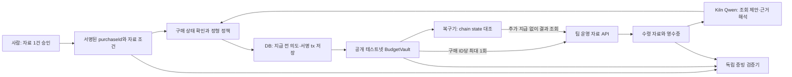

# Control Memory v3 — 한 번 허락한 자료, 한 번만 결제

2026-09-28 / **구매 복구 P0 구현·실제 Kiln·공개 Sepolia 검증 완료**. 아래는 기획 결정 당시의 설계와 완료 gate다. 최신 결과는 [v3 구현·검증](PURCHASE-IMPLEMENTATION.ko.md)과 [실행 증빙](../artifacts/purchase/README.md)을 따른다. 기획 수립 당시 제품은 `8bf91bd`이며 [기존 구현](CURRENT-IMPLEMENTATION.ko.md)과 구분한다. [v2 문서 작업안](HACKATHON-PLAN.ko.md)은 보존하되 PDF→CSV 개발은 보류한다.

## 1. 이번에는 사용자보다 ‘사고 순간’을 더 좁힌다

**제안 기능 문장:** “Control Memory는 유료 웹 자료 조회를 붙인 리서치봇 개발자를 위해, 결제 직후 응답 유실·재시작이 일어나도 사용자가 승인한 자료 조회 한 건의 중복 지급을 막고, 지급과 자료 수령을 별도로 복구·검증하는 도구다.”

사용자가 맡기는 것은 **자료 조회 한 건**, 구현 단위도 **구매 의도 한 건**이다. 에이전트의 새 실행·새 견적·새 거래 ID는 새로운 구매 허가가 아니다.

- **첫 사용자:** x402 등으로 유료 검색/본문 API를 붙이고, 봇의 재시도·재시작 및 비용을 직접 책임지는 개발자. ‘시장조사 회사의 34세 팀장’처럼 확인하지 않은 인물을 고객으로 꾸미지 않는다.
- **발생 순간:** 외부 API에 결제를 보냈는데 결과가 안 온다. 봇/worker를 다시 띄우면 또 구매하려 한다.
- **사용자 질문:** “다시 실행해도 되는가? 이미 돈이 나갔다면 같은 자료를 또 사지 않고 이어갈 수 있는가?”
- **완료 결과:** 결제 1건과 연결된 자료·인용 답변, 또는 지급 여부/미수령을 구분한 중지 영수증. 돈이 나갔다고 업무 완료로 표시하지 않는다.
- **첫 화면:** 이번 질문, 승인된 조회 1회, 지급 상태, 자료 수령 상태, 다시 실행, 중지, 증빙. 여러 팀·여러 에이전트 총괄 대시보드는 목표 데모에서 제외한다.

핵심은 ‘예산 안에서도 잘못 쓸 수 있다’는 사실이다. 총 20 TC·건별 8 TC라면 동일 자료를 6 TC씩 두 번 사도 금액 한도에는 걸리지 않는다. 여기에 **승인한 구매 1건당 성공 지급 최대 1회**를 집행한다. 숫자는 데모용 테스트 단위이며 상용 서비스 가격이 아니다.

## 2. 실제 수요 신호와 이미 있는 해법

확인일은 2026-09-28. 공개 자료는 고객 인터뷰나 구매 의향과 다르다. 자세한 적합성·반증은 [사용자 조사](USER-DISCOVERY.v3.ko.md)에 남긴다.

| 확인한 자료 | 기획에 반영할 사실 |
|---|---|
| [Exa 공식 x402 안내](https://exa.ai/docs/integrations/payments/x402/quickstart) | 검색·본문을 요청별 결제로 이용하는 경로가 존재한다. 이런 도구를 붙이는 개발자는 접근 가능한 첫 대상이다. Exa가 우리의 고객·협력사라는 뜻은 아니다. |
| [x402 #1062](https://github.com/x402-foundation/x402/issues/1062) | 지급 뒤 결과를 못 받은 공개 신고가 있다. **9월 21일 완료로 닫혔다.** 당시 문제를 현재 모든 SDK의 결함으로 주장하지 않는다. |
| [#1062 수정 안내](https://github.com/x402-foundation/x402/issues/1062#issuecomment-5767578074), [복구 PR #3214](https://github.com/x402-foundation/x402/pull/3214) | `settlement_pending`과 기존 지급의 자동 복구가 이미 있다. 새 기술이라고 발표하지 않는다. |
| [payment-identifier 명세](https://github.com/x402-foundation/x402/blob/main/specs/extensions/payment_identifier.md) | 같은 ID·요청의 재사용과 응답 캐시가 표준에 있다. 표준을 적용한 기준선보다 무엇이 추가되는지 확인해야 한다. |
| [x402 #3564](https://github.com/x402-foundation/x402/issues/3564) | HTTP 오류 응답에서 결제 관측 hook이 빠지는 재현이 있다. **로컬 fixture이며 실자산 손실 사례는 아니다.** 지급·HTTP·수령 상태를 분리할 이유다. |
| [x402trace](https://github.com/fardinvahdat/x402trace), [402.report](https://402.report/) | 진단·지출 기록·통제 제품도 존재한다. 단순 로그, kill switch, timeout 탐지만으로 차별화하지 않는다. 제품 소개는 독립 성능 검증이 아니다. |

최근 대화의 ‘API 구매’ 방향은 유지하되 다음 주장은 버린다. ‘사람의 매번 승인 또는 무제한 지갑’만 선택 가능하다는 이분법, ‘x402에 중복 방지가 없다’, ‘모든 연구봇은 반복 결제를 겪는다’, ‘거래 수가 곧 고객 수다’는 주장을 하지 않는다. 기존 signer policy·SDK·내구성 있는 작업 큐가 충분한 팀에는 도입 이유가 약하다.

Exa는 요청 매개변수로 가격을 미리 계산한다고 명시한다. 따라서 ‘나중에 숨은 수수료가 나타나는 협상’을 이 서비스의 실제 구매 관행처럼 꾸미지 않는다. 예산 초과 fixture는 경계 검사에 남기고, 주인공 사고는 결제와 결과 수령 사이의 단절로 옮긴다.

**검증할 차별점:** 사용자가 서명한 구매 단위를 기준으로, 새 실행/견적/결제 ID가 생겨도 같은 승인에서는 두 번째 지급이 안 된다는 점을 계약·복구 상태·제3자 증빙까지 연결해 입증한다. 세계 최초나 사업적 해자는 아직 아니다.

## 3. 데모의 업무는 질문 하나, 자료 하나

합성 서비스 A의 요금제 설명을 대상으로 한다.

> “A사에서 외부 게스트도 문서를 편집할 수 있는지, 최신 안내의 근거를 가져와 줘. 유료 자료 조회는 한 번만, 수수료 포함 8 TC까지 허용해.”

옛 요약에는 ‘게스트 무료’만 있고 새 본문은 보기 권한과 편집 좌석을 구분한다. Qwen은 기존 자료로 답할 수 있는지 판단하고 필요한 조회를 제안한다. 받은 본문에서 근거 위치를 찾아 짧은 답을 만든다. 답변에 필요한 실제 읽기·해석이 있으므로 가격 정렬만 시키던 버전보다 AI 역할이 명확하다.

합성 자료·팀 운영 유료 테스트 API를 명시한다. 실제 Exa 서비스가 이 사고를 일으킨 것처럼 연출하지 않는다. 최신 자료의 사실성은 체인이 보장하지 않는다. 데모 본문의 버전·기대 답·근거 문장은 미리 고정하고 다른 표현의 평가 사례를 별도로 둔다.

사용자가 승인하는 정형 항목은 `purchaseId, resourceSpecHash, maxSettlements=1, totalCap, perTxCap, merchantAllowlist, expiresAt, chainId, asset, policyVersion`이다. `resourceSpec`에는 승인된 URL/자료 버전 범위, 조회 종류, 응답 schema를 포함한다. 새 자료나 두 번째 유료 조회는 새 사람 승인이다. 이번 MVP는 배치 승인·자동 정기 갱신·다중 자료 리서치를 만들지 않는다.

## 4. 가장 강한 장면: 연결을 끊고 다시 실행한다

1. 사람이 조회 1회·최대 8 TC를 승인한다. Qwen의 조회 제안을 실제 Kiln 응답으로 남긴다.
2. 정상 견적 6 TC가 공개 테스트넷에서 지급된다. 테스트 프록시가 **클라이언트로 가는 결과 응답만** 버린다. 화면은 결과가 오지 않았다고 표시한다.
3. 구매 worker를 종료하고 다시 시작한다. 관객이 ‘다시 실행’을 누른다.
4. 코드가 새 결제를 만들기 전에 구매 ID와 체인을 대조한다. 별도의 공격 버튼으로 새 runId·새 offerId·새 paymentKey를 써도 같은 구매에 두 번째 지급이 거부되는 것을 보인다.
5. 팀 운영 판매자의 기존 구매 결과 조회에서 자료를 회수한다. Qwen이 근거가 붙은 답을 완성한다. 화면에는 **실행 2회 / 지급 1회 / 자료 수령**이 함께 남는다.
6. 원 서버를 끄고, 다른 검증기가 승인·지급·자료 hash를 대조한다. 별도 승인에 대한 owner 직접 취소도 보조 실행으로 검증한다.

반전은 AI의 실수를 기다리는 데서 만들지 않는다. 네트워크 장애는 명시적인 실험 조건이며, 중복 지급 시도는 harness가 만든 공격이다. 모델의 실제 출력과 주입한 공격을 구분한다. 정상 SDK를 일부러 구형으로 만들어 비교하지 않는다. [상세 데모 대본](DEMO-STORYBOARD.v3.ko.md).

## 5. 무엇을 바꿔야 이 보장이 실제로 생기나

현재 `src/engine.mjs`의 `paymentKey`는 `runId`에서 만들어지고 계약의 `usedPayments`는 그 키를 검사한다. 같은 offer 서명 재사용도 막지만 **새 실행·새 유효 offer를 같은 업무에 사용하는 것**을 사람의 구매 단위로 묶는 필드는 없다. 기존 중복 테스트를 새 보장의 증거로 재사용하지 않는다.

### 구매 단위를 계약에서 고정

- 새 계약/서명 도메인 버전에서 한 mandate를 한 구매로 제한한다. owner가 승인한 `purchaseId`와 `resourceSpecHash`를 mandate에 넣고, offer도 같은 purchaseId·resourceSpecHash에 서명한다.
- `settled[purchaseId]`는 전송과 같은 트랜잭션에서 한 번만 갱신한다. 지급 전 기존 예산·판매자·기한 검사도 유지한다. 새 runId/paymentKey/offerId로 재서명해도 이 latch는 풀리지 않는다.
- 키 namespace는 `chainId, vault, owner, purchaseId`로 고정한다. 두 mandate로 동일 구매를 다시 등록하는 것도 거부하고, 취소 후 재활성화로 latch를 초기화하지 않는다. 새 허가는 owner의 새 서명이 필요하다.
- `PurchaseSettled`에 purchaseId·resourceSpecHash·offerDigest·evidenceHash·금액을 연결한다. 계약은 hash가 묶였는지 검사할 뿐, URL의 의미나 자료 품질을 이해하지 않는다.
- 직접 owner 취소를 추가한다. 취소보다 먼저 포함된 지급은 되돌리지 않는다. 서버 중지와 온체인 권한 취소는 다른 버튼·상태다.

### 지급과 수령은 서로 다른 상태

| 지급 상태 | 수령 상태 | 가능한 다음 동작 |
|---|---|---|
| NOT_SUBMITTED | NONE | 정책을 확인한 최초 지급 |
| SUBMITTED / UNKNOWN | NONE | 예약 유지, 체인 대조. 새로운 지급 의도 금지 |
| SETTLED | PENDING | 동일 구매의 결과 조회. 새 유료 조회 금지 |
| SETTLED | RECEIVED_VALID | 저장 자료 재사용, 답변 재개 |
| SETTLED | UNRECOVERABLE | ‘지급 완료·자료 미수령’ 영수증. 자동 환불·추가 구매 없음 |
| FAILED_FINAL | NONE | 미지급 확정 근거가 있을 때에만 기존 구매 범위의 재시도 |
| REVOKED | ANY | 새 지급 거부. 과거 지급·수령 기록 유지 |

UNKNOWN을 시간만 지나면 FAILED로 바꾸지 않는다. tx hash·서명 payload·nonce·purchaseId를 방송 전에 저장한다. 재시작은 저장한 동일 의도를 복구한다. 교체·취소·reorg 및 finality 판단은 체인 증거로 처리하고, 확인할 수 없으면 보류한다. 둘 이상의 프로세스가 경합해도 DB unique key와 계약 latch가 지급 한도를 유지해야 한다.

판매자의 결과 조회는 owner의 일회성 challenge 서명 또는 구매별 접근 자격으로 보호한다. tx hash만 알면 남의 자료를 읽게 만들지 않는다. 판매자가 회수 API/결과 캐시를 제공하지 않으면 복구할 수 없다. 그때도 두 번째 지급을 막는 기능과 미수령 증빙은 남는다. 첫 지급의 손실까지 예방하거나 배송을 강제한다고 약속하지 않는다.

‘자료 수령’은 bytes 보관·schema·요청 binding 검사 통과다. Qwen의 내용 해석·인용 적합성은 별도 품질 평가다. 판매자가 서명한 hash는 그 판매자의 진술 및 일치 증거이지 사실의 참/거짓 판정이 아니다.

### Control Memory의 위치

핵심 안전 경계는 처음부터 모든 구매에 적용한다. 한 번 손실을 겪어야 중복을 막도록 설계하지 않는다. 기존 `REQUIRE_ALL_IN_PRICE`는 별도 기존 실험으로 남긴다. 이번 흐름의 메모리는 `purchaseId → 지급·수령·복구 증거`라는 내구성 있는 상태이며, 이를 새로운 학습 알고리즘이라고 부르지 않는다. 공급자별 장기 위험 점수·자동 규칙 학습은 P0에서 제외한다.

## 6. x402와 계약을 섞어 주장하지 않는다

현재 TestCredit/BudgetVault는 표준 x402의 `exact` 결제가 아니다. 일반 USDC signer에 vault 밖 잔액을 넣고 SDK를 연결하면 계약의 지급 제한을 우회하는 경로가 생긴다. 그런 경로를 추가하고 ‘계약이 모든 지급을 막는다’고 주장해서는 안 된다.

**해커톤 관통 데모:** 기존 EVM 기반을 확장한 공개 Sepolia의 TestCredit/BudgetVault와 팀 운영 자료 API 하나. 판매자는 해당 계약 지급을 확인하고 자료를 제공한다. 테스트 자산·독자 결제 어댑터임을 표시한다. HTTP 402를 쓴다는 이유만으로 x402 호환으로 부르지 않는다.

**실사용 연결 검증:** Exa/x402 대상의 읽기 전용 quote·receipt 해석과, 최신 SDK의 idempotency/pending recovery를 기준선으로 조사한다. 현재 vault로 표준 판매자가 수락하는 지급을 만들 수 있는지, 필요한 signer/scheme와 회수 API가 있는지를 별도 spike로 확인한다. 성공 전에는 ‘Exa 연동 완료’, ‘x402 drop-in’, ‘바로 실전 결제 가능’이 아니다. 새 chain·새 token·커스텀 facilitator를 동시에 구현하지 않는다.

공개 체인은 **원 앱 없이도 지급 횟수·승인·취소를 확인하고, 잘못된 실행자의 추가 지급을 거부**하는 역할이다. 고객이 운영자를 전적으로 신뢰하고 서버 DB로 충분하다면 더 단순한 해결책이 맞을 수 있다. 체인을 수요 증거 대신 쓰지 않는다.

## 7. Qwen과 NPU가 해야 할 일

Qwen3-32B는 ① 질문·기존 자료를 보고 추가 자료의 필요성을 판단하고 조회를 제안하며 ② 받은 본문에서 질문에 맞는 근거를 찾아 답한다. 결제 상태 대조·금액 계산·재시도 허가·nonce·인용 위치 존재 검사는 코드가 한다. 재시도 화면에 말풍선을 만들려고 모델을 다시 호출하지 않는다.

Kiln의 현재 [공식 모델 문서](https://kiln.bricksum.com/docs/en/models)는 Qwen3-32B의 auto tool 호출을 지원하고 강제/병렬 호출·structured output은 지원하지 않는 것으로 표시한다. auto 호출 결과를 코드가 schema와 정책으로 검증한다. 원문을 지급 권한 명령으로 취급하지 않는다. API/model 설정을 결과와 함께 저장한다.

| flow | 기록할 값 | 검증 목적 |
|---|---|---|
| need-assessment | 실제 request ID·입력/출력 토큰·latency·조회 제안 | 불필요한 구매 회피와 필요한 조회 성공을 함께 측정 |
| evidence-answer | 같은 항목·인용 위치·기대 답과의 비교 | 유용한 답과 근거를 얻었는지 |
| recovery | 코드 조회/재전송 횟수·복구 시간·추가 지급 | 모델 호출 목표 0. 실제 실행 기록으로 확인 |
| invalid/expired/over-budget | 중지 사유·차단 위치·usage | 반복 안전 판단에 불필요한 추론을 쓰지 않는지 |

NPU는 자료 이해에 쓰고 지급 복구에는 쓰지 않는다. 호출·토큰 감소는 하드웨어에 독립적인 개선이다. NPU 서버의 전력·공유 부하를 측정하지 못하면 joule 또는 ‘에너지 몇 % 절감’을 실제 성과로 발표하지 않는다. 공급자의 라우팅/계측 근거가 있으면 범위·조건과 함께 추가하고 없으면 미계측으로 남긴다. 기존 48행 실험은 새 과제의 결과가 아니다.

## 8. 반드시 이겨야 하는 기준선과 반증

비교는 세 가지다. A: 문서대로 구성한 최신 x402 SDK+payment-identifier+pending recovery, B: 여기에 영속 outbox/DB unique key를 추가한 서버 구현, C: B와 같은 조건에 사용자 서명 구매 ID·계약 제한·독립 verifier를 더한 제안 구조. 의도적인 무한 결제 루프는 위협 시연이지 A/B의 기본 동작이라고 부르지 않는다.

재전송, worker 재시작, 새 run/offer/payment ID, 동시 두 worker, 결제 이후 응답 유실, 회수 불가, 만료·취소, 정상 신규 구매를 고정 사례로 둔다. **동일 전송 재시도와 새 금융 승인 생성을 구별**하고 버전·상태 저장 설정·retention을 공개한다.

주요 지표는 승인 구매당 실제 지급 수, 승인 밖 지급, 결과 회수율, 정상 완료율, 복구 시간, 사람 개입, 추가 모델 호출/토큰, 지급/가스 비용이다. 모두 막아서 얻은 지급 0건은 성공이 아니다. C가 B 대비 독립 집행·검증 이외에 개선이 없으면 그대로 보고한다. 고객이 그 차이를 원하지 않으면 제품 시장성은 약하다.

AI 평가는 최소 12개 질문/자료 조합에서 정형·키워드 기준선과 비교한다. 보기/편집 권한, 오래된 요약/새 본문, 근거 없음/실제 근거, 조회 불필요/필요를 포함한다. 안전한 지출과 올바른 답변을 별도로 판정한다. 평가 기준·예산을 고정한 뒤 실행하며 계획된 호출 수를 실행 성과로 세지 않는다.

## 9. 개발 순서와 완료 gate

| 순서 | 바꿀 것 | 완료 증거 |
|---|---|---|
| P0-1 | purchaseId·resourceSpec 서명 binding, 계약 지급 latch, owner 직접 취소 | 새 run·새 offer·새 key·동시 요청·동일 구매 재등록의 추가 지급 거부. 정상 새 승인 성공 |
| P0-2 | 구매 outbox·지급/수령 상태·재시작 복구 | 방송 전/후 crash, 응답 유실, UNKNOWN 유지, 동일 의도 복구 |
| P0-3 | 실제 bytes를 주는 팀 운영 자료 API, 구매별 보호된 결과 조회 | 같은 지급으로 회수, 무권한 조회 거부, 회수 불가의 정직한 중지 |
| P0-4 | Qwen 조회 필요성/인용 답변, 단일 작업 UI | 실제 Kiln request ID·flow usage·자료와 답변. 장애 장면 추가 호출 0 확인 |
| P0-5 | 공개 테스트넷 배포·독립 검증·관객 재시작 데모 | 정상 지급 tx, 두 경계 이탈 중지, 구매 ID 우회 거부, 다른 프로세스/PC에서 판정 |
| P1 | 최신 SDK 기준선·실제 사용자 shadow replay | 합성 fixture 밖 사건·표준 SDK와의 비교. 유료 상용 호출은 별도 단계 |

기존 기본 예산/판매자/만료 경계는 유지한다. 최소 두 경계 이탈 실행은 **수수료 포함 12 > 건별 8**, **허용 밖 판매자**로 별도 보관한다. 중복 지급 공격이 이 두 실행을 대신한다고 임의 해석하지 않는다. [공개 실증의 공통 절차](ONCHAIN-VALIDATION.ko.md)를 적용하되 문서 변환 부분은 이 문서의 자료 조회로 대체한다.

README의 현재 기능 문장은 구현 완료 전까지 유지한다. 새 계약 배포·schema version을 사용하고 옛 증빙을 새 규칙으로 재해석하지 않는다. 제한된 실제 사용 전에는 인증/키 보관, 고객별 자금·회수, 판매자 계약, 수수료 한도, 장애 대응을 따로 해결해야 한다.

## 10. 우승을 위해 더하는 대신 남기는 것

- **기억할 문제:** “돈은 나갔는데 자료는 없다. 봇을 다시 켜도 되는가?”
- **관객이 하는 행동:** 지급 뒤 연결 끊기와 다시 실행.
- **눈으로 확인할 차이:** 실행 횟수는 늘어도 같은 승인에서 지급은 1회. 자료를 회수하면 답변이 이어진다.
- **기술 깊이:** 사람의 구매 단위와 금융 상태를 재시작·새 ID·계약·증빙 전체에 걸쳐 유지한다.
- **정직한 한계:** 지급 한 번을 보장해도 공급자의 이행·자동 환불·자료의 진실까지 보장하지 않는다.

가장 먼저 검증할 가설은 ‘이 장애 복구를 자기 일로 느끼는 개발자가 있고, 기존 SDK+DB보다 독립 집행/증빙을 필요로 하는가’다. 그 답을 얻기 전에 플랫폼·마켓플레이스·자율 규칙 학습으로 다시 범위를 넓히지 않는다.
