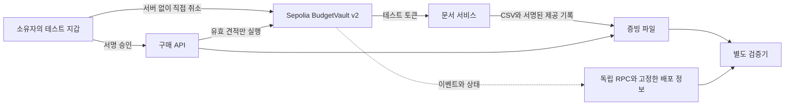

# 공개 온체인 실증 계획과 보장 범위

2026-09-28 / **PLANNED**. [기획 v2](HACKATHON-PLAN.ko.md)의 P0-2/3, P1-3을 구체화한다. 현재 실제 거래는 local chain 31337이며 아래 공개 Sepolia 실행 결과는 아직 없다.

## 현재 코드에서 확인한 것

BudgetVault는 owner mandate와 seller offer의 서명, 총/건별 한도, 판매자, 목적/SKU, 수량/환불, 기한, 중복을 검사한 뒤 TestCredit을 전송한다. Payment에는 evidenceHash·offerDigest·cumulativeSpent가 있다. 따라서 체인은 해시 보관 이상의 역할을 한다.

반면 createMandate·executePayment·revoke는 모두 onlyExecutor다. 실행자가 허용 밖으로 지급하지 못하더라도 실행/취소를 지연·거절할 수 있다. 같은 운영자가 local chain을 관리하므로 독립된 공개 합의의 증거는 아니다. 금고는 고객 예치금이 아니라 미리 채운 테스트 토큰이다.

현재 우회 테스트 일부는 `staticCall` 거부를 확인한다. 이는 채굴된 실패 tx 영수증과 다르다. 공개 실증에서는 실제 호출·receipt.status·상태 변화를 함께 남긴다.

## 체인이 증명하는 것과 아닌 것

| 주장 | 필요한 증거 | 주장하지 않는 것 |
|---|---|---|
| 누가 어떤 조건을 승인했나 | 도메인·원문·owner 서명·MandateCreated | 주소의 현실 신원, 사람이 내용을 충분히 이해했다는 사실 |
| 판매자가 어떤 가격을 제시했나 | canonical offer·seller 서명·기한·offerDigest | 설명의 진실, 반드시 이행한다는 보장 |
| 그 조건으로 얼마가 이동했나 | code hash·Payment·Transfer·이전 누적액·블록 시각/순서 | 임의의 다른 결제 경로까지 사용하지 않았다는 보장 |
| 증빙이 나중에 바뀌었나 | 사본 재해시와 체인 evidenceHash | 앵커 이전 조작, 숨긴 기록이나 거짓 입력 |
| 중지됐나 | Revoked 포함/확정, 이후 동일 mandate 거부 | 중지 전에 확정된 거래의 취소·환불 |
| 결과를 받았나 | result bytes/hash·orderId·판매자 receipt·schema 검사 | 모든 내용의 정확성, 판매자의 이행 독립 증명 |

## 최소 아키텍처 변경

1. 로컬 체인 생성과 외부 RPC 연결을 adapter로 분리한다. chainId·계약 주소·배포 code hash를 고정하고 영수증의 URL을 자동 신뢰하지 않는다. Sepolia chainId 11155111은 배포 시 RPC·지갑 양쪽에서 재확인한다.
2. owner 직접 취소(`msg.sender == mandate.owner`)와 서명 취소 relay를 제공한다. 제3자에게 예산/수취인 변경 권한은 생기지 않는다. 새 version/domain으로 배포하고 기존 receipt 검증을 유지한다.
3. 별도 테스트 지갑의 EIP-712 승인·직접 tx를 지원한다. 현재 localStorage 키는 로컬 모드에 한정한다. mainnet 지갑을 재사용하지 않아도 된다.
4. receipt 포함과 finality를 구분한다. 지원되는 `finalized` 블록과 관측 block hash를 보관한다. 미확정은 PENDING, reorg/조회 불일치는 재대조 대상으로 둔다. nonce 충돌·재시작도 재현한다.
5. 독립 검증기는 receipt + 별도로 신뢰한 배포 manifest + 외부 RPC만 사용한다. 원 서버의 SQLite·쿠키·개인 키·검증 API를 사용하지 않는다. RPC 간 값이 다르면 성공을 강제하지 않는다.

체인에는 필요한 주소·금액·정책/증빙 digest 중심으로 남긴다. 문서 원문·개인정보·키·전체 대화는 올리지 않는다. 작은 값의 단순 hash는 사전 대입으로 추정될 수 있으므로 익명화라고 부르지 않는다. 공개 실증은 합성 입력만 사용한다.

## 실증 시나리오

| ID | 조작 | 예상·수집 자료 |
|---|---|---|
| OC-01 | 총 20, 건별 8, A/B 승인. 정당한 6 TC offer 실행 | 승인/결제 tx, status=1, Transfer=6, spent=6, 같은 run의 서명·증빙 digest |
| OC-02 | 앱 정책을 우회하고 **실행자 지갑**으로 5+7=12 offer 전송 | status=0, TestCredit 지출/판매자 잔액 불변, calldata·tx. 운영자 테스트 ETH 가스는 발생 |
| OC-03 | outsider offer 직접 전송 | 실제 merchant 정책 거부. EXECUTOR_ONLY 거부만으로 대체하지 않음 |
| OC-04 | 원 API 서버 정지 후 owner 직접 revoke | 지갑의 취소 tx, active=false. 새 paymentKey로 기존 승인 사용 시 거부 |
| OC-05 | JSON을 다른 PC/브라우저 검증기에 전달 | 원 API 없이 VALID·관측 체인/블록. 변조 INVALID, 자료 누락/체인 부재 INCOMPLETE |
| OC-06 | 동일 offer/paymentKey 재시도, 취소와 지급 경합 | 중복 지급 0. 체인 순서에 따라 선행 지급과 이후 취소를 구별 |

실패 tx는 테스트 자산·운영자 테스트 가스만 쓴다. 명시적 gasLimit으로 자동 추정의 거부를 넘어 실제 채굴 실패를 관찰하되 무한 재전송하지 않는다. revert receipt에는 보통 이유 문자열이 없으므로 calldata·관련 상태의 eth_call 진단·계약 코드와 함께 설명한다. 시뮬레이션을 채굴된 로그로 표시하지 않는다.

각 실행은 `network, chainId, contract, codeHash, commit, runId, mandateId, paymentKey, txHash, receipt.status, blockNumber/hash, observedFinality, sender, gasUsed, effectiveGasPrice, tokenDelta, evidenceHash, verifierVersion/result`를 연결한다. 전체 hash는 JSON에, UI에는 짧은 값과 복사/explorer 링크를 둔다.

## 실패·통제 체크포인트: P1

`sessionId, sequence, previousCheckpointHash, eventHeadHash, controlsHash` 요약을 등록한다. 순번 증가·이전 hash 연결을 검사하고 체크포인트까지의 원문을 export에 포함한다. 정상 지급의 preEvidenceHash는 Payment에 유지한다.

실패마다 tx를 강제하지 않는다. 대표 실패 및 종료 묶음부터 등록하고 지연·가스·아직 미등록인 구간을 공개한다. 특정 블록까지 기록이 제출됐다는 증거이며, 모든 사건의 기록 여부나 오프체인 예약액의 진실까지 증명하지 않는다. 현재 규모에서는 단일 해시 연결로 충분하므로 Merkle tree·NFT를 추가하지 않는다.

## 비용과 완료 gate

서명은 오프체인이지만 현재 승인 활성화는 tx다. 배포/초기 공급, session 승인, 지급, 취소, 선택적 체크포인트 비용을 분리한다. TestCredit 예산과 운영자 테스트 ETH 가스를 구분한다. ‘수수료 포함’은 상품·서비스 수수료이며 gas sponsored 조건을 승인 화면에 표시한다. 사용자에게 가스를 청구하는 실사용은 별도 상한/예약 정책이 필요하다.

48개 비교 행의 SIMULATED 지급을 온체인 48건으로 세지 않는다. TC에 임의 현실 환율을 붙여 ROI를 만들지 않는다. 한 승인을 여러 지급에 쓰는 비용을 관측할 수 있지만 경계를 완화해 가스를 줄이지 않는다.

**완료 gate:** OC-01~06 자료, 검증된 배포 코드, 원 서버 밖 판정, 직접 취소를 모두 확보한다. faucet/RPC가 막히면 미완료다. 기존 local 시연을 공개 성공으로 재표기하지 않는다.

출처: [Ethereum 네트워크](https://ethereum.org/en/developers/docs/networks/), [EIP-712](https://eips.ethereum.org/EIPS/eip-712), [현재 계약](../contracts/ControlMemory.sol), [현재 검증기](../src/verifier.mjs), [기존 결제 자료](../artifacts/demo/acceptance.json). 공식 문서 확인일 2026-09-28.
