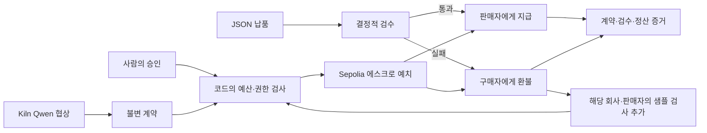

# 공개 Sepolia 실증과 한국어 데모

2026-09-29 KST. **실제 Kiln 협상 → 공개체인 예치 → 지급/환불 → 다음 거래 차단**을 실행했다. 앱·지갑·API 키 없이 별도 RPC로 최종 확정된 블록과 영수증 6건을 대조했다. 병행 개발 중인 실제 보고서 기반 납품 기능과 이 합성 CAPEX 실증의 결과를 합산하지 않는다.

## 한 사용자, 한 문제

대상은 외부 AI에게 작은 JSON 데이터 제작을 맡기는 리서치팀의 AI Platform Lead다. 해결하는 문제는 “예산 내 결제”만이 아니라 **납품 전에 돈을 넘기지 않고, 약속을 어긴 판매자에게 다시 같은 방식으로 지출하지 않는 것**이다. 이 특정 사용자가 실제로 구매할 의사가 있다는 인터뷰 증거는 아직 없다.

이 실행의 데이터는 합성이다. 구조·행 수·중복·값 타입·URL 형식·납기를 검증하며, CAPEX 값의 경제적 진실성이나 출처 관련성을 입증하지 않는다. 다른 작업에서 진행 중인 공식 자료 대조는 별도 증거가 완성될 때 추가한다.

## 직접 확인

```sh
pnpm install --frozen-lockfile
pnpm ade:replay:build
pnpm ade:replay
```

http://127.0.0.1:3410/?replay=1 에서 한국어 9단계와 3분 자동 재생을 볼 수 있다. 읽기 전용 서버는 signer와 Kiln 키를 불러오지 않는다. 단계 버튼으로 이동하고 지급·환불·차단 감사 영수증을 내려받을 수 있다.

- [실행 보고서](../artifacts/deal-escrow/runs/d07e8650-bc47-4ecd-b138-8885d8288a04/report.json)
- [독립 finalized 검증](../artifacts/deal-escrow/runs/d07e8650-bc47-4ecd-b138-8885d8288a04/independent-verification.json)
- [고정 배포 정보](../artifacts/deal-escrow/sepolia/trusted-deployment.json)
- [브라우저 검사](../artifacts/deal-escrow/public-ui/browser-checks.json)

배포 계약: [0x7fAFf4f3CE80c1603752A5cEa8f35a61638101b9](https://sepolia.etherscan.io/address/0x7fAFf4f3CE80c1603752A5cEa8f35a61638101b9).

| 실제 동작 | 상태 | 거래 |
|---|---|---|
| Seller A 예치 | 1.80 demo units 잠금 | [fund](https://sepolia.etherscan.io/tx/0x0e7281178c068321f14f3e94cd5481ac5853692d877ed2f7ed42ddbe58f62d41) |
| Seller A 납품 | 52행, 96.15% URL, 지급 | [release](https://sepolia.etherscan.io/tx/0x4885281275dabcc83e13ec20b39edcc538a2eb0ab5b6c6497b8c0ea6cd8232b0) |
| Seller B 예치 | 별도 승인 작업의 1.80 units 잠금 | [fund](https://sepolia.etherscan.io/tx/0x9020bcaad098c1693d52d828ce819a41bb7c8aace0abdd5861d85a5f9e3337d5) |
| Seller B 납품 | 7/40행, 환불 | [refund](https://sepolia.etherscan.io/tx/0x2618632ab0c3f3dce66eb61fbac9ef19c0a78976086538e771683aac92378d5d) |
| Seller B 다음 거래 | PREVIEW_REQUIRED, 서명된 예치 0건 | 같은 실행의 차단 영수증 |
| 상한 초과 | 2.50 > 2.00, MAX_SINGLE | 서명된 예치 0건 |
| 기한 경과 | MANDATE_NOT_EXPIRED 실패 | 서명된 예치 0건 |
| 사람의 중지 | MANDATE_ACTIVE 실패 | 서명된 예치 0건 |

금액은 테스트 자산 표시 단위다. 1 minor unit = 10^9 wei이며 달러 환산이 아니다. 각 의뢰의 원금 예산은 3.00 units, 건별 상한은 2.00 units다. 가스는 별도 데모 운영 예산에서 지출한다. 원금 한도를 사용자 지갑의 가스 포함 총비용 한도라고 주장하지 않는다. 기존에 무료로 받은 테스트 ETH 중 0.01 ETH를 전용 지갑으로 옮겼으며, 실제 코인 구매·faucet 제한 우회는 없었다.

## 체인이 맡는 역할



체인은 단순 기록 장식이 아니다. 원금을 실제로 보관하고, 같은 계약의 지급/환불을 동시에 허용하지 않으며, 정산에 검수 증거 해시를 연결한다. 다만 예산·승인·검수의 오프체인 실행은 controller를 신뢰한다. 공개 실증에서 buyer와 controller는 같은 데모 주소다. 악성 controller에 대한 완전한 방어, 실제 자산 수탁, 사건 기록의 완전성, 실데이터 진실성은 입증하지 않았다.

서비스 동작은 canonical 2 confirmations로 진행했다. 최종 독립 검증은 **다른 RPC(Tenderly), finalized block 11801261**에서 성공했다. 계약 코드 해시, 실제 tx calldata·금액·참여자·이벤트·정산 상태와 저장된 증거를 대조했다. 앱이 실행 중일 필요가 없다.

```sh
pnpm ade:verify:public
```

## 실제 Kiln 측정

| 흐름 | 호출 | 입력 tokens | 출력 tokens | 합계 |
|---|---:|---:|---:|---:|
| Buyer counter-offer | 2 | 1,418 | 1,118 | 2,536 |
| Seller A negotiation | 1 | 542 | 516 | 1,058 |
| Buyer final selection | 2 | 1,429 | 792 | 2,221 |
| Seller B negotiation | 1 | 569 | 516 | 1,085 |
| 전체 | 6 | 3,958 | 2,942 | 6,900 |

예산·해시·납품·정산 판단·통제 적용은 LLM 호출 0회다. 실패한 모델 출력은 재정 권한을 얻지 않는다. 모델이 항상 최적 가격을 고른다는 증거는 아니다. 실제 Seller B 합의 금액도 1.80이므로 예시 대본의 1.50으로 바꾸지 않았다.

API 응답 토큰과 요청 지연을 측정했다. NPU 전력, 장비 배치/이용률, TTFT, GPU 기준선 대비 절감률은 미측정이다. 제공자가 응용별 평균 전력 P를 제공한다면 E≈P×시간이라는 가정 기반 계산을 할 수 있지만, API 지연에는 대기·네트워크가 포함되어 장비 활성시간과 같지 않다. 근거 없는 J 또는 절감률은 표시하지 않는다.

## 재시도와 증거 무결성

공개 실행기는 구매 의도와 원 서명 거래를 먼저 저장한다. RPC가 응답을 잃거나 확인 블록이 부족해도 같은 거래를 조회한다. 완료 후 `pnpm ade:sepolia`를 다시 실행했을 때 **새 송금 0건·Kiln 호출 0회·영수증 바이트 변경 없음**을 확인했다. 비밀 journal은 `data/private/`에만 있다.

재생 화면은 특정 실행의 파일을 고정해 읽는다. 다른 실행의 토큰, 환불, 추가 통제를 임의로 섞지 않는다. 영수증 누락·상태 변경·배포 불일치·토큰 합계 변경·통제 원인 변조를 거부하는 회귀 검사를 추가했다. 독립 RPC 판정도 영수증 SHA-256이 일치할 때만 표시한다.

## 시연 대본

0–15초: 외부 AI에게 일을 맡길 때 선불의 위험을 보여준다. 15–45초: 실제 Qwen 협상과 1.80 units 계약. 45–70초: 판매자 수령액 0, 에스크로 잠금. 70–90초: 52행 납품과 실제 지급. 90–115초: 7행 실패와 실제 환불. 115–135초: 해당 판매자의 다음 거래 예치 차단. 135–155초: 지급·환불·차단 영수증과 최종 확정 대조. 155–170초: 6회/6,900토큰, 결정적 검사 0회. 170–180초: AI 협상, 코드 통제, 조건부 정산으로 마무리한다.

브라우저의 자동 재생은 실제로 측정된 과거 기록을 설명하는 것이다. 실시간 체인 거래라고 소개하지 않는다. 영상 파일은 저장된 실제 브라우저 프레임을 시간순으로 배치한 3분 무음 증거 영상이며, 내레이션과 실제 사용자 관찰은 별도다.
