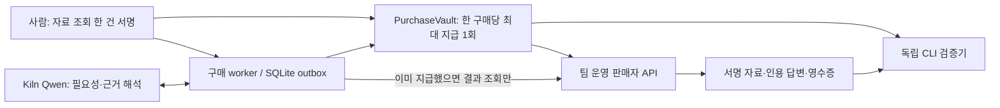

# 구매 복구 v3 — 구현과 검증

2026-09-28. **로컬 devnet 구현·실제 Kiln 검증 완료. 공개 Sepolia 실증은 테스트 ETH 부족으로 미완료.**

기능은 유료 자료 조회 한 건으로 제한한다. 사용자의 서명은 `purchaseId + resourceSpecHash + maxSettlements=1`에 묶인다. 다시 실행하거나 새 견적을 받아도 같은 승인은 두 번째 지급을 허용하지 않는다. `contracts/PurchaseVault.sol`이 이를 토큰 전송과 한 트랜잭션에서 집행한다.

## 구성과 신뢰 경계

| 구성 | 실제 역할 |
|---|---|
| `web/PurchaseApp.tsx` | 테스트 지갑으로 구매 1회 승인, 지급/수령 별도 표시, 중지, worker 재시작, JSON 영수증 |
| `src/purchase-model.mjs` | Kiln `qwen3-32b`의 조회 필요성 판단과 인용 답변. 지급 도구·키·권한 변경 기능 없음 |
| `src/purchase-engine.mjs` | SQLite 원자적 작업 잠금, 지급 전 서명 tx 저장, 같은 tx 재전송, 체인 대조, 결과 복구 |
| `src/purchase-worker*.mjs` | 별도 Node 프로세스. UI 재시작은 실제 종료와 새 PID 생성 |
| `src/purchase-seller.mjs` | HTTP 자료 API. 판매자 서명 견적·자료, 일회성 조회 challenge, 실제 응답 socket 유실 주입 |
| `contracts/PurchaseVault.sol` | owner 서명·판매자·자료·기한·수수료 포함 한도·구매당 지급 1회, 직접 취소 |
| `src/purchase-verifier.mjs` | 별도로 신뢰한 배포 manifest와 RPC로 승인·지급·자료 bytes 대조 |



예산은 TestCredit 단위다. 판매자 수수료는 포함하며, 네트워크 가스와 Kiln 비용은 운영자가 별도로 부담한다. 실제 사용자 자금을 수탁하는 제품이 아니며 테스트 토큰은 공용 데모 금고에서 지원한다. vault 밖 지급 경로에 이 보장이 적용된다고 주장하지 않는다.

## 불확실한 지급을 다루는 방법

지급 전에 서명된 tx의 payload·hash·nonce와 증빙을 저장한다. 방송 확인이 끊겨도 `UNKNOWN`을 시간만으로 실패 처리하지 않는다. 재시작 후 같은 tx를 확인·재전송한다. 대체 거래가 있을 때에는 확정 블록의 nonce 소비와 미지급 상태를 확인한 후에만 최초 지급을 다시 준비한다. 공개 체인은 `finalized`, 로컬 체인은 1블록을 사용한다.

`SETTLED/PENDING`은 돈은 나갔지만 자료는 없다는 뜻이다. 판매자가 기존 결과를 제공하면 추가 지급 없이 받는다. 판매자가 결과를 잃었으면 `SETTLED/UNRECOVERABLE`로 남는다. 자동 환불·배송 강제는 구현하지 않았다. 중지 요청보다 먼저 체인에 포함된 지급도 되돌리지 않는다.

판매자 결과 조회는 owner 또는 지정된 executor의 일회성 서명이 필요하다. tx hash만으로 다른 구매의 결과를 읽을 수 없다. 모델은 근거 문단 ID만 고르고 코드가 해당 원문을 그대로 복사한다. 모델이 인용문을 재작성할 때 생긴 오류를 제거하고 복사에 쓰는 출력 토큰도 줄인다. 선택한 근거와 답변이 의미상 올바른지는 별도 평가한다.

## 재현

```sh
pnpm install --frozen-lockfile
pnpm contracts:build
pnpm purchase:build
pnpm build
# .env.local에 KILN_API_KEY 설정
pnpm purchase:start
```

콘솔: http://127.0.0.1:3500/purchase. 자료 API는 3501, 체인 RPC는 8546이다. 기존 콘솔 3400과 데이터가 분리된다. 키와 SQLite·체인 원장은 Git에서 제외된 `data/private/purchase-devnet/`에 저장된다.

```sh
pnpm purchase:test
pnpm test
# 서버가 실행 중일 때. 실제 Kiln 요청 2회와 테스트 자산 거래 발생.
pnpm purchase:verify
# 별도 12개 합성 사례. 실제 Kiln 요청 12회.
node --env-file-if-exists=.env.local scripts/evaluate-purchase-model.mjs
```

서버는 시작 시 정확한 소스 bytes와 hash 목록을 `artifacts/purchase/source/`에 보관한다. worker는 시작 시 이 목록과 현재 파일이 같아야 한다. 코드를 바꿨다면 부모 서버도 재시작한다. 이는 실행 재현을 위한 기록이며 원격 실행이나 물리 NPU의 암호학적 증명은 아니다.

## 독립 검증

```sh
node scripts/verify-purchase.mjs bundle.json trusted-deployment.json http://127.0.0.1:8546 report.json
```

배포 manifest는 bundle과 별도의 신뢰 경로에서 받는다. bundle 안의 RPC를 그대로 믿지 않는다. CLI는 앱 HTTP 서버에 접속하지 않고 체인과 서명·bytes를 검사한다. 로컬 devnet은 로컬 운영자가 제어하는 체인이므로 공개 네트워크의 독립성과 같지 않다. 결과 bundle과 원장 데이터가 없으면 다른 PC가 과거 로컬 체인을 재현할 수 있는 것도 아니다.

- `VALID/PURCHASE_AUTHORITY_AND_PAYMENT`: 서명 승인 안의 지급 및 실제 토큰 전송이 일치함.
- `SIGNED_CONTENT_MATCH`: 판매자가 서명한 자료 bytes가 해당 구매와 맞음. 자료의 진실성·답변 품질·부재 증명은 아님.
- `APPROVAL_AND_NO_PAYMENT_AT_OBSERVED_BLOCK`: 관측 블록까지 해당 구매 지급이 없음. off-chain 중지 사유의 진실까지 증명하지 않음.
- `INVALID`: 변조 또는 명시적 불일치. `INCOMPLETE`: 필수 자료/RPC/최종 확정이 부족함.

통합 검증은 HTTP listener를 8초 닫고 별도 CLI 프로세스 검증과 owner 직접 취소를 실행한다. 부모 프로세스 전체를 끈 실험으로 표현하지 않는다. 그 프로세스가 로컬 RPC도 호스팅하기 때문이다.

## 공개 Sepolia 준비 및 남은 gate

```sh
pnpm purchase:sepolia
pnpm purchase:sepolia --deploy
# PowerShell
$env:PURCHASE_NETWORK = 'sepolia'
pnpm purchase:start
```

`--deploy` 전에 무료 테스트 ETH가 필요하다. 스크립트는 Ethereum Sepolia(11155111)만 허용한다. 전용 주소는 `0x6E4DE4126F057A9334c3fBDD0dd9e26c40534327`이며 2026-09-28 확인 잔액은 0이다. 실제 ETH를 구매할 필요가 없다. `SEPOLIA_RPC_URL`은 선택 설정이며 API key가 있는 RPC URL은 공개 증빙에서 제거한다.

자금 준비 후 계약 배포, 실제 지급, 두 경계 이탈, 직접 취소, 새 견적 중복 공격을 공개 체인에 남겨야 한다. 별도 RPC에서 최종 확정과 explorer tx hash를 검증하기 전에는 공개 실증 완료가 아니다. 현재 `purchase:verify` harness는 로컬 devnet만 실행하도록 제한되어 있다.

## 현재 한계

- 합성 자료와 팀 운영 판매자 한 곳이다. Exa나 표준 x402에 바로 연결되는 구현이 아니다.
- UI 키는 테스트용 localStorage 지갑이다. production wallet·키 보관·고객별 입출금·자금 회수·멀티서버 운영은 미구현이다.
- signer의 nonce는 프로세스별 직렬화와 확정 대체 거래 복구로 처리한다. 여러 독립 실행자가 동일 키를 쓰는 운영용 nonce 서비스는 없다.
- NPU 라우팅·전력은 직접 계측하지 않았다. 토큰·latency는 Kiln 응답과 클라이언트 측정이다.
- 실제 고객 인터뷰, 최신 x402 SDK/DB와의 장애 복구 비교는 P1이다. 합성 검증 성공을 시장 수요나 보편적 보안성으로 확대하지 않는다.

최종 실행 파일과 측정 수치는 [증빙 색인](../artifacts/purchase/README.md)을 참조한다.
