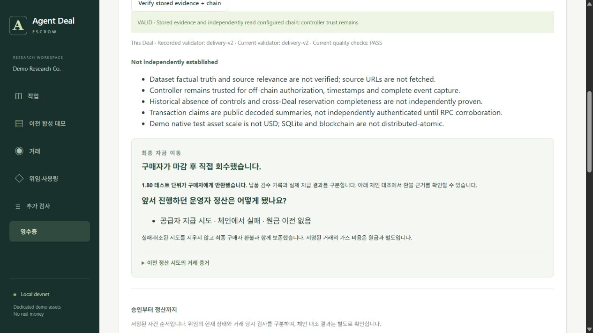

# 지급·환불 경합을 한 번의 최종 정산으로 복구

2026-09-29. **운영자가 정산을 준비하는 사이 구매자가 직접 환불한 경우, 실패·취소된 운영자 시도를 보존하고 체인에서 완료된 구매자 환불에 장부를 맞춘다.** 반대로 운영자 지급이 먼저 완료되면 구매자는 이를 되돌릴 수 없다.

수정 전에는 구매자가 환불받았는데도 앱이 `DELIVERY_VERIFIED` 또는 `DELIVERY_SUBMITTED`에 머물며 예약 예산을 계속 유지했다. [실제 로컬 EVM 회귀](../tests/deal-escrow/buyer-refund-race.test.mjs)의 지급/환불 두 경로에서 이 실패를 재현했다.

## 확정 전에는 시도를 지우지 않는다

- **서명 전:** 이미 확정된 구매자 환불을 확인하면 운영자의 미서명 정산 의도를 취소한다. 새 서명·nonce를 만들지 않는다.
- **서명 후 결과 미확인:** 구매자 환불만 보고 운영자의 서명 거래를 지우지 않는다. 기존 nonce의 결과가 확인될 때까지 예약 예산을 유지하고 다른 서명을 막는다.
- **정확한 실패 또는 대체 거래 확인:** 기존 서명 거래의 status 0 영수증, 또는 같은 nonce의 확정 대체 거래를 대조한 뒤 기존 시도를 보존한다. 구매자 환불을 한 번만 반영하고 예약 예산을 해제한다.
- **운영자 지급이 먼저 성공:** 유실된 응답을 기존 지급 해시로 복구한다. 구매자의 후속 환불 요청은 계약에서 거부된다.

이미 서명한 거래가 뒤늦게 체인에 포함되어 실패하면 가스 비용은 발생한다. 원금의 중복 이동을 막는 것과 가스를 전혀 쓰지 않는 것은 다르다. 자동 복구가 새 nonce의 취소 송금을 만드는 기능은 추가하지 않았다.

## 검사한 경계

| 로컬 EVM 사례 | 확인한 결과 |
|---|---|
| 지급 서명 후 RPC 중단 → 구매자 환불 | 불확실한 동안 예약 180 유지, DB 재시작 후 정확한 지급 실패와 구매자 환불을 함께 복구 |
| 환불 서명 후 RPC 중단 → 구매자 환불 | 운영자의 실패한 환불 시도도 보존; 성공한 구매자 환불과 해시·주체를 구분 |
| 지급/환불 의도 저장 후 서명 전 중단 | 구매자 환불 후 미서명 의도만 취소; controller nonce 불변 |
| 같은 nonce의 외부 취소 거래 | 대체 거래·블록·nonce를 대조하고 원래 지급 시도와 최종 환불을 보존 |
| 납품 저장 후 정산 의도 생성 전 중단 | 납품 기록을 유지하고, 존재하지 않은 운영자 거래를 만들어 넣지 않음 |
| 운영자 지급 성공 후 응답만 유실 | 지급을 복구하고 구매자 환불을 거부; `SETTLED` 유지 |

영수증에서 이전 시도를 빼거나 성공으로 바꾸는 변조, 실패 영수증의 status 변경, 원래 정산 조건 변경, 이전 schema로 위장하는 변경을 거부한다. 기존 운영자 환불의 동일 의도 대체 거래도 계속 복구된다. 전체 자동 검사 **93개**, 실패·건너뛰기 0, TypeScript/Vite 빌드 통과다.

## 영수증과 화면

schema 4는 최종 `transactions.refund`에 구매자 환불을 담고, `controller_attempts`에 실패·취소된 운영자 시도를 따로 담는다. 원래 납품 검수와 정산 attestation도 보존한다. 이전 schema 1/2/3 기록은 다시 쓰지 않는다.

납품 검수 실패가 이미 기록된 경우에는 기존의 신뢰된 실패→추가 샘플 조건을 적용한다. 납품 없이 마감이 지났다는 사실만으로 검수 실패를 만들어 넣지는 않는다.

영수증 화면은 **“구매자가 직접 회수한 최종 결과”**, **“앞서 진행하던 운영자 시도”**, **“납품 검수”**를 구분한다. 이전 시도 해시와 시간 순서를 펼쳐볼 수 있다. [브라우저 검사](../artifacts/deal-escrow/settlement-race/ui/browser-checks.json)에서 실제 검증 버튼의 `VALID`, 실패 해시, 현재 93개 검사 결과를 확인했고, 390px 뷰포트의 문서 너비는 375px였다. 캡처한 콘솔 오류·경고는 0건이다.



## 별도 실증과 재현

격리한 실행 `ed9d96e6-60b1-4236-b4c6-b3e7dd93cb33`의 [보고서](../artifacts/deal-escrow/settlement-race/ed9d96e6-60b1-4236-b4c6-b3e7dd93cb33/report.json)와 [영수증](../artifacts/deal-escrow/settlement-race/ed9d96e6-60b1-4236-b4c6-b3e7dd93cb33/receipt.json)를 보존했다. 1.80 DEMO 원금은 구매자가 회수했고, 이미 서명했던 운영자 지급은 status 0으로 끝났다. 그 시도의 가스를 소비한 controller nonce 증가 1회를 기록했다. 별도 새 지급은 없다.

이 실행은 합성 납품·61초 EVM 시간 이동·실제 DB 재열기를 사용한 **로컬 개발 실증**이다. 별도 OS 프로세스를 강제 종료한 시험, 실제 사용자 주문 또는 새로운 Sepolia 실행이 아니다. 모델 호출과 공개 체인 거래는 0이다. 실행 당시 소스 지문을 그대로 보존하며, 후속 전체 회귀와 현재 UI의 검증 지문은 별도로 기록한다.

```powershell
node --test tests/deal-escrow/buyer-refund-race.test.mjs
pnpm ade:test
pnpm ade:build
# 새 격리 로컬 실증 생성. 모델·공개 RPC 호출 없음.
node scripts/demo-deal-research-race.mjs --local
```

현재 실증 화면은 `http://127.0.0.1:3416/?legacy=1`의 영수증에서 확인한다. 주 원문 작업 화면 3415의 기존 거래는 재사용하거나 변경하지 않았다.

현재 남는 한계는 RPC의 과거 기록 가용성, 같은 nonce 대체 거래 검색의 기존 2,048블록 범위, 심한 체인 재편성 시 수동 조정, 키 분실이다. 이번 결과를 모든 정산 경합이나 무기한 복구의 보장으로 일반화하지 않는다. 실제 고객·공급자 참여와 사람의 원문 검토도 별도 미완료다.
