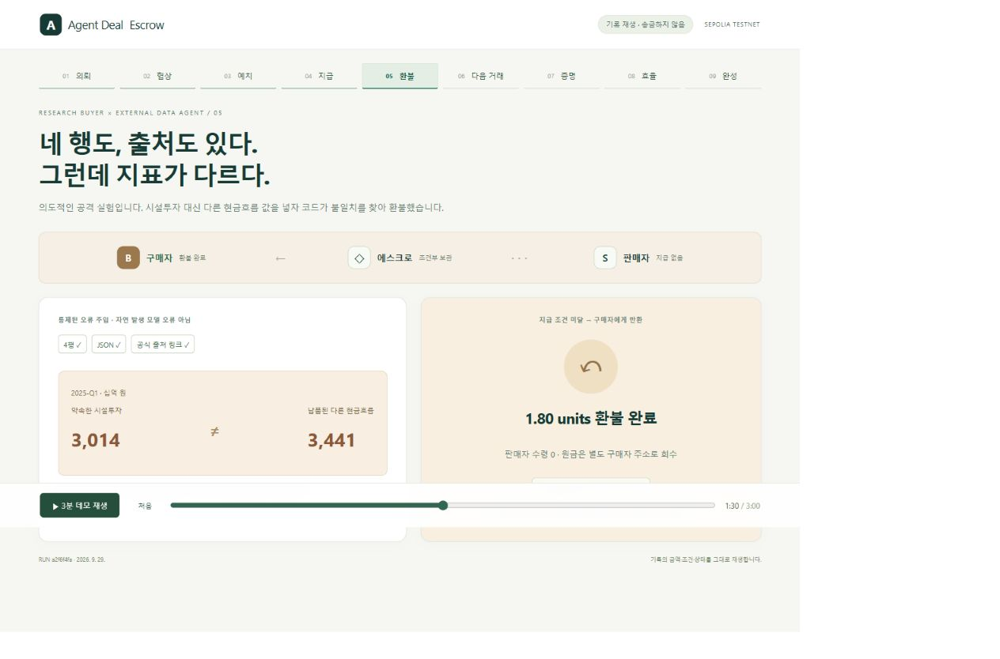

# 실제 원문 납품과 공개 Sepolia 정산

2026-09-29. 실행 `a2f6f4fa-9f1e-4892-8518-325b8762c4f2`. 기존 합성 데이터 실증과 별도로, 실제 발행사 자료에서 추출한 결과·잘못된 지표의 납품·공개 체인 정산을 같은 실행으로 연결했다.

## 무엇을 실제로 했는가

1. LG에너지솔루션의 공식 2025년 4분기 실적 발표 PDF를 다시 받아 SHA-256이 고정 버전과 일치하는지 확인했다.
2. 실제 Kiln `qwen3-32b`가 세 견적의 기간·내용·납기를 비교하고, 정확한 작업의 가격을 2.10에서 1.80 테스트 단위로 변경 제안했다. 판매자는 공개 최저가 규칙으로 응답했다.
3. 승인·계약 조건을 검사하고 Sepolia 에스크로에 원금을 잠갔다.
4. 실제 Kiln이 원문에서 전사한 표를 입력받아 네 분기의 값을 추출했다. 고정 참조표와 맞는 납품에 1.80 units를 지급했다.
5. 별도 의뢰에서는 그 결과의 Q1 시설투자 3,014를 다른 지표의 3,441로 바꾸었다. 형식·행 수·출처 필드는 유지했지만 검수에서 실패하여 원금을 구매자에게 환불했다.
6. 해당 판매자의 다음 거래는 사전 샘플이 없어 예치 전에 차단했다. 별도의 건별 한도 초과와 사람의 승인 철회도 서명 없이 차단했다.

실행은 테스트용 자동 승인 시나리오다. 실제 고객이 구매하거나 외부 공급자가 계약에 서명했다고 주장하지 않는다. 의도적인 오납품은 fault injection이며 자연 발생 모델 오류가 아니다.

## 온체인 근거

- 네트워크: Sepolia, chain ID 11155111.
- [에스크로 계약](https://sepolia.etherscan.io/address/0x04173D24864AD32fE791bd20ef5E97B4a3FC021B)
- controller: `0x132d5273a213d7c4D85fF24Ca0D94bFE084cA3e6`
- 별도 buyer: `0xC7EEcEc71Bbc6e143f289E5F75E0416E9470bB40`
- 각 의뢰의 원금 예산 3.00 units, 건별 상한 2.00 units. 1 minor unit = 10^9 wei. USD 환산이 아니다.
- 기존 무료 Sepolia 자산으로 운영자가 원금·가스를 공급했다. 고객 자산 수탁이나 실자산 구매는 없었다.

| 동작 | 거래 |
|---|---|
| 실제 자료 의뢰 예치 | [0x11fb9a08…](https://sepolia.etherscan.io/tx/0x11fb9a0835bd769079258e6225be419a7eb5802754a22106d70fe43077f8410a) |
| 실제 추출 납품 지급 | [0xeb9d63ca…](https://sepolia.etherscan.io/tx/0xeb9d63ca0c71be068cdd85a224d1ace286838ecdcf099c33c511c9be5d4eaecc) |
| 오납품 실험 예치 | [0x6c2a2320…](https://sepolia.etherscan.io/tx/0x6c2a23209a579a3af3647697cd67d2a3e73577695dce0f9e2345d1d01b985fce) |
| 오납품 원금 환불 | [0x845a4ed7…](https://sepolia.etherscan.io/tx/0x845a4ed742759a5f2fb70a4fd9fcec9aa45b0e99f43b076d315245c27aaf3ca8) |

앱은 canonical 2 confirmations를 확인했다. 이후 별도 Tenderly RPC에서 최종 확정 블록 11,801,516 기준으로 다섯 영수증 모두 `VALID`, 전체 `PASS`를 확인했다. 결과는 [독립 검증 파일](../artifacts/deal-escrow/source-sepolia/a2f6f4fa-9f1e-4892-8518-325b8762c4f2/independent-verification.json)에 기록한다. 앞선 확인에서는 확정 블록이 거래에 도달하지 않아 `INCOMPLETE`였으며, 확정 후에만 완료 배지를 표시했다. 과거 실행의 PASS를 재사용하지 않는다.

## 실제 추론과 에너지 가정

| 흐름 | 호출 | 입력 | 출력 | 합계 | API 지연 |
|---|---:|---:|---:|---:|---:|
| 견적 비교 | 1 | 855 | 1,263 | 2,118 | 17.924초 |
| 원문 표 추출 | 1 | 895 | 1,482 | 2,377 | 21.112초 |
| 합계 | 2 | 1,750 | 2,745 | 4,495 | 39.036초 |

정책·참조표 대조·정산 판단·통제 적용은 추가 LLM 호출 0회다. CPU가 에너지를 쓰지 않는다는 의미는 아니다. 이전 6회/6,900토큰 실행과 과업이 다르므로 감소율을 계산하지 않는다.

에너지 수치는 **가정 기반 민감도 계산**이다. 공식 문서의 [Qwen3-32B 4카드 구성](https://developer.furiosa.ai/latest/en/furiosa_llm/models/qwen3.html)과 [카드당 150W TDP](https://developer.furiosa.ai/latest/en/overview/rngd.html)를 계산의 출발점으로 삼았다. 이것이 실제 Kiln 배치나 전력 측정이라는 의미는 아니다.

`E = 카드 수 × 가정한 카드당 W × 전력 비율 × API 지연(초) × 활성 시간 비율`

| 흐름 | 활성 25%·명목 전력 50% | 활성 50%·명목 전력 75% | 활성 100%·명목 전력 100% |
|---|---:|---:|---:|
| 견적 비교 | 1,344.3 J | 4,032.9 J | 10,754.4 J |
| 원문 표 추출 | 1,583.4 J | 4,750.2 J | 12,667.2 J |
| 합계 | 2,927.7 J | 8,783.1 J | 23,421.6 J |

TDP는 소비전력 실측 또는 보장된 상한이 아니다. 활성 비율·전력 비율은 분석자가 정한 가정이며, 세 수치는 신뢰구간이 아니다. 네 카드를 요청에 독점 귀속시키는 가정이다. 배치 공유, 호스트, 저장장치, RPC, 체인 검증자, 냉각은 미측정·미포함이다. 전체 서비스 에너지나 GPU 대비 절감률로 해석하지 않는다. [계산 원자료](../artifacts/deal-escrow/source-sepolia/a2f6f4fa-9f1e-4892-8518-325b8762c4f2/energy-estimate.json)는 원 실행 보고서의 SHA-256에 연결된다.

## 다시 보기와 검증

```sh
pnpm install --frozen-lockfile
pnpm ade:replay:build
pnpm ade:source:replay
# http://127.0.0.1:3413/?replay=1

pnpm ade:source:verify
pnpm ade:source:energy
pnpm ade:test
```

화면은 기록 재생이며 송금하지 않는다. API 키·지갑 없이 저장된 납품과 영수증을 보여준다. `ade:source:verify`는 읽기 전용 공용 RPC 검증, `ade:source:energy`는 기존 수치의 로컬 계산이다.

새 실제 실행 명령 `ade:source:demo`에는 Kiln 설정과 테스트 지갑이 필요하다. 기존 완료 journal에서 다시 실행하면 모델 호출·송금 0건으로 같은 증거만 검증한다. 모델 요청 도중 응답을 잃으면 자동 재호출하지 않고 검토 필요 상태를 남긴다. 서명 거래는 제출 전에 저장하며 확인이 늦어져도 같은 거래를 대조한다. 새 실행을 만들려고 private journal을 임의로 지우지 않는다.

## 검증 범위와 남은 일

- 68개 자동 검사가 통과했다. 새 검사에는 추론 응답 유실 후 중복 호출 방지, 실제 공개 실행의 원문/오납품/통제 연결, 과거 합성 영수증 혼입 거부, 에너지 가정 계산이 포함된다.
- 한국어 재생 9개 단계를 데스크톱과 390px 모바일에서 확인했다. 가로 넘침과 브라우저 경고·오류는 없었고, 다운로드한 영수증의 거래 ID도 일치했다. [브라우저 검사 기록](../artifacts/deal-escrow/source-sepolia/ui/browser-checks.json)과 화면을 함께 보존한다. 실제 사람의 이해도 검증은 별도다.
- 납품 원문이 PDF 전체가 아닌 전사된 표라는 점, 고정된 네 정답값을 검수에 사용한다는 점을 화면에 명시한다. 참조표의 사람 검토는 대기다.
- 검수와 승인 집행은 controller를 신뢰한다. 별도 구매자 주소를 사용했지만, 이 실행은 앱 종료 후 구매자 직접 환불까지 포함하지 않는다. 그것은 별도 복구 실증이어야 한다.
- 현재 공개 실증은 새 문서에 대한 일반화·실제 고객의 지불 의사·공급자의 에스크로 참여·실자산 운영 준비를 증명하지 않는다.


