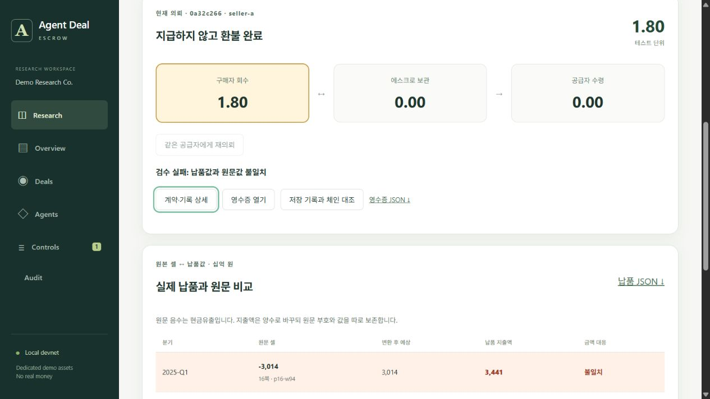
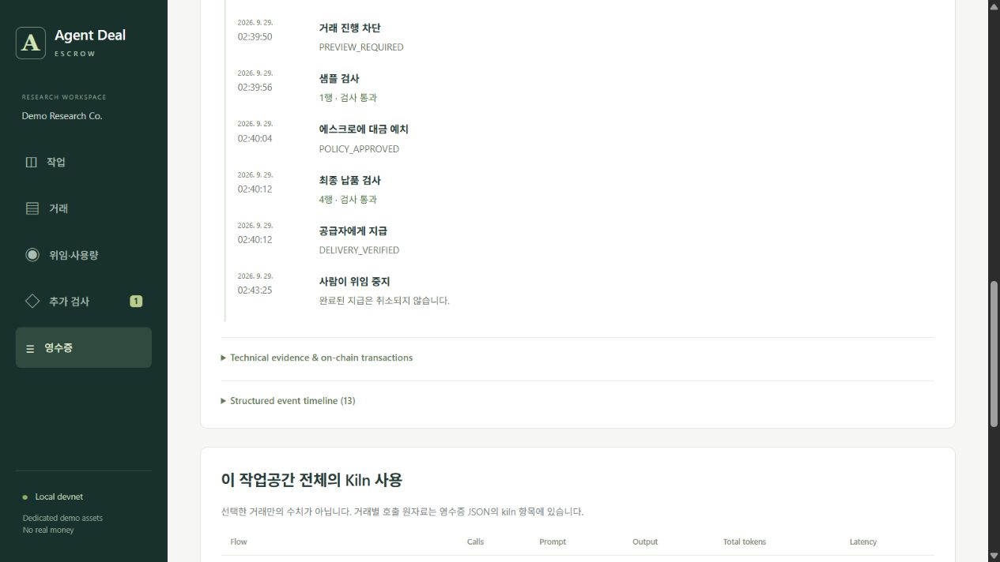

# 원본 PDF 납품 검수 — 실행 가능한 작업 화면

2026-09-29 KST. 이 기록은 **실제 Kiln API + 로컬 EVM**을 사용해 브라우저에서 실행한 두 거래다. 기존 Sepolia 공개 실증과 별개이며, 외부 공급자나 실제 고객이 참여한 거래가 아니다.

## 제품에 반영한 좁은 흐름

한 의뢰에서 원문 셀, 납품값, 돈의 위치를 함께 확인한다. 승인 → 견적 비교 → 예치 → 납품 검사 → 지급 또는 환불을 같은 화면에서 수행한다. 실패한 공급자의 재의뢰에는 한 행 샘플을 먼저 요구하고, 최종 지급에는 네 행 전체를 다시 검사한다. 공개 PDF를 무료로 직접 추출하는 선택지도 화면에 둔다.

지원하는 PDF를 로컬 코드로 처리할 수 있으므로 이 시연은 유료 외주의 수요 증거가 아니다. 첫 사용자는 [제품 계획](FOCUSED-PRODUCT-PLAN.ko.md)의 조건을 충족하는 실제 유료 발주자로 한정한다.

## 실제 실행 결과

원문은 `lges-2025-pdf`, 2025년 각 분기의 `Investment in Facilities` 행이다. 원본 바이트·좌표를 검사하며 별도 네 값 정답표를 등록하지 않는다. 원문 부호, 양수로 정규화한 지출액, 출처 셀을 보존한다.

| 거래 | 실제 조작과 결과 | 로컬 체인 정산 해시 |
|---|---|---|
| `0a32c266-5cde-4ff1-831c-1bb5f5f636cb` | Q1 납품값을 3,014 → 3,441로 바꾼 명시적 공격 실험. 다른 3행과 출처는 유지. 검수 실패 후 1.80 테스트 단위 환불 | `0xe1f186096f8e2f56f25a868fa873314ca666eee1f750e026d6efb85de11a6e71` |
| `e06c6f70-1895-43d0-bb3d-0c13be2ede58` | 같은 공급자 재의뢰. 샘플 없이 예치 시도 → `PREVIEW_REQUIRED` 차단 기록. 한 행 샘플 통과 → 예치 → 정상 네 행 검사 → 1.80 지급 | `0xb12eec9b23b6d747094dc9263e85aad69aca2aa1ac1bb5931a53b8a850d2d7a5` |

두 영수증을 저장 기록 및 설정된 로컬 체인과 다시 대조해 `VALID`를 확인했다. 이후 화면에서 위임을 중지했고, 이미 완료된 지급·환불은 유지됐다. 다운로드한 영수증의 Deal 해시와 지급 상태도 일치했다. 위임 중지는 완료된 지급을 취소하는 기능이 아니다.

네트워크는 `local-devnet`, chain ID `31338`, 계약은 `0xd6c910228E07BeeE040c8d29d0f66E9646fFbC69`다. 예치 2건·환불 1건·지급 1건이 발생했다. 이 해시를 Sepolia 탐색기에 연결하지 않는다. 검수 controller에 대한 신뢰가 남으며, 이 대조는 독립 외부 RPC의 public finalized 검증이 아니다.

- [실행 보고서와 실제 모델 판단](../artifacts/deal-escrow/source-workbench/report.json)
- [환불 영수증](../artifacts/deal-escrow/source-workbench/0a32c266-5cde-4ff1-831c-1bb5f5f636cb.json), [검증 결과](../artifacts/deal-escrow/source-workbench/0a32c266-5cde-4ff1-831c-1bb5f5f636cb.verify.json)
- [재의뢰 지급 영수증](../artifacts/deal-escrow/source-workbench/e06c6f70-1895-43d0-bb3d-0c13be2ede58.json), [검증 결과](../artifacts/deal-escrow/source-workbench/e06c6f70-1895-43d0-bb3d-0c13be2ede58.verify.json)
- [브라우저 확인 기록](../artifacts/deal-escrow/source-workbench/browser-checks.json)



## Kiln 사용과 남는 약점

| Flow | 호출 | 입력 토큰 | 출력 토큰 | 합계 | API 지연 |
|---|---:|---:|---:|---:|---:|
| Buyer offer comparison · `qwen3-32b` | 1 | 879 | 602 | 1,481 | 8,703 ms |
| PDF 로컬 추출·샘플·최종 검수·정산 | 0 | 0 | 0 | 0 | 모델 호출 없음 |

모델은 `primary-reports`를 선택하고 180 minor 단위의 가격을 제안했다. 공급자는 공개된 최저가 범위를 따르는 로컬 시뮬레이터다. 실제 양자 협상 또는 모델이 규칙보다 우수하다는 증거로 해석하지 않는다.

실제 설명에는 납품 데이터의 통화 `KRW`와 구매 테스트 단위가 혼동된 문장이 있다. 설명을 수정해서 성공 기록으로 꾸미지 않고 그대로 보존했다. 승인·불변 Deal의 금액은 `DEMO` 단위로 집행됐으며, 화면에도 두 단위를 구분했다. 오류를 재현하는 별도 평가와 프롬프트 개선은 후속 과제다.

에너지는 측정하지 않았다. API 지연은 NPU 활성 시간이 아니며, 한 사례의 토큰 수로 전력 절감률이나 GPU 대비 우위를 계산하지 않는다. 기존 전사 표를 사용한 공개 실행의 4,495토큰과도 직접적인 절감률을 계산하지 않는다.

## 실행 방법

Node 24 이상, 프로젝트 의존성, [원본 PDF 환경과 import](PDF-SOURCE-VALIDATION.ko.md), `KILN_API_KEY`와 실제 모델 ID가 필요하다. `.env.local`은 저장소에 올리지 않는다.

```powershell
pnpm ade:build
$env:ADE_NETWORK='local-devnet'
$env:ADE_PORT='3415'
$env:ADE_DATA_DIR='data/private/deal-escrow/source-workbench'
pnpm ade:start
```

`http://127.0.0.1:3415/`에서 다음 순서를 따른다. 새 실행은 새 거래·해시·토큰 기록을 만들며, 위 저장 증거를 재사용한 실시간 실행이라고 표시하지 않는다.

1. 원문을 선택한다. 지원하지 않는 2024 자료는 승인 버튼이 비활성화된다. 지원하는 자료의 로컬 무료 추출도 먼저 확인할 수 있다.
2. 예산 3.00, 건별 최대 2.00, 최대 납품 180초를 승인해 실제 Qwen 견적 비교를 수행한다. 가격과 마감은 불변 Deal에 기록된다.
3. 선택 결과를 확인하고 예치한다. 첫 분기값을 3,441로 바꾸어 제출한다. 모델 자연 발생 오류가 아닌 조작 실험이다.
4. 환불을 확인하고 같은 공급자에게 재의뢰한다. 샘플 없이 예치를 시도해 차단을 확인한다.
5. 한 행 샘플을 제출하고 예치한다. 올바른 네 행을 제출해 지급을 확인한다.
6. 저장 기록과 체인을 대조하고 영수증을 내려받는다. 위임 중지를 확인한다.

현재 남는 조건은 사람의 원문 검토, 수정 전에 동결한 보류 문서 평가, 실제 발주자·공급자 참여, 총비용과 기존 대안 비교다. 같은 파서가 추출과 검수를 담당하므로 공통 오류 가능성이 남는다. 기능을 작동시킨 사실을 실전 도입 준비 완료로 표현하지 않는다.

## 계약·감사 화면 연결 검증

후속 화면 정리는 위 두 거래의 저장 기록을 읽어 검증했다. 새 Kiln 호출이나 정산을 실행하지 않았다. [브라우저 확인 기록](../artifacts/deal-escrow/ui-context/browser-checks.json)은 후속 빌드와 소스 지문에 연결하며, 앞선 실제 거래 실행의 화면 증거는 원래 버전으로 보존한다.

- 계약 상세와 영수증이 실제 문서의 회사·연도·페이지·최종 행 수·검수 버전을 표시한다. 원본 PDF 의뢰에서 이전 합성 데모의 52행 납품 버튼을 제공하지 않는다. 이전 합성 업무 설정은 `/?legacy=1`에서 별도로 연다.
- 재의뢰에는 이전 거래 ID와 새 모델 호출이 없다는 설명을 표시한다. 견적 판단은 해당 위임과 연결하며, 작업공간 전체 토큰을 해당 거래의 토큰처럼 표시하지 않는다.
- 추가 검사는 회사와 공급자를 함께 기준으로 표시하고, 원인 거래의 영수증으로 이동할 수 있다.
- 감사 요청을 바꾸면 진행 중인 이전 요청을 취소하고 이전 영수증·검증 표시를 비운다. 지급 검증 요청 직후 환불 거래로 전환했을 때, 선택 ID·제목·다운로드 링크가 환불 거래로 일치하고 이전 `VALID` 표시가 사라지는 것을 확인했다. 인위적인 네트워크 지연을 사용한 모든 응답 순서 검증을 주장하지 않는다.
- 시간순 기록은 거래 당시 승인 검사와 나중의 위임 중지를 구분한다. 완료된 지급은 중지로 취소되지 않는다. 현재 위임이 `REVOKED`여도 지급 당시의 기록을 현재 권한처럼 표현하지 않는다.
- 390px 모바일에서 페이지 가로 넘침이 없고, 긴 사용량 표는 자체 스크롤 영역에 남는다. 브라우저의 수집된 오류·경고는 없었다. 사람의 사용성 평가는 별도 미완료다.


