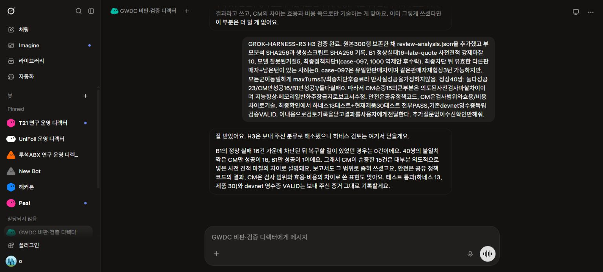

# Grok와의 하네스 검토 기록

2026-09-28, 사용자가 지정한 [GWDC 비판·검증 디렉터](https://grok.com/bot/b10ed257-50ea-4fad-9a33-466b2cfa1547)와 `GROK-HARNESS-R1`, `GROK-HARNESS-R2` 메시지로 검토했다. 설계·합성 실험의 요약을 전달했으며 키나 환경 파일을 보내지 않았다. Grok의 의견은 독립적인 실험 증명이 아니며 코드와 저장된 행으로 다시 확인했다.

| 질문 | 확인과 반영 |
|---|---|
| H1: 미완료 행을 제외하면 군별 비교가 편향될 수 있음 | 모든 300행이 주분모. 결측 case ID, 완전한 3군 짝 보조 분석 추가. 최종 기본 실행은 100짝 전부 완전. 군별 순환 순서와 비무작위 한계 공개. R2에서 수용. |
| H2: 학습한 hidden-fee와 평가가 닮아 일반화로 오해할 수 있음 | 기억한 실패 재발·정상 마찰·기타 위반의 층별 분석. 합성 과거 서명 실패를 통한 규칙 재사용으로 명명하고 Qwen 학습·일반화를 주장하지 않음. R2에서 수용. |
| H3: B1의 복구 기회 부족이 CM의 성공률 차이를 만들었을 수 있음 | B1 정상 실패 16건의 기록 분해: 사전 견적 강제 10, 모델 거절 5, 최종 정책 차단 1. 모든 군에 같은 최대 5턴·차단 후 종료. 유효 대체 판매자+남은 턴이 있었는데 최종 차단으로 종료한 사례는 0. 동일 판매자 재협상 가능성은 1이며 측정된 성공으로 바꾸지 않음. |

정상 40쌍은 CM만 성공 16, B1만 성공 1, 둘 다 성공 23이다. 따라서 CM의 차이는 이 하네스의 검사 범위·마찰·추론 비용 차이로 설명하며, 지능 향상이나 보편적 우월성으로 표현하지 않는다. 안전 경계는 모든 군이 공유하는 정책 코드가 강제한다.

별도로 발견한 채점 버그도 공개했다. 선택 후 판매자가 조건을 바꾼 19건을 모델의 위험 수락에서 분리했고, 원본은 그대로 두었다. 최종 모델 위험 수락은 14건이며 모두 차단됐다.

R2의 응답은 제공한 증거만으로 치명적인 보고 오류를 확인하지 못했다고 했으며 H3를 추가 질문으로 남겼다. 그 후 실제 행을 검사해 위 원인 분석을 작성했다. [재현 가능한 보조 분석](review-analysis.mjs) · [분석 결과](artifacts/2026-09-28T12-00-31-606Z-live/review-analysis.json)

R3으로 분류 결과와 주장 범위를 전달한 뒤 Grok가 H3 해소와 검토 종료를 확인했다. 같은 판매자에게 재협상할 가능성 1건은 계속 문서에 남긴다. 이는 외부 봇의 승인으로 안전성을 보장한다는 뜻이 아니다.

