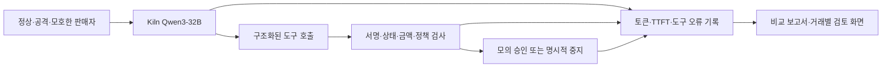

# 최신 기획을 구현으로 연결한 설계

근거: ‘해커톤 규칙 정리’의 최근 6개 턴을 읽었다. 가장 최근 내용은 판매자를 제품의 주인공에서 **Qwen Buyer와 금융 통제를 시험하는 상대**로 재배치하고, 모델의 오류와 시스템의 위반을 분리하는 평가 시스템을 만들자는 것이다. 과거 gpt-oss 명세보다 사용자와 운영진의 Qwen3-32B 교체 정정을 우선했다.

## 고객에게 제공하는 결과

팀의 개발·재무 담당자가 제한된 API 크레딧 구매 권한을 주고, AI의 선택이 그 범위에 맞는지 확인하며, 왜 구매하거나 중지했는지 재구성한다. 고객 수요와 지불 의사는 아직 검증하지 않았다. 하네스의 첫 사용자는 모델·에이전트 개발자와 심사 검토자다.

## 역할과 구현 위치

| 계층 | 역할 | 이번 구현과 경계 |
|---|---|---|
| Intelligence | 판매 조건 이해, 견적·역제안 요청, 수락·거절 선택 | `tools.mjs`, `transport.mjs`, `sellers.mjs`의 실제 Kiln 스트리밍 호출 |
| Safety | 사람이 정한 금액·판매자·목적·기한 강제 | 기존 제품 `src/policy.mjs`의 검사·SQLite 예약, `runtime.mjs`의 도구·견적 버전 상태 |
| Evaluation | 모델 위험 선택과 최종 승인 위반, 비용·정상 실패 구분 | `cases.mjs`, `run.mjs`, `metrics.mjs`, `analyze.mjs`, HTML dashboard |
| Evidence | 서명·이벤트·실행 코드 재구성 | 하네스의 원문/해시 검사와 기존 제품의 devnet 영수증 검증을 별도 제시 |

제품의 기존 `Engine`은 `propose_purchase/request_counteroffer` 어댑터를 사용한다. 새 하네스는 네 도구의 별도 buyer state machine을 실행하며 **금융 정책과 예약 코드는 공유**한다. 따라서 하네스의 모델 성공률을 현재 콘솔 전체의 성공률로 표시하지 않는다. 실제 결제 어댑터·다중 사용자 인증을 하네스에 연결하지 않은 것은 평가를 금융 실행과 분리한 설계다.

## 최신 요구를 확인하는 순서

1. 오프라인 100-case × 3군에서 강제로 위험 수락을 내는 driver로 통제가 독립적으로 작동하는지 검사한다.
2. 실제 Qwen으로 동일 군과 case를 실행하고 모델이 선택한 도구·응답 모델·usage·스트림 시간을 남긴다.
3. 모델이 만든 판매자 3종으로 추가 견고성 검사를 하고, 직렬/병렬 추론의 호출·시간을 비교한다.
4. 정상 구매 실패와 조기 검사 마찰을 포함해 메모리의 이득·손실을 평가한다. 반복된 실패에서만 효과가 있으면 그 범위로 설명한다.
5. 결과 화면에서 한 건의 입력→도구→검사→결과를 직접 열고 JSON·서명·이벤트 검증을 수행한다.

## 발표에 사용할 내용

먼저 기존 콘솔의 승인·중지·실제 devnet 결제와 영수증 재구성을 보여준다. 이어 하네스의 **모델 위험 수락 → 코드 차단 → 최종 위반 승인**을 제시한다. 판매자가 선택 후 바꾼 견적은 모델 오류와 별도로 표시한다. 마지막으로 성공률·호출·flow 토큰·TTFT를 함께 제시하며, 토큰 절감률을 전력 절감률로 바꾸지 않는다.

규칙을 벗어난 금액을 모델이 선택해도 모의 승인으로 이어지지 않았다는 것은 해당 시험의 결과다. 실제 서비스의 무사고 보장, 모든 공격에 대한 증명, 사용자의 선호를 학습하는 `learning/` 모듈의 실사용 검증과는 다르다.
