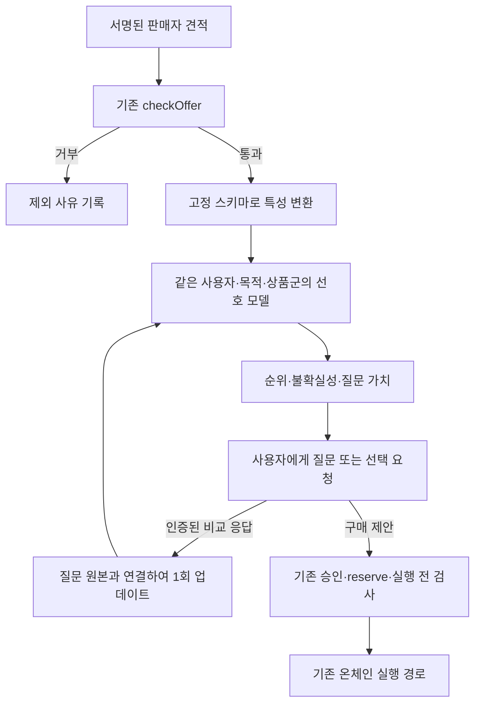

# 백엔드 연결 계약과 구현 인수 기준

## 현재 상태

이 폴더의 모형·질문 관리·특성 변환·통제 도출·데모는 실행 가능하다. 실제 앱의 `checkOffer`를 호출하는 [product-adapter.mjs](product-adapter.mjs)도 구현하고 EIP-712 서명된 테스트 견적으로 검증했다. 새 공개 API나 UI를 등록하거나 기존 결제·Control Memory 동작을 교체하지는 않았다.

현재 앱의 모델은 사용자 변경 지시에 따른 `qwen3-32b`이며, 이 학습 모듈에는 Kiln 모델명을 하드코딩하지 않는다. LLM 응답은 학습 증거나 정책 변경 명령으로 신뢰하지 않는다. 실제 연결 상태는 [Kiln 명세](../docs/KILN-INTEGRATION.ko.md)를 따른다.

## 호출 흐름



순위는 검사 시점의 스냅샷이다. 다음 요청에서 예산·예약·기한·중지 상태가 바뀔 수 있으므로 실행 직전에 기존 검사와 예약을 다시 거쳐야 한다. 추천 결과에서 바로 거래를 제출하는 함수는 없다.

## 서버가 제공해야 하는 입력

`authenticatedOwner`와 `actorId`는 인증된 서버 컨텍스트에서 얻어야 한다. 브라우저나 LLM이 보내는 값을 그대로 넣으면 인증이 되지 않는다. 이 라이브러리는 인증 서버를 대체하지 않는다. 주소는 프로필 생성 시 일관된 표기로 고정한다.

```javascript
import { verifiedMenu, recommendVerifiedOffers } from './learning/product-adapter.mjs';

const args = {
  profile, session, records: signedOffers, domain,
  now: trustedServerTimestampSeconds,
  authenticatedOwner: authenticatedSessionOwner,
};
const menu = verifiedMenu(args);
// 후보가 없으면 사용자에게 넘긴다. 임의 후보를 추가해서 질문하지 않는다.
if (menu.eligible.length >= 2) {
  const question = profile.issueQuery({
    id: serverGeneratedQueryId,
    candidates: menu.eligible,
    objective: 'regret_reduction',
    issuedAt: trustedServerTimestampSeconds,
    expiresAt: approvedQuestionExpiry,
  });
  // question.query의 견적 조건과 출처를 사용자에게 그대로 제시한다.
}
const recommendation = recommendVerifiedOffers({ ...args, decisionPolicy: savedApprovedPolicy });
// recommendation.paymentAuthorized는 항상 false.
```

질문에는 실제 보여준 후보의 특성·범위·유효시간과 `presentationHash`가 고정된다. 답변 API는 `queryId`, `evidenceId`, `choice`, 인증된 actor를 넣는다. 답변에 외부 숫자 벡터를 넣어 모델을 수정하는 경로는 없다. `skip`은 학습하지 않는다. 질문 시점의 선택이므로 답변 뒤 추천할 때는 최신 견적을 다시 검사한다.

`decisionPolicy`에는 ownerId·purpose·category·featureSchema·preferenceEpochId·approvalRef와 위험/질문 비용 기준이 모두 필요하다. `validationStatus`와 사용 동의도 서버가 보관한 배포 승인 자료에서 가져온다. 클라이언트가 문자열을 보내면 검증 완료로 인정하는 HTTP 엔드포인트를 만들면 안 된다. 합성 실험 JSON은 실사용 승인 자료가 아니다.

## 저장·정정·시간 변화

실제 제안 준비 상태를 사용하려면 모델 저장본과 독립적으로 관리하는 `EpochAuthority`를 연결해야 한다. `enrollInitial(model.export())`은 신규 범위의 최초 등록용이며 이미 시작된 epoch를 덮어쓰지 않는다. 저장된 모델을 복원해 `new LearningProfile(model, {epochAuthority})`로 연결하면 저장소의 현재 ID·순번과 일치하는지 검사한다. 이 저장소를 연결하지 않으면 `READY_TO_PROPOSE`는 나오지 않는다.

```javascript
import { EpochAuthority } from './learning/epoch-authority.mjs';
import { LearningProfile } from './learning/profile.mjs';
const epochAuthority = new EpochAuthority('data/private/preference-epochs.sqlite');
// 새로운 범위를 처음 생성할 때에만 최초 등록. 복원된 이전 모델로 재등록하지 않는다.
epochAuthority.enrollInitial(initialModel.export());
const profile = new LearningProfile(initialModel, { epochAuthority });
// 승인 흐름에 넘기기 직전 다시 확인. 이것은 선호 상태 최신성 검사일 뿐 결제 승인이 아니다.
profile.checkProposalFreshness(savedProposal);
```

epoch 전환은 현재 ID·순번 검사, 다음 순번, 과거 모델 스냅샷·전환 사건 기록을 SQLite 트랜잭션에 넣는다. 질문·답변·판정도 현재 epoch 검사를 동기 구간에서 수행한다. 네트워크 인증 등 비동기 작업 뒤에 profile 메서드를 호출한다. 그 사이 세대가 바뀌면 이전 질문/worker가 거부된다. 제안에는 scope·epoch ID/순번·모델 해시가 포함되어 이후 학습이나 epoch 변경에 의한 노후화를 확인할 수 있다.

현재 epoch의 시작 스냅샷은 저장소에서 복구할 수 있지만 그 뒤 **모든 질문과 응답**을 영속 저장하는 서비스는 아직 구현하지 않았다. 과거 모델과 함께 authority DB 자체를 이전 백업으로 되돌리면 최신성을 증명할 수 없으므로, authority는 모델 복원 입력과 분리해 관리해야 한다. 로컬 관리자에 의한 파일 변조·백업 롤백까지 막는 외부 원장은 아니다.

코어의 `model.export()`와 `PreferenceModel.restore()`는 설정·증거·철회 기록을 저장하고 재생한다. 스냅샷은 신뢰할 수 있는 서버 저장소에서 읽어야 한다. SHA-256 해시는 내용 일치 확인용이며, 공격자가 파일과 해시를 함께 고치는 것을 막는 서명은 아니다.

`LearningProfile`의 진행 중 질문 레지스트리와 감사 로그는 현재 메모리 안에 있다. 재시작 후 미완료 질문은 다시 발급해야 한다. 실제 서비스 연결 전에는 질문 원본·답변·모형 버전의 저장과 중복 처리를 데이터베이스 트랜잭션으로 묶어야 한다. 동시 요청 직렬화, 세션 인증, 속도 제한, 보관·삭제 정책을 이 라이브러리가 제공한다고 주장하지 않는다.

잘못된 응답은 `model.retract({evidenceId, actorId, reason})`로 철회하고 재계산한다. 원 사건과 철회 사유는 감사 목적으로 보존한다. 사용자가 취향이 바뀌었다고 명시하면 beginPreferenceEpoch({id, actorId, reason, now})로 새 세대를 시작한다. 과거 모델과 질문은 archivedEpochs에 보존되고, 대기 질문은 무효화되며 이전 epoch의 증거·제안 정책은 거부된다. 현재 epoch ID와 시작 시각은 model.export/restore로 유지된다. 과거 스냅샷·감사·질문의 영속 저장은 서버가 전환과 함께 원자적으로 수행해야 한다. 현재 모델에는 자동 변화 탐지·시간 감쇠가 없으므로 오래된 확신을 실사용 자동 제안 근거로 쓰면 안 된다.

## 본 서비스에 반영할 때 필요한 검증

실제 사용자의 동의를 얻은 선택 데이터를 모으고, 사용자·시간별로 개발/검증/최종 평가를 분리한다. 거절·환불은 이유와 비교 대안을 확인한다. β·ε·이전 κ는 개발/검증 데이터에서 선택하며 최종 평가를 보고 다시 고르는 일을 피한다.

같은 하드 정책 아래서 균등/명시 설정, 학습 없는 추천, 선호 학습 추천을 비교한다. 예측 log loss·Brier, 사용자가 다른 상품을 선택한 비율, 질문 부담, 실제 순위 품질, 범위 밖 상품·취향 변화·오래된 증거의 실패율을 측정한다. 실세계 최적 상품을 모르므로 합성 regret를 그대로 실사용 지표로 보고하지 않는다.

기존 Control Memory 실험은 [B0/B1/CM 3군 규약](../docs/EXPERIMENT-PROTOCOL.ko.md)을 유지한다. 이번 선호 모델 합성 실험은 해당 실험의 대체 증거가 아니다. 판매자가 견적을 수정하는 조건과 통제가 오히려 불리한 조건도 제외하지 않는다.

## 요청별 완료 증거

| 요청 | 구현·자료 | 확인 방법 |
|---|---|---|
| 논문·오픈소스 선정 | [연구 기록](RESEARCH.ko.md), 고정 커밋, 라이선스, 원문 10개 | 출처와 SHA-256 manifest |
| 무엇을 얼마나 업데이트하는지 | [알고리즘](ALGORITHM.ko.md), `model.mjs` | 손계산 및 독립 softmax/정보이득 대조 |
| 상품군마다 다른 선호 | 4개 범위 키, 호환 부모 스냅샷만 이전 | 다른 사용자·목적·스키마·분류 거부 테스트 |
| 불확실성 관리 | 사후 구간, 후회, 질문가치, 동의·검증 조건 | 결제 권한을 반환하지 않는 경계 테스트 |
| 통제 분리 | `control.mjs`, 정책 우선 어댑터 | 서명 오류·예산 초과·수수료 원인·범위·수정 견적 검사 |
| 실제로 실행해 보기 | [데모](artifacts/demo.json), [실험 결과](artifacts/simulation.ko.md) | 테스트·명령·seed·코드 해시로 재현 |

해커톤 발표에는 “보안 통제는 검증된 실패에서 추가하고, 선호 연구 모듈은 확인된 비교 선택으로 추천 가중치의 분포를 갱신한다. 실사용 자동 선택은 아직 검증 전”이라고 설명할 수 있다.
