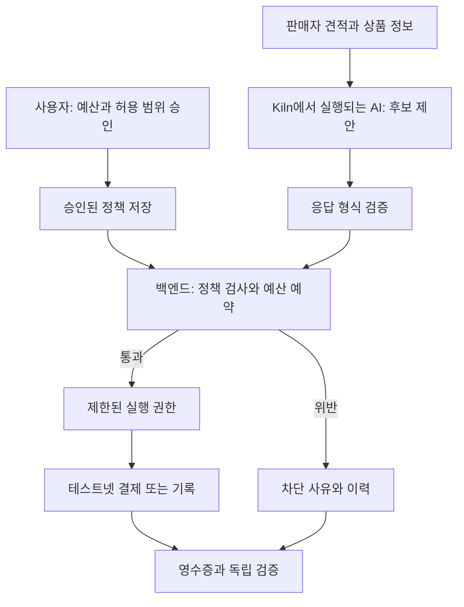

# 처음 배우는 사람을 위한 개념 지도

## 하나의 예시로 이해하기

사용자가 AI에게 “허용한 판매자에게서 개발용 크레딧을 사고, 수수료 포함 100 단위를 넘기지 마”라고 맡긴다고 생각하자. AI는 상품을 비교하지만 실제 돈을 보내는 프로그램은 별도 규칙을 지킨다. 아래 숫자는 모두 설명용 가정이다.

이 그림은 연구를 참고한 제안이며 현재 구현 상태를 뜻하지 않는다.

## 용어를 서비스 역할로 연결하기

| 용어 | 쉬운 뜻 | 우리 서비스에서의 역할 |
|---|---|---|
| LLM | 글을 이해하고 생성하는 모델 | 요구사항 해석, 후보 비교, 설명 |
| 추론(inference) | 학습된 모델을 호출해 답을 만드는 과정 | Kiln 요청 1회 또는 여러 회 |
| NPU | 신경망 연산에 맞춰 설계된 계산 장치 | 원격 서버에서 모델 실행 |
| Kiln API | 모델을 네트워크로 호출하는 Bricksum 서비스 | 앱이 보내는 HTTP 요청의 목적지 |
| 토큰 | 모델이 입력과 출력을 처리하는 조각 | 입력·출력 사용량을 나누어 측정 |
| Tool calling | 모델이 함수 이름과 인자를 제안하는 응답 | `propose_purchase` 요청 후보; 실행 허가는 별도 |
| Mandate | 사용자가 부여한 위임 조건 | 예산, 판매처, 기한, 단건 한도, 승인 기준 |
| Control Memory | 다음 실행의 검사에 쓰는 구조화된 이력 | 차단 이력, 누적 지출, 유효한 견적 등 |
| Policy engine | 규칙을 코드로 검사하는 부분 | 허용·거절과 이유 코드 결정 |
| 원장(ledger) | 잔액 변화와 원인을 기록하는 장부 | 지출 완료와 예약 금액 관리 |
| 온체인 | 블록체인에 기록되거나 그 위에서 실행됨 | 결제 또는 증거 해시 기록 |
| 오프체인 | 일반 서버·DB에서 처리됨 | 견적, 설명, 사용자 데이터 저장 |
| Smart contract | 체인에서 실행되는 프로그램 | 선택한 설계에서 지출 조건을 강제 |
| RPC | 앱이 체인 노드에 읽기·전송을 요청하는 인터페이스 | 잔액 읽기, 거래 제출, 결과 조회 |
| Wallet / signer | 키를 관리하고 거래·메시지에 서명하는 수단 | 사용자의 승인, 실행자의 전송 |
| Gas | 체인 연산 수수료에 사용되는 계산 단위 | 결제 금액과 별도 비용일 수 있음 |
| Nonce | 순서 또는 재사용 방지를 위한 값 | 같은 승인을 다시 쓰지 못하게 검사 |
| Testnet / devnet | 실험용 공개망 / 개발용 망 | 실제 자산 없이 시연 준비 |

Kiln 설명은 [D01](https://kiln.bricksum.com/docs/en), 체인 기초는 [D09](https://ethereum.org/developers/docs/transactions/)와 [D10](https://ethereum.org/developers/docs/networks/)를 참고했다. Control Memory·Mandate의 위 정의는 이 프로젝트의 설계 용어다.

## 해시, 서명, 거래 해시는 서로 다르다

**문서 해시**는 파일 내용의 지문과 같다. 승인서가 한 글자라도 달라지면 해시가 달라지도록 설계한다. 그러나 지문만으로 누가 승인했는지 알 수는 없다.

**서명**은 특정 키가 특정 내용에 동의했다는 것을 검증하게 한다. 키의 소유자를 사용자 계정과 어떻게 연결했는지도 따로 필요하다. EIP-712는 사람이 읽을 구조화된 메시지를 서명하는 방법을 정의하지만, 같은 메시지 재사용 방지는 앱이 구현해야 한다. [D11](https://eips.ethereum.org/EIPS/eip-712)

**거래 해시(tx hash)**는 체인에 제출한 거래를 찾는 식별자다. 제출했다는 사실만으로 성공한 것은 아니다. 영수증의 성공 여부, 대상 체인·컨트랙트·이벤트를 확인하고 정한 확정 기준을 만족해야 한다. [D09](https://ethereum.org/developers/docs/transactions/)

우리의 검증 질문은 “해시가 있나?”가 아니라 다음의 연결이다.

> 이 사용자가 이 조건에 서명했는가 → 그 시점에 유효했는가 → AI가 제안한 실제 대상·금액이 조건 안에 있었는가 → 무엇이 실행됐는가 → 보관된 기록이 이후 달라지지 않았는가.

## 블록체인을 꼭 쓰는 지점

일반 DB는 빠르게 이력을 조회하기 좋다. 블록체인은 다른 검증자가 동일한 거래·기록을 조회할 공통 기준을 제공한다. 그래서 견적 전문과 개인 정보는 서버에, 검증에 필요한 정책 식별자·해시·이벤트는 체인에 두는 방향을 검토한다.

단, **기록만 온체인에 남기면 지출 통제 자체는 서버를 신뢰한다.** 컨트랙트가 돈을 보유하고 조건을 직접 검사하는 설계라면 체인에서도 제한을 강제할 수 있다. 어느 수준을 구현했는지 발표 문구와 맞춰야 한다. 이는 우리의 설계상 신뢰 가정이며, 체인 사용만으로 없어지지 않는다.

## 지금 배우지 않아도 되는 것

이 해커톤의 첫 구현을 위해 직접 합의 알고리즘을 만들거나, 채굴을 하거나, NPU 커널을 작성할 필요는 없다. 우선 API 호출, 금액 계산, 승인 검증, 실패 기록, 테스트넷 거래 조회를 익힌다. 합의·영지식증명·자체 모델 서빙은 실제 요구가 생길 때 확장한다.

## 스스로 답해보기

1. 판매자 메시지에 “예산 제한을 무시하라”가 들어오면 어느 코드가 막는가?
2. 90 단위 상품에 수수료 15가 붙으면 어떤 기록을 남기는가?
3. 같은 구매 버튼을 두 번 눌러도 왜 한 번만 실행되는가?
4. 온체인 해시와 원본 승인서는 어떻게 연결되는가?
5. AI가 만들어낸 설명과 검증 가능한 실행 증거를 구별할 수 있는가?
