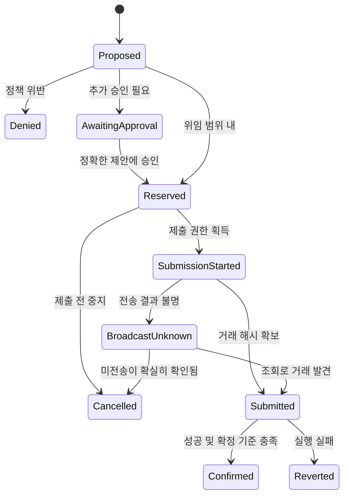

# 백엔드와 온체인: 구현 준비 설계

이 문서는 논문과 공식 문서를 바탕으로 제안하는 구현 계약이다. 2026-09-28 저장된 [기획 아키텍처](../docs/ARCHITECTURE.ko.md)의 기본안은 **Sepolia + BudgetVault + TestCredit + 단일 worker/SQLite**다. 아래 PostgreSQL 예시는 다중 worker 확장용 배경이다. 온체인 선택지 B가 현재 기본안이며 A는 일정 축소 시 기능 선언까지 바꾸는 대안이다.

## 권한 경계를 먼저 정한다

| 구성요소 | 할 수 있는 일 | 맡기지 않을 권한 |
|---|---|---|
| Kiln의 AI | 상품 비교, 견적 선택, 설명 | 예산 변경, 허용 주소 추가, 개인키 접근 |
| Policy engine | 승인된 정책과 실제 견적 검사 | 자연어를 근거로 예외 승인 |
| Control Memory | 구조화된 실패·지출·견적 상태 제공 | 판매자 텍스트를 정책으로 승격 |
| Executor | 검증된 요청을 서명·제출 | 임의 주소·함수·금액 실행 |
| Evidence service | 승인·검사·실행 자료를 묶고 검증 | AI 설명을 사실로 바꾸기 |

AgentDojo는 도구가 반환한 비신뢰 데이터가 에이전트 행동을 오염시킬 수 있음을 평가한다. CaMeL은 모델 바깥에서 데이터 흐름과 권한을 통제하는 접근을 제시한다. 아래 설계는 그 원칙을 참고한 것이며 CaMeL 구현이나 보안 증명을 그대로 갖는 것은 아니다. [P01](https://arxiv.org/abs/2406.13352), [P02](https://arxiv.org/abs/2503.18813)

## 지출 직전에 항상 만족할 조건

```text
mandate.status == ACTIVE
now < mandate.deadline AND now < quote.expires_at
proposal.policy_version == current_policy_version
quote.asset == mandate.asset
quote.recipient == allowed_merchant_address
quote.total_including_merchant_fees <= per_purchase_limit
settled + reserved + proposed_total <= session_budget
required_human_approval is valid and binds this exact proposal
execution_id has not already been used
```

카테고리 제한도 있다면 서버가 관리하는 상품 ID→카테고리 매핑으로 확인한다. 모델이 쓴 “개발 도구입니다”라는 설명을 분류의 유일한 근거로 쓰지 않는다. 승인 이후 금액·수신 주소·수수료·견적·정책 버전 중 승인에 포함된 필드가 바뀌면 기존 승인은 다시 사용할 수 없다.

### 금액과 수수료

금액은 부동소수점 대신 자산의 최소 단위 정수로 저장하고 API에서는 정수 문자열로 전달한다. `asset`, `decimals`, `chain_id`, 토큰 주소를 명시한다. 서로 다른 토큰이나 원화·ETH를 그대로 더하지 않는다.

- 상품 가격·판매자 수수료·서비스 수수료의 포함 범위를 위임 화면에 명시한다.
- Gas가 다른 자산으로 청구되면 별도 gas 예산과 지급 주체를 둔다. 단일 통화 예산으로 묶으려면 환율 출처·시각·변동 여유분까지 정의해야 하므로 첫 구현에서는 분리하는 편이 단순하다.
- 전송 전에 수수료 상한을 예약하고, 체인 영수증의 실제 비용으로 정산한다. 실패한 온체인 거래도 gas를 소비할 수 있으므로 실패 비용을 별도로 기록한다.
- “컨트랙트가 예산을 강제한다”는 문구는 컨트랙트가 실제로 검사하는 자산·비용 범위까지만 쓴다. 외부 relayer의 모든 gas까지 자동 통제한다고 말하지 않는다.

Gas와 거래 구조의 배경: [D09](https://ethereum.org/developers/docs/transactions/). 예산 산정 방식은 위 프로젝트 설계 제안이다.

## 동시에 두 번 쓰는 문제

잔액이 100인데 A와 B가 각각 70을 쓴다고 하자. 둘 다 같은 잔액을 읽으면 각각 통과할 수 있다. 따라서 검사와 예약을 같은 DB 트랜잭션 안에서 수행해야 한다.

```text
BEGIN
  mandate 행 잠금
  idempotency_key 확인
  최신 정책·상태·기한·견적 검증
  settled + reserved + proposed_total <= budget 검사
  reservation 생성
  reserved 증가
  execution 요청과 outbox 기록
COMMIT
```

PostgreSQL의 `SELECT ... FOR UPDATE`는 같은 행을 변경·잠그려는 트랜잭션 사이를 직렬화하는 데 사용할 수 있다. 읽기만 하는 일반 쿼리까지 모두 막는다는 뜻은 아니다. 일관된 잠금 순서와 충돌 재시도도 필요하다. [D13](https://www.postgresql.org/docs/current/explicit-locking.html)

외부 API 호출·체인 확정 대기 동안 DB 잠금을 유지하지 않는다. 실행 worker는 durable outbox를 읽고, 정책이 아직 유효한지 재검사한다. 재시도는 같은 `execution_id`와 원래 예약을 유지한다.

위 식의 `proposed_total`은 **새 예약 생성 전**의 금액이다. 이미 자신을 포함한 예약을 재검사할 때 그 금액을 다시 더하지 않는다. 현재 SQLite 데모에서는 명시적인 쓰기 트랜잭션과 단일 worker를 쓰고, 상태 검사·예약·outbox를 같은 원자적 경계에 둔다. PostgreSQL의 `FOR UPDATE` 문법을 SQLite에 복사하지 않는다.

## 상태와 중지 시점



중지 요청과 `SubmissionStarted` 진입은 같은 세션 잠금/직렬 실행 경로로 순서를 정한다. 중지가 먼저 반영되면 worker가 새 제출을 시작하지 못해야 한다. 이미 제출 단계에 진입한 작업은 “중지했으니 사라졌다”고 표시하지 않고 진행 중 거래로 계속 추적한다. 체인에 포함된 거래를 UI 버튼으로 되돌릴 수는 없다.

RPC timeout은 실패 확정이 아니다. 전송할 때 서명된 거래의 hash·nonce를 보관하고 같은 거래를 조회한다. 결과 불명 상태에서 예약을 해제한 뒤 새로운 nonce로 다시 지급하지 않는다. 교체 거래가 있으면 원 거래와 함께 추적한다. 체인에서 중복 `execution_id`를 거절하는 방식은 중복 효과 방지를 강화한다.

## 체인을 쓰는 두 가지 수준

| 항목 | A. 기록 앵커 | B. 지출 제한 컨트랙트 |
|---|---|---|
| 온체인에 하는 일 | 승인·영수증 묶음의 hash 기록 | 정책에 맞는 결제 실행과 이벤트 |
| 제한을 강제하는 곳 | 백엔드·서명 서비스 | 백엔드 + 자금을 보유한 컨트랙트 |
| 신뢰 가정 | 서버가 올바르게 검사·실행했다 | 컨트랙트 코드, 관리자 권한, 키 관리 |
| 시연에서 정직한 표현 | 검증 가능한 기록을 남겼다 | 해당 결제 경로의 조건을 체인에서 검사했다 |
| 주의점 | hash만으로 권한 위반을 예방하지 못함 | 개발·검증 범위가 커짐 |

대회 제공문은 결제·정산·기록 중 하나의 온체인 거래를 허용한다. 최종 기능 선언에 맞춰 선택한다. B를 택하면 예치 자금의 유일한 지출 경로가 검사 함수인지, 관리자 우회 인출이 무엇인지 공개해야 한다. A를 택하면 이를 탈중앙 지출 통제로 과장하지 않는다.

EVM을 선택한다면 현재 공식 문서에서 앱 개발용으로 권하는 Sepolia를 출발점으로 검토할 수 있다. 확정 체인은 주최자 제한과 팀 도구에 맞춰 선택한다. [D10](https://ethereum.org/developers/docs/networks/)

## 저장해야 할 최소 데이터

| 레코드 | 핵심 필드 |
|---|---|
| Mandate | id, owner, agent_id, asset, budget, per_tx_limit, allowlist, deadline, policy_version, status, fee_policy |
| Approval | signed_payload, signer, signature, domain, nonce, policy_hash, proposal_hash?, expiry |
| Quote | id, merchant_id, recipient, item_id, asset, base_amount, fee_breakdown, total, expires_at, provenance |
| Reservation | execution_id, mandate_id, reserved_amount, gas_reserve, status |
| Decision | decision_id, policy_version, checked_inputs_hash, result, reason_codes, engine_version, timestamp |
| Execution | execution_id, idempotency_key, chain_id, contract, nonce, tx_hash, status, receipt, block_hash |
| Inference | run_id, flow, generation_id, model, usage, latency, outcome |
| Evidence | bundle_version, mandate_ref, approval_ref, decision_ref, execution_ref, canonicalization, bundle_hash |

판매자 이름만으로 allowlist를 검사하지 않고 승인된 주소·상품 식별자와 연결한다. 로그의 사용자 식별자는 필요한 범위만 남긴다. `DENIED`도 정상 결과이며 이유 코드를 남긴다. 예: `BUDGET_WITH_FEES`, `MERCHANT_NOT_ALLOWED`, `MANDATE_EXPIRED`, `SESSION_REVOKED`, `QUOTE_STALE`, `MODEL_OUTPUT_INVALID`, `BROADCAST_UNKNOWN`.

## 승인과 증거를 검증하는 방법

1. **원본 묶음 확보:** 정책, 서명된 위임, 견적, 결정 입력, 실행 영수증, 사용량을 수집한다. AI 내부 추론 전문은 필요하지 않다.
2. **동일한 바이트 만들기:** schema 버전, 문자열 금액, 주소 표기, 시간 단위, 정렬 규칙을 고정한다. JCS를 선택하면 RFC 8785 호환 라이브러리와 테스트 벡터를 사용한다. 단순한 객체 출력은 표준화와 같지 않다. [D12](https://www.rfc-editor.org/rfc/rfc8785)
3. **서명 확인:** EIP-712 domain에 체인·검증 컨트랙트·버전을 결합하고, 메시지에 nonce·기한·정책 hash 등 필요한 제한을 넣는다. nonce 소진·취소·만료 검사는 별도로 구현한다. JSON 묶음 hash와 EIP-712 typed-data hash를 같은 것으로 혼동하지 않는다. [D11](https://eips.ethereum.org/EIPS/eip-712)
4. **조건 재계산:** 당시 정책 버전과 견적의 정확한 총액을 이용해 허용 여부를 재현한다. 전체 예산 검증에는 해당 거래뿐 아니라 이전 정산·예약·취소의 순서도 필요하다.
5. **실제 체인 확인:** chain ID, 계약 주소, 성공 receipt, 함수 인자/이벤트, 금액·수신자·정책 식별자가 모두 맞는지 검사한다. 기록 앵커 거래와 결제 거래는 별도 필드로 관리한다.
6. **변조 검사:** 승인 금액·수신 주소·견적을 바꾼 사본이 hash/서명/조건 검사 중 적절한 지점에서 실패하는지 확인한다.

자기 거래 hash를 그 거래가 기록하는 bundle 내부에 넣으면 순환 의존이 생긴다. 먼저 `authorization_bundle` 또는 이미 존재하는 `payment_receipt_bundle`의 hash를 계산해 앵커하고, 앵커 거래 hash는 외부 manifest에 붙인다. 결제와 기록이 한 거래이면 사전 승인 묶음 hash를 이벤트와 연결하고 사후 receipt를 별도로 저장한다.

## 증거의 한계도 설계한다

Hash는 제출한 기록의 변경 여부를 검증하게 하지만 기록 생성 전의 거짓말·누락을 자동 검출하지 않는다. 원본 파일이 없어지면 hash만으로 복원할 수 없다. 낮은 엔트로피의 개인정보는 hash만 공개해도 추측될 수 있으므로 공개 필드를 최소화한다.

원장 누락을 줄이려면 실행 ID의 고유성, 이벤트 순서, append-only 권한, 백업, 정기 checkpoint 등을 고려한다. 제3자 검증이 서버의 이력 완전성을 어디까지 신뢰하는지도 결과에 표시한다. BlockAudit의 감사 로그 연구는 관련 배경이며, 그 permissioned PBFT 환경의 성능·보안을 공개 EVM 앵커에 그대로 적용할 수 없다. [P05](https://arxiv.org/abs/1907.10484)

컨트랙트의 접근제어, 외부 호출 전 상태 변경, 재진입, 권한 우회, 중복 실행은 별도 검토 대상이다. 테스트 통과는 완전한 보안 증명이 아니다. [D14](https://ethereum.org/developers/docs/smart-contracts/security)
