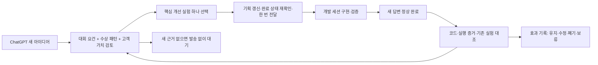

# 증거를 쌓는 기획·개발 개선 루프

2026-09-28 사용자 요청으로 기존 완료 후 리뷰를 확장했다. 목표는 심사자가 한 작업의 가치·기술 역할·성공과 실패를 이해하고 재현할 수 있도록 개선하는 것이다. 모델 자체를 학습시키거나 우승을 보장하는 시스템은 아니다.

## 실제 연결

기존 heartbeat `vc`를 사용한다. 5분은 완료 상태 확인 간격이다. 개발·기획 담당은 **기획 GWDC 챌린지 시스템 아키텍처** (`01a0e73b-176c-7403-81cd-305eb84b0196`, local). 새 채팅이나 추가 자동화를 만들지 않는다. 개발 결과는 이 세션의 다음 완료 답변과 공유 파일로 받는다. 별도 답신 요청은 필요 없다.

추가 입력은 사용자가 계속 아이디어를 발전시키는 ChatGPT **해커톤 규칙 정리**다. [IDEA-SYNC.ko.md](IDEA-SYNC.ko.md)의 방식으로 새 내용·수정 내용을 대조하고 아이디어만 새로 생겼어도 개발 대상의 정상 완료/idle 상태에서 한 번 전달한다. 아이디어 대화로 자동 답장을 보내지는 않는다.

## 1. 무엇을 기준으로 판단하는가

우선순위는 **사용자 최신 요청/대회 원문 → 실제 실패·안전 경계 → 관통 실행 증거 → 이해·사용 가치 → 효율·표현**이다. 우승 사례는 [패턴 문서](WINNING-PATTERNS.ko.md)의 가설로만 사용한다. 모든 대회의 수상 특징을 의무 기능으로 추가하지 않는다.

`evolution.json`의 여섯 축을 `unknown / planned / implemented / verified / contradicted`로 관리한다. 숫자 합계나 우승 확률을 만들지 않는다. verified에도 증거 범위(local/공개 체인/시뮬레이션/인간 관찰)를 반드시 붙인다. 미측정은 unknown이며 목표치를 현재값으로 쓰지 않는다.

축: 문제·사용자, 받은 결과, 기술 필요성, 독립 재현, 데모 이해, 비용·성공률. 고객 수요는 대회 기술 acceptance와 별도다. 대회 원문·마감·제출 형식이 미확인인 경우 그 사실을 남기고 임의로 정하지 않는다.

## 2. 매 완료 회차의 절차

1. HEARTBEAT의 상태·중복 방지 규칙을 적용한다. 실행 중·사용자 입력 대기·중단·오류이면 메시지를 보내지 않는다.
2. 완료 답변, snapshot 변경, 이전 activeExperiment의 완료 조건을 대조한다. 코드 변경이 없어도 설계 결정은 검토한다. 다른 채팅의 완료를 대신 주장하지 않는다.
3. 결과를 `improved / unchanged / regressed / inconclusive` 중 하나로 남긴다. 측정 정의가 바뀌었으면 같은 기준으로 비교하거나 비교 불가라고 쓴다. 테스트 통과와 실사용 효용은 구분한다.
4. 심사역은 필수 증거·관통 흐름, VC는 사용자·대안·얻는 결과, 구현 검증자는 반례·수정 범위·재현을 검토한다. WP1~WP6 중 이번 변경과 관계된 항목만 적용한다.
5. 기존 P0/P1 미해결과 현재 개발 작업부터 본다. 새 제안은 핵심 **한 건**으로 제한한다. 부수적인 검증 완료나 회귀 위험을 합쳐 메시지 최대 세 건. 이미 개발 중인 동일 일을 새 티켓으로 만들지 않는다.
6. 가장 큰 증거 빈칸을 기존 범위에서 메우는 최소 변경을 고른다. 가설·현재값·예상 변화·수정 파일/담당·검증 절차·완료 조건·기각 조건을 사전에 기록한다. 수정 또는 기능 삭제도 개선이다.
7. 개발 세션이 관리하는 기획 본문과 제품 파일을 동시에 덮어쓰지 않는다. 이 채팅은 council 원장/검토 문서를 소유한다. 기획서에는 필요한 작은 합의 내용만 대상이 완료 상태일 때 반영하거나 전달문으로 반영을 요청한다.
8. 발송 전 같은 completed turn·idle을 다시 확인한다. pendingDelivery와 marker를 먼저 저장하고 한 번 발송한 후 성공을 기록한다. 모호하면 marker 조회 전 재전송 금지.
9. 다음 완료 때 결과로 실험을 닫고 다음 가장 큰 빈칸을 선택한다. “수신했습니다”는 새 개선 결과가 아니다. 같은 지적을 재촉하지 않는다.

## 3. 실험 카드와 학습 기록

모든 실험은 `id, patternIds, hypothesis, baseline, expectedChange, minimumChange, acceptance, rejectionCondition, evidence, owner, status, sourceTurnId, outcome`을 가진다. active는 하나다. 완료 카드와 원시 자료는 삭제하지 않고 history에 보존한다.

개선 효과는 다음으로 평가한다: 새로 재현 가능한 acceptance, 사라진 반례, 정상 성공을 유지한 비용 감소, 실제 관찰의 오해 감소. 회차 수·문서 수·AI 동의 수를 성과로 삼지 않는다. 역효과면 되돌릴 범위 또는 더 작은 대안을 개발 세션에 제안한다.

동일 실험에서 새 증거 없이 완료가 두 번 반복되면 문제를 한 번 더 작게 나누거나 deferred로 두고 독립적인 다음 후보를 고른다. 외부 자료/사용자 결정이 꼭 필요하면 필요한 결정만 한 번 알린다. 무변화 폴링은 이 횟수에 포함하지 않는다.

## 4. 현재 시작점과 다음 순서

2026-09-28 ROUND-004에서 **EV-001 / C-E02 견적 시도 집계 정정**을 오프라인 회귀 5개와 원본 hash 대조로 닫았다. 현재 active 후보는 **EV-007 / escrow 상품·납품 판정 경계 검증**이다. 새 사용자 선호와 v3를 대조한 비교002를 적용하며, 전송/진행 상태는 evolution.json과 delivery.json을 기준으로 한다.

그 다음은 최신 사용자 아이디어와 개발 완료에서 선택한 문제를 먼저 맞춘다. 기존 기획 v2의 **소유자 직접 취소**는 중요한 후보이며 고정 순서는 아니다. 이미 구현 중이면 그 결과를 기다린다. 구현이 없고 다음 과제로 선택되면 executor에 의존하지 않는 취소 경로와 부정/경합 검증을 하나의 카드로 제안한다. 공개 체인 거래와 배포는 이 감시 채팅이 실행하지 않는다. 개발 세션도 자체 사용자 권한 범위에 따라 실행 여부를 판단한다.

이후 독립 재현 → 실제 문서 결과 → 데모 이해 → Qwen 대 규칙 기준선 순서는 기본 후보일 뿐이다. 새 실패·사용자 지시에 따라 근거를 기록하고 바꾼다. 필수 Kiln 증거가 깨지면 효율 실험보다 복구가 먼저다. 고객 관찰과 하드웨어 계측은 수집되지 않은 상태를 유지하며 자동으로 꾸며 채우지 않는다.

## 5. 자율 실행의 경계와 조용한 대기

이 채팅은 읽기·공식 자료 조사·council 문서·로컬 오프라인 확인을 실행하고 승인된 개발 채팅에만 조율 메시지를 보낸다. 유료 모델 재호출, 체인 거래, 새 외부 연락, 배포를 자동 범위에 추가하지 않는다. 이미 사용자가 개발 채팅에 준 별도 권한을 철회하는 지침도 아니다.

기존 기능을 재사용하고 마감 직전에는 새 기능보다 증빙·재현·데모를 우선한다. 현재 마감/제출 길이는 확인 전이므로 동결 날짜를 만들어내지 않는다. 새로운 중요한 행동이 없으면 종료하고 다음 완료를 기다린다. 운영 설정은 사용자 지시 또는 명백한 운영 버그 수정에 한해 갱신하고 대상/주기/권한을 스스로 확대하지 않는다.
